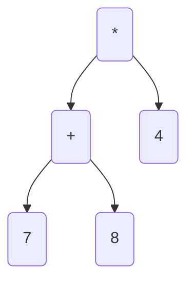
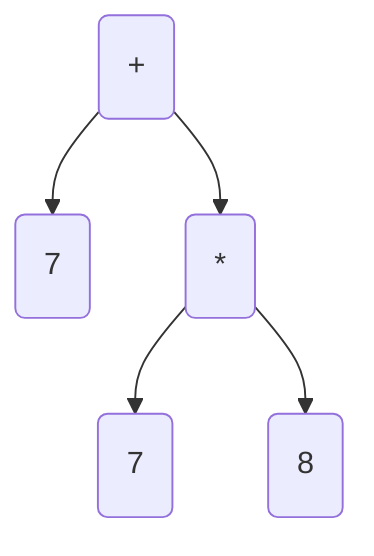
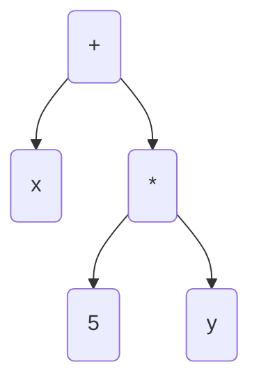

## Programování 2

# 10. cvičení, 28-4-2022

###### tags: `Programovani 2`,  `čtvrtek 2`

## Farní oznamy

1. Tento text a kódy ke cvičení najdete v repozitáří cvičení na https://github.com/PKvasnick/Programovani-2.
2. **Domácí úkoly** Prohlédl jsem všechny úkoly. Teď už můžu konečně zadat nové. 

**Zápočtový program**: 

- skupina Čt 10:40: 1 / 11
- skupina Čt 12:20: 9 / 20.

Je opravdu důležité, abyste měli téma ke konci dubna. Myslete na to, že specifikace budeme muset upřesňovat, takže to nejspíš nevyřídíte za jedno odpoledne. 

---

**Dnešní program**:

- Kvíz 
- Pythonské okénko
- Opakování: Jednoduchá rekurze v Pythonu
- Sudoku
- Opakování: Rekurze a binární stromy

---

## Na zahřátí


Je dobré tušit, jak funguje jazyk, který používáte. Ale není to samozrřejmě povinné.

---

### Co dělá tento kód

```python
first = {"name": "Peter", "occupation": "physicist"}
second = {"street": "Muskatova", "city": "Bratislava"}
first | second
???
```

Operace se slovníky?

---

## Opakování: Rekurze

Jednoduchá rekurzivní implementace vychází z toho, že  *Pythonovská funkce zná sebe samu*, takže ji v jejím těle můžeme volat:

```python
# Fibonacci numbers recursive
def fib(n):
    if n < 2:
        return n
    else:
        return fib(n-1) + fib(n-2)

print(fib(5))

```

Takováto implementace je velice srozumitelná, ale má vadu: zkuste si spočítat `fib(35)`. Důvodem je, že každé volání funkce vede ke dvěma dalším voláním, takže počet volání potřebný pro výpočet `fib(n)` exponenciálně roste. Existují dva způsoby, jak vyřešit takovýto problém s rekurzí:

Jedná se o primitivní, tedy odstranitelnou rekurzi, takže není složité vytvořit nerekurzivní implementaci. 

```python
# Fibonacci non-recursive

def fib(n):
    if n < 2:
        return n
    else:
        fpp = 0
        fp = 1
        for i in range(1,n):
            fp, fpp = fp + fpp, fp

    return fp

print(fib(35))

```

Můžeme rekurzivní funkci "vypomoct" zvenčí tak, že si někde zapamatujeme hodnoty, které se již vypočetly, a tyto hodnoty budeme dodávat z paměti a nebudeme na jejich výpočet volat funkci. 

Vyzkoušejte si tento kód:

```python
from functools import cache

# Fibonacci numbers recursive
@cache
def fib(n):
    if n < 2:
        return n
    else:
        return fib(n-1) + fib(n-2)

print(fib(40))
```

To funguje a rychle. Funkce `cache` je _dekorátor_, tedy funkce, která nějak upravuje jinou funkci. Ukážeme si, jak to funguje. 

Chtěli bychom, aby se funkce volala jen v nevyhnutných případech, tedy když se počítá pro novou hodnotu `n`. Pro tento účel nebudeme upravovat funkci zevnitř, ale ji zabalíme:

- Vytvoříme funkci `memoize`, která jako parametr dostane původní "nahou" funkci `fib` a vrátí její upravenou verzi se zapamatováváním.

- Sice zatím nemáme úplně dobrou metodu jak si pamatovat sadu hodnot, pro které známe nějaký údaj, například sadu `n`, pro které známe `fib(n)`, ale můžeme si lehko pomoci dvojicí seznamů.

  ```python
  # Momoised Fibonacci
  
  def memoize(f):
      values = [0,1]
      fibs = [0,1]
      def inner(n):
          if n in values:
              return fibs[values.index(n)]
          else:
              result = f(n) 
              values.append(n) # musime aktualizovat najednou
              fibs.append(result)
              return result
      return inner
  
  @memoize
  def fib(n):
      if n < 2:
          return n
      else:
          return fib(n-1) + fib(n-2)
  
  print(fib(100))
  
  ```

Abychom si ukázali další použití dekorátorů, zkusme zjistit, jak roste počet volání `fib(n)` u rekurzivní verze. Dekorátor, který na to použijeme, využívá pro ten účel zřízený atribut funkce:

```python
# Dekorátor, počítající počet volání funkce
def counted(f):
    def inner(n):
        inner.calls += 1 # inkrementujeme atribut
        return f(n)
    inner.calls = 0 # zřizujeme atribut funkce inner
    return(inner)

@counted
def fib(n):
    if n < 2:
        return n
    else:
        return fib(n-1) + fib(n-2)

@counted # pro porovnání přidáme i nerekurzivní verzi funkce
def fib2(n):
    if n < 2:
        return n
    else:
        f, fp = 1, 0
        for i in range(1,n):
            f, fp = f+fp, f
        return f

for i in range(30):
    fib.calls = 0 # musíme resetovat počítadla
    fib2.calls = 0
    print(i, fib(i), fib.calls, fib2(i), fib2.calls)
    
```

Dekorátory umožňují změnit chování funkcí bez toho, aby bolo potřebné měnit kód, který je volá. Je to pokročilé téma, ale učí nás, že s funkcemi je možné dělat divoké věci. Není například problém zkombinovat dekorátory pro memoizaci a počítání volání: 

```python
@counted
@memoize
def fib(n):
    ...
```

bude bez problémů fungovat. 

---

## Rekurze

O rekurzi jsem se dost bavili v minulém semestru, takže pojďme radši něco naprogramovat.

### Hanojské věže (bylo minule)


Máme 3 kolíčky a sadu kroužků různých velikostí.

Kroužky jsou na začátku na jediném količku uspořádané podle velikosti, největší vespod. 

Úloha je přesunout kroužky na jiný kolíček tak, že v každém okamžiku budou kolečka na vśech kolících uspořádaná podle velikosti - tedy nesmíme vétší kolečko uložit na menší.

Kde tady nalézt rekurzi? Použijeme princip podobný matematické indukci: 

- Úlohu umíme vyřešit pro 1 kroužek.

- Pokud bychom znali řešení pro n-1 kroužků, uměli bychom úlohu vyŕešit pro n kroužků?


(Kód v `code/Ex8/hanoi.py`)

```python
def move(n: int, start: str, end: str, via: str) -> None:
    if n == 1:
        print(f"Moved {start} to {end}")
    else:
        move(n-1, start, via, end)
        move(1, start, end, via)
        move(n-1, via, end, start)
    return


if __name__ == '__main__':
    move(5, "A", "B", "C")
```

### Všechny možné rozklady přirozeného čísla

1 -> (1)

2 -> (2), (1,1)

3 -> (3), (2, 1), (1, 1, 1)

4 -> (4), (3, 1), (2, 2), (2, 1, 1), (1, 1, 1, 1)

Podobný styl rekurze: indukce

- Máme řesení pro několik malých čísel 1, 2, ...
- Z řešení pro n umíme zkonstruovat rešení pro n+1.

---

## Sudoku


- V každém řádku, sloupci a čtverci 3x3 chceme všechny číslice 1-9.

Sudoku dokáže být velice těžké, napsat program na řešení ale těžké není. Musíme jenom do hloubky prohledat prostor řešení a pokud to urobíme rekurzivně, nebude program složitý.

**Ingredience:**

- Reprezentace mřížky

```python
grid = [[5, 3, 0, 0, 7, 0, 0, 0, 0],
        [6, 0, 0, 1, 9, 5, 0, 0, 0],
        [0, 9, 8, 0, 0, 0, 0, 6, 0],
        [8, 0, 0, 0, 6, 0, 0, 0, 3],
        [4, 0, 0, 8, 0, 3, 0, 0, 1],
        [7, 0, 0, 0, 2, 0, 0, 0, 6],
        [0, 6, 0, 0, 0, 0, 2, 8, 0],
        [0, 0, 0, 4, 1, 9, 0, 0, 5],
        [0, 0, 0, 0, 8, 0, 0, 7, 9]
       ]
```

- Metoda pro kontrolu, zda je daná číslice přípustná v daném místě mřížky

```python
def possible(x, y, n):
    """Is digit n admissible at position x, y in the grid?"""
    global grid
    for row in range(9):
        if grid[row][x] == n:
            return False
    for col in range(9):
        if grid[y][col] == n:
            return False
    row0 = (y // 3) * 3
    col0 = (x // 3) * 3
    for row in range(3):
        for col in range(3):
            if grid[row0+row][col0+col] == n:
                return False
    return True
```

- Algoritmus

Najdeme nevyplněné místo a vyzkoušíme všechny přípustné číslice. Rekurzivně pokračujeme, dokud je co vyplňovat nebo dokud nenajdeme spor.

```python
def solve():
    global grid
    for row in range(9):
        for col in range(9):
            if grid[row][col] == 0:
                for n in range(1, 10):
                    if possible(col, row, n):
                        grid[row][col] = n
                        solve()
                        grid[row][col] = 0
                return
    print_grid()
    s = input("Continue?")
```

Toto celkem dobře funguje a hned máme (jediné) řešení:

```python
5 3 4 6 7 8 9 1 2
6 7 2 1 9 5 3 4 8
1 9 8 3 4 2 5 6 7
8 5 9 7 6 1 4 2 3
4 2 6 8 5 3 7 9 1
7 1 3 9 2 4 8 5 6
9 6 1 5 3 7 2 8 4
2 8 7 4 1 9 6 3 5
3 4 5 2 8 6 1 7 9
Continue?

```

Pokud ubereme některé číslice, můžeme samozřejmě dostat víc řešení. 

## Operace s výrazy



Výraz ve tvaru binárního stromu je jednoznačný a nepotřebuje závorky. Podle toho, jak výraz ze stromu přečteme, dostáváme různé typy notace: 

- in-order --> infixová notace (běžná notace, potřebuje závorky) (7+8) x 4
- Pre-order --> prefixová notace (polská logika, nepotřebuje závorky) * 4 +7 8
- Post-order --> postfixová notace (reverzní polská logika, nepotřebuje závorky) 7 8 + 4 *

Pro binární operátory je binární graf jednoznačným zápisem výrazu a nepotŕebuje závorky. Pro výraz 7 + 8 * 4 máme úplně jiný strom než pro (7 + 8) * 4:



**Úkol** Jak vypočíst hodnotu takovéhoto stromu?


Uměli bychom strom nějak zobrazit? Můžeme třeba zkusit posouvat jednotlivé úrovně stromu a použít in-order průchod stromem: 

```python
    def to_string(self, level = 0):
        strings = []
        if self.left is not None:
            strings.append(self.left.to_string(level + 1))
        strings.append(' ' * 4 * level + '-> ' + str(self.value))
        if self.right is not None:
            strings.append(self.right.to_string(level + 1))
        return "\n".join(strings)

    def __str__(self):
        return self.to_string()
    
        -> 7
    -> 6
        -> 8
-> 5
        -> 5
    -> 4
        -> 2
```

Výsledek sice neoslní, ale jakž-takž vyhoví. 

`to_string` musí být oddělená od `__str__`, protože potřebujeme jinou signaturu. 

### Operace s výrazy ve tvaru stromů




```python

```

Toto nám ale dává obecně větší strom, ve kterém bude spousta hlušiny:

- příčítání nuly a násobení nulou
- násobení jedničkou

Můžeme si vytvořit čistící proceduru, která stromy rekurzivně vyčistí, a opět postupujeme tak, že určité uzly či struktury ve stromu rekurzivně nahrazujeme jinými uzly či strukturami. 

```python
class Expression:
    ...


class Constant(Expression):
    def __init__(self, value):
        self.value = value

    def __str__(self):
        return str(self.value)

    def eval(self, env):
        return self.value

    def derivative(self, by):
        return Constant(0)

    def prune(self):
        return self

# Testování konstanty, zdali je či není 0 nebo 1 !!

def is_zero_constant(x):
    return isinstance(x, Constant) and x.value == 0


def is_unit_constant(x):
    return isinstance(x, Constant) and x.value == 1


class Variable(Expression):
    def __init__(self, name):
        self.name = name

    def __str__(self):
        return self.name

    def eval(self, env):
        return env[self.name]

    def derivative(self, by):
        if by == self.name:
            return Constant(1)
        else:
            return Constant(0)

    def prune(self):
        return self


class Plus(Expression):
    def __init__(self, left, right):
        self.left = left
        self.right = right

    def __str__(self):
        return "(" + str(self.left) + " + " + str(self.right) + ")"

    def eval(self, env):
        return self.left.eval(env) + self.right.eval(env)

    def derivative(self, by):
        return Plus(
            self.left.derivative(by),
            self.right.derivative(by)
        )

    def prune(self):
        self.left = self.left.prune()
        self.right = self.right.prune()
        if is_zero_constant(self.left):
            if is_zero_constant(self.right):
                return Constant(0)
            else:
                return self.right
        if is_zero_constant(self.right):
            return self.left
        return self


class Times(Expression):
    def __init__(self, left, right):
        self.left = left
        self.right = right

    def __str__(self):
        return "(" + str(self.left) + " * " + str(self.right) + ")"

    def eval(self, env):
        return self.left.eval(env) * self.right.eval(env)

    def derivative(self, by):
        return Plus(
            Times(
                self.left.derivative(by),
                self.right
            ),
            Times(
                self.left,
                self.right.derivative(by)
            )
        )

    def prune(self):
        self.left = self.left.prune()
        self.right = self.right.prune()
        if is_zero_constant(self.left) | is_zero_constant(self.right):
            return Constant(0)
        if is_unit_constant(self.left):
            if is_unit_constant(self.right):
                return Constant(1)
            else:
                return self.right
        if is_unit_constant(self.right):
            return self.left
        return self


def main():
    vyraz = Plus(
        Variable("x"),
        Times(
            Constant(5),
            Variable("y")
        )
    )
    print(vyraz)
    print(vyraz.derivative(by="x"))
    print(vyraz.derivative(by="x").prune())
    print(vyraz.derivative(by="y"))
    print(vyraz.derivative(by="y").prune())


if __name__ == '__main__':
    main()
-----------    
(x + (5 * y))
(1 + ((0 * y) + (5 * 0)))
1
(0 + ((0 * y) + (5 * 1)))
5
```

- Všimněte si post-order procházení stromu při prořezáváni.
- Metodu `prune` definujeme také pro konstanty a proměnné, i když s nimi nedělá nic. Ulehčuje to rekurzivní volání metody.
- Musíme být pozorní při testování, zda je daný uzel/výraz nulová nebo jedničková konstanta. Nestačí operátor rovnosti, musíme nejdřív zjistit, zda se jedná o konstantu a pak otestovat její hodnotu. V principu bychom mohli dvě testovací funkce proměnit v metody třídy `Expression`.

**Domácí úkol**

Implementujte konstrukci, která ze stromu, kódujícího polynomiální funkci, vytvoří strom, kódující její primitivní funkci (podle některé proměnné). 
