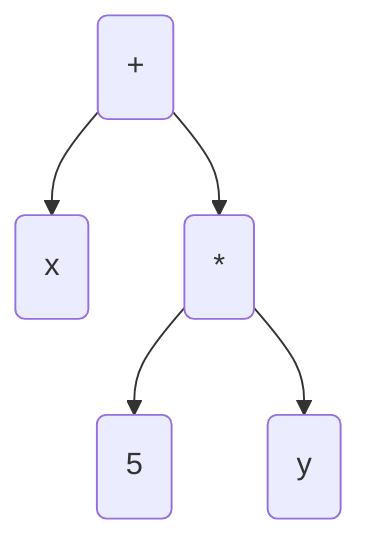
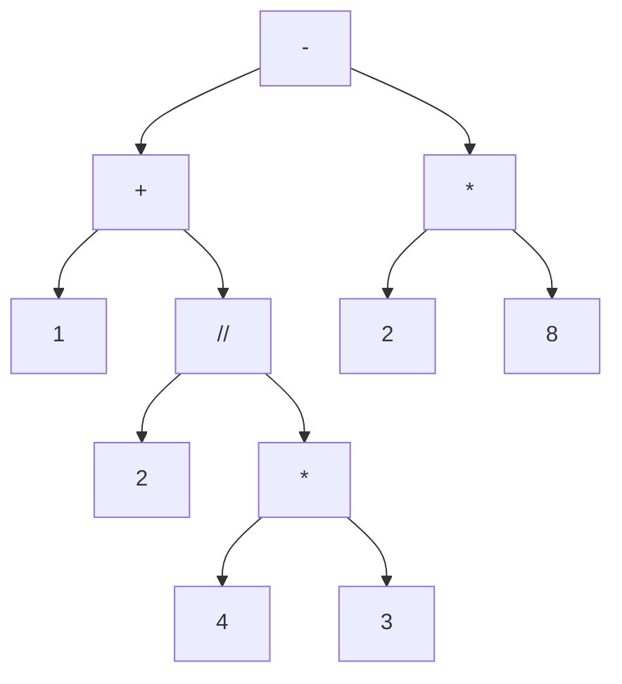
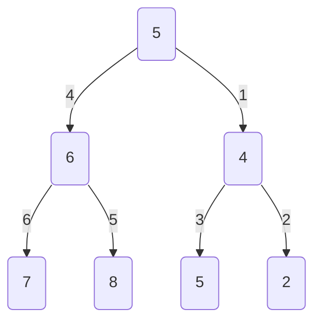
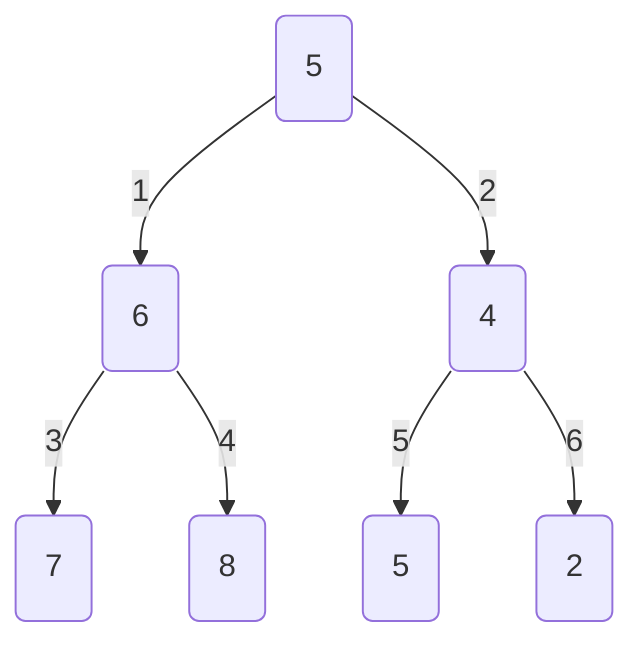
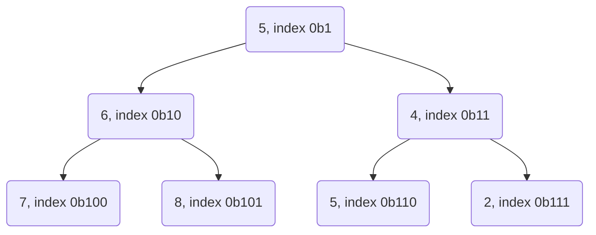

## Programování 2

# 10. cvičení, 20-04-2023

###### tags: `Programovani 2`,  `čtvrtek 1` `čtvrtek 2`

## Farní oznamy

1. Tento text a kódy ke cvičení najdete v repozitáří cvičení na https://github.com/PKvasnick/Programovani-2.
2. **Domácí úkoly** Snažil jsem se zadat lehčí úlohy, ale některé byly nepříjemné:
   - Zarovnání textu - to nebyl t0ežký příklad, chtělo to ale přesně kódovat. 
   - Výpočet infixového výrazu - tomu se budeme věnovat
   - Telefonní seznam byl opravdu lehký, stačilo neudělat chybu. Mnozí kupodivu udělali...
3. **Zápočtový program**:  

   - Postupně přicházejí návrhy a já je schvaluji
   - Je opravdu důležité, abyste měli téma **co nejdříve**. Myslete na to, že specifikace budeme muset upřesňovat, takže to nejspíš nevyřídíte za jedno odpoledne.


---

**Dnešní program**:

- Kvíz  
- Pythonské okénko
- Rekurze: kombinace a permutace
- Stromy aritmetických výrazů
- Domácí úkol (infixový výraz)
- Pokračování z minula: nerekurzivní průchod stromem

---

## Na zahřátí

> Writing the first 90 percent of a computer program takes 90 percent of  the time. The remaining ten percent also takes 90 percent of the time  and the final touches also take 90 percent of the time. 
>
> **N.J. Rubenking**


---

### Co dělá tento kód

```python
first = {"name": "Peter", "occupation": "physicist"}
second = {"street": "Muskatova", "city": "Bratislava"}
first | second
???
```

Operace se slovníky?

---

## Rekurze: Permutace, kombinace a podobná zviřátka

### Permutace

Chceme vygenerovat všechny permutace množiny (rozlišitelných) prvků. Nejjednodušší je použít rekurzivní metodu:

```python
def getPermutations(array):
    if len(array) == 1:
        return [array]
    permutations = []
    for i in range(len(array)): 
        # get all perm's of subarray w/o current item
        perms = getPermutations(array[:i] + array[i+1:])  
        for p in perms:
            permutations.append([array[i], *p])
    return permutations

print(getPermutations([1,2,3]))
```

Výhoda je, že dostáváme permutace setříděné podle původního pořadí. 

Nevýhoda je, že dostáváme potenciálně obrovský seznam, který se nám musí vejít do paměti. Nešlo by to vyřešít tak, že bychom dopočítávali permutace po jedné podle potřeby? 

```python
def getPermutations(array):
    if len(array) == 1:
        yield array
    else:
        for i in range(len(array)):
            perms = getPermutations(array[:i] + array[i+1:])
            for p in perms:
                yield [array[i], *p]

for p in getPermutations([1,2,3]):
    print(p)
```

### Kombinace

Kombinace jsou něco jiné než permutace - permutace jsou pořadí, kombinace podmnožiny dané velikosti. 

Začneme se standardní verzí, vracející seznam všech kombinací velikosti n. Všimněte si prosím odlišnosti oproti permutacím:

```python
def combinations(a, n):
    result = []
    if n == 1:
        for x in a:
            result.append([x])
    else:
        for i in range(len(a)):
            for x in combinations(a[i+1:], n-1):
                result.append([a[i], *x])
    return result

print(combinations([1,2,3,4,5],2))

[[1, 2], [1, 3], [1, 4], [1, 5], [2, 3], [2, 4], [2, 5], [3, 4], [3, 5], [4, 5]]
```

Teď už lehce vytvoříme generátor:

```python
def combi_gen(a, n):
    if n == 1:
        for x in a:
            yield [x]
    else:
        for i in range(len(a)):
            for x in combi_gen(a[i+1:], n-1):
                yield [a[i]] + x

for c in combi_gen([1,2,3,4,5],3):
    print(c)
```

Další variace: kombinace s opakováním pro bootstrap.

Generátory najdete v modulu `itertools`:


---

## Stromy aritmetických výrazů



Takovýto strom definuje polynom. 

### Domácí úkol: Výpočet infixového výrazu

Máme výraz typu 

```python
1 + 4 * 3 / 2 - 2 * 8 =
```

a máme vypočíst jeho hodnotu.

*Poznámka*: "/" je podle zadání operátor celočíselného dělení (častá chyba).

**První možnost** (poněkud podvratná): `eval`

```python
In[1]: eval("1 + 4 * 3 // 2 - 2 * 8")
Out[1]: -9
```

**Druhá možnost**: stavový stroj:

Kód od kolegyně Miroslavy Benedikovičové:

```python
def sgn(x):
    if x > 0:
        return 1
    elif x < 0:
        return -1
    else:
        return 0

def evaluate_expression():
    operator = ''
    result = 0
    num1 = int(input())
    
    while True:
        operator = input().strip()
        if operator == '=':
            break
        num2 = int(input())
        if operator == '+':
            result += num1
            num1 = num2
        elif operator == '-':
            result += num1
            num1 = -num2
        elif operator == '*':
            num1 *= num2
        elif operator == '/':
            num1 = sgn(num1) * (abs(num1)//(num2))
    result += num1
    print(result)

evaluate_expression()
```

**Třetí možnost**: *shunting yard* algoritmus (Edsger Dijkstra): dva zásobníky (hodnoty a operátory).

Následující kód pochází od kolegyně Kateřiny Vejdělkové:

```python
cisla = []
operatory = []
prioritky = {'+': 0, '-': 0, '*': 1, '/': 1}       #operacím přiřadíme priority, abychom rozlišili, které se provedou první

while True:
    vstup = input()
    if vstup ==  '=':                               #znaménkem = výraz končí, končí tedy i naše načítání výrazu
        break
    
    if vstup.isdigit():                              #čísla přiřadíme do příslušného seznamu
        cisla.append(int(vstup))                     #seznam také slouží jako takový zásobník, do kterého vkládáme a bereme prvky na konec
        
    else:
        while operatory and prioritky[operatory[-1]] >= prioritky[vstup]:       #pokud načteme znaménko s vyšší prioritou, vyhodnotíme ho hned
            znamenko = operatory.pop()
            b, a = cisla.pop(), cisla.pop()
            
            if znamenko == '+':
                cisla.append(a + b)
            elif znamenko == '-':
                cisla.append(a - b)
            elif znamenko == '*':
                cisla.append(a * b)
            elif znamenko == '/':
                cisla.append(a // b)
        
        operatory.append(vstup)           #operátor přidáme do seznamu operátorů

while operatory:                          #a vyhodnotíme zbylé operátory
    znamenko = operatory.pop()
    b, a = cisla.pop(), cisla.pop()
    
    if znamenko == '+':
        cisla.append(a + b)
    elif znamenko == '-':
        cisla.append(a - b)
    elif znamenko == '*':
        cisla.append(a * b)
    elif znamenko == '/':
        cisla.append(a // b)

print(cisla[0])                 #jediné zbylé číslo v seznamu je námi hledaný výsledek
```

**Čtvrtá možnost** (Spíš pro naše účely než užitečná): konstrukce grafu a jeho vyhodnocení

Kód je složitý tím, že musíme respektovat prioritu operátorů.  Strom postupně konstruujeme tak, že kořen proměňujeme na levý podstrom nového operátoru, ale u operátoru vyšší priority konstruujeme podstrom vyšší priority na pravém podstromu:



Výsledný kód by tak byl poněkud komplikovaný, ale můžeme si vypomoct algoritmem shunting yard - nejdříve převést infix výraz na postfix a pak už strom výrazu vygenerujeme stejným způsobem, jako počítáme jeho hodnotu - s použitím zásobníku:

```python
from operator import add, sub, mul, floordiv


operators = {
    "+": {"priority": 1, "function": add},
    "-": {"priority": 1, "function": sub},
    "*": {"priority": 2, "function": mul},
    "/": {"priority": 2, "function": floordiv}
}


def is_operator(s: str) -> bool:
    return s in operators


def infix_to_postfix(infix):
    postfix = []
    op_stack = []
    for s in infix:
        if is_operator(s):
            while op_stack and (operators[s]["priority"] <= operators[op_stack[-1]]["priority"]):
                yield op_stack.pop()
            op_stack.append(s)
        else:
            yield s
    while op_stack:
        yield op_stack.pop()
    return


class Node:
    ...


class Constant(Node):
    def __init__(self, value):
        self.value = value

    def eval(self):
        return self.value

    def print(self, level=0):
        TAB = " " * 4
        SEP = " --> "
        print(TAB * level + SEP + str(self.value))

    def get_priority(self):
        return 3


class Operation(Node):
    def __init__(self, opstring):
        self.opstring = opstring
        self.priority = operators[opstring]["priority"]
        self.operation = operators[opstring]["function"]
        self.left = None
        self.right = None

    def eval(self):
        return self.operation(self.left.eval(), self.right.eval())

    def print(self, level=0):
        TAB = " " * 4
        SEP = " --> "
        if self.left:
            self.left.print(level + 1)
        print(TAB * level + SEP + self.opstring)
        if self.right:
            self.right.print(level + 1)

    def get_priority(self):
        return self.priority


def read_infix():
    while True:
        s = input().strip()
        if s == "=":
            break
        yield s
    return


def main() -> None:
    print(*infix_to_postfix(read_infix()))

stack = []
root = None
postfix = infix_to_postfix(read_infix())
for p in postfix:
    if is_operator(p):
        root = Operation(p)
        root.right = stack.pop()
        root.left = stack.pop()
        stack.append(root)
    else:
        stack.append(Constant(int(p)))

root = stack.pop()
root.print()
print(root.eval())


if __name__ == "__main__":
    main()

```

Vidíme, že takto opravdu dokážeme převést různé infixové výrazy na stromy, a se stromy dokážeme dělat podstatně zajímavější věci než jenom počítat jejich hodnotu. 

### Operace se stromy výrazů


```python
class Expression:
    ...


class Constant(Expression):
    def __init__(self, value):
        self.value = value

    def __str__(self):
        return str(self.value)

    def eval(self, env):
        return self.value

    def derivative(self, by):
        return Constant(0)


class Variable(Expression):
    def __init__(self, name):
        self.name = name

    def __str__(self):
        return self.name

    def eval(self, env):
        return env[self.name]

    def derivative(self, by):
        if by == self.name:
            return Constant(1)
        else:
            return Constant(0)


class Plus(Expression):
    def __init__(self, left, right):
        self.left = left
        self.right = right

    def __str__(self):
        return f"({self.left} + {self.right})"

    def eval(self, env):
        return self.left.eval(env) + self.right.eval(env)

    def derivative(self, by):
        return Plus(
            self.left.derivative(by),
            self.right.derivative(by)
        )


class Times(Expression):
    def __init__(self, left, right):
        self.left = left
        self.right = right

    def __str__(self):
        return f"({self.left} * {self.right})"

    def eval(self, env):
        return self.left.eval(env) * self.right.eval(env)

    def derivative(self, by):
        return Plus(
            Times(
                self.left.derivative(by),
                self.right
            ),
            Times(
                self.left,
                self.right.derivative(by)
            )
        )

        
def main():
    vyraz = Plus(
        Variable("x"),
        Times(
            Constant(5),
            Variable("y")
        )
    )
    print(vyraz)
    print(vyraz.eval({"x": 2, "y": 4}))
    print(vyraz.derivative(by="x"))
    print(vyraz.derivative(by="y"))


if __name__ == '__main__':
    main()

```

Můžeme si vytvořit čistící proceduru, která stromy rekurzivně vyčistí, a opět postupujeme tak, že určité uzly či struktury ve stromu rekurzivně nahrazujeme jinými uzly či strukturami. 

```python
class Expression:
    ...


class Constant(Expression):
    def __init__(self, value):
        self.value = value

    def __str__(self):
        return str(self.value)

    def eval(self, env):
        return self.value

    def derivative(self, by):
        return Constant(0)

    def prune(self):
        return self

# Testování konstanty, zdali je či není 0 nebo 1 !!

def is_zero_constant(x):
    return isinstance(x, Constant) and x.value == 0


def is_unit_constant(x):
    return isinstance(x, Constant) and x.value == 1


class Variable(Expression):
    def __init__(self, name):
        self.name = name

    def __str__(self):
        return self.name

    def eval(self, env):
        return env[self.name]

    def derivative(self, by):
        if by == self.name:
            return Constant(1)
        else:
            return Constant(0)

    def prune(self):
        return self


class Plus(Expression):
    def __init__(self, left, right):
        self.left = left
        self.right = right

    def __str__(self):
        return "(" + str(self.left) + " + " + str(self.right) + ")"

    def eval(self, env):
        return self.left.eval(env) + self.right.eval(env)

    def derivative(self, by):
        return Plus(
            self.left.derivative(by),
            self.right.derivative(by)
        )

    def prune(self):
        self.left = self.left.prune()
        self.right = self.right.prune()
        if is_zero_constant(self.left):
            if is_zero_constant(self.right):
                return Constant(0)
            else:
                return self.right
        if is_zero_constant(self.right):
            return self.left
        return self


class Times(Expression):
    def __init__(self, left, right):
        self.left = left
        self.right = right

    def __str__(self):
        return "(" + str(self.left) + " * " + str(self.right) + ")"

    def eval(self, env):
        return self.left.eval(env) * self.right.eval(env)

    def derivative(self, by):
        return Plus(
            Times(
                self.left.derivative(by),
                self.right
            ),
            Times(
                self.left,
                self.right.derivative(by)
            )
        )

    def prune(self):
        self.left = self.left.prune()
        self.right = self.right.prune()
        if is_zero_constant(self.left) | is_zero_constant(self.right):
            return Constant(0)
        if is_unit_constant(self.left):
            if is_unit_constant(self.right):
                return Constant(1)
            else:
                return self.right
        if is_unit_constant(self.right):
            return self.left
        return self


def main():
    vyraz = Plus(
        Variable("x"),
        Times(
            Constant(5),
            Variable("y")
        )
    )
    print(vyraz)
    print(vyraz.derivative(by="x"))
    print(vyraz.derivative(by="x").prune())
    print(vyraz.derivative(by="y"))
    print(vyraz.derivative(by="y").prune())


if __name__ == '__main__':
    main()
-----------    
(x + (5 * y))
(1 + ((0 * y) + (5 * 0)))
1
(0 + ((0 * y) + (5 * 1)))
5
```

- Všimněte si post-order procházení stromu při prořezáváni.
- Metodu `prune` definujeme také pro konstanty a proměnné, i když s nimi nedělá nic. Ulehčuje to rekurzivní volání metody.
- Musíme být pozorní při testování, zda je daný uzel/výraz nulová nebo jedničková konstanta. Nestačí operátor rovnosti, musíme nejdřív zjistit, zda se jedná o konstantu a pak otestovat její hodnotu. V principu bychom mohli dvě testovací funkce proměnit v metody třídy `Expression`.

**Domácí úkol**

Implementujte konstrukci, která ze stromu, kódujícího polynomiální funkci, vytvoří strom, kódující její primitivní funkci (podle některé proměnné). 

### Nerekurzivní průchod stromem

**Rekurze** je sice elegantní způsob, jak implementovat metody procházení binárními stromy, ale víme, že bychom brzo narazili na meze hloubky rekurze. Proto je zajímavé zkusit implementovat nerekurzivní verze těchto metod. 

1. Použít zásobník: LIFO pro prohledávání do hloubky (depth-first):
   - Jako zásobník by nám stačil obyčejný seznam (list), tady používáme collections.deque
   - cestou tiskneme stav zásobníku, abychom viděli, co se děje

```python
from collections import deque
...

	def to_list_depth_first(self):
        stack = deque()
        df_list = []
        stack.append(self)
        print(stack)
        while len(stack)>0:
            node = stack.pop()
            df_list.append(node.value)
            if node.left:
                stack.append(node.left)
            if node.right:
                stack.append(node.right)
            print(stack)
        return df_list

deque([5])
deque([6, 4])
deque([6, 5, 2])
deque([6, 5])
deque([6])
deque([7, 8])
deque([7])
deque([])
[5, 4, 2, 5, 6, 8, 7]
```



 Pořadí dáme do pořádku přehozením levé a pravé větve. 

2. Použít frontu FIFO pro prohledávání do šířky (breadth-first)

```python
    def to_list_breadth_first(self):
        queue = deque()
        bf_list = []
        queue.append(self)
        print(queue)
        while len(queue)>0:
            node = queue.popleft()
            bf_list.append(node.value)
            if node.left:
                queue.append(node.left)
            if node.right:
                queue.append(node.right)
            print(queue)
        return bf_list
    
deque([5])
deque([6, 4])
deque([4, 7, 8])
deque([7, 8, 5, 2])
deque([8, 5, 2])
deque([5, 2])
deque([2])
deque([])
[5, 6, 4, 7, 8, 5, 2]
```



Tato poslední metoda je zvlášť důležitá, protože umožňuje jednoduché mapování binárního stromu do pole (už jsme viděli u hromady, že je praktické nepoužít nultý prvek pole).



- Potomci uzlu na indexu k jsou 2k a 2k+1
- Předek uzlu na indexu k je k // 2
- Uzel k je levý potomek svého předka, pokud k % 2 == 0, jinak je to pravý potomek.

**Úkol** Zkuste popřemýšlet, jak byste ze seznamu hodnot, který poskytuje metoda `to_list_breadth_first` zrekonstruovali původní strom. 

(Kód v `code/Ex9/list_tree.py`)

```python
...
def tree_from_list(values: list[int]) -> Node:
    values = [0] + values
    queue = deque()
    index = 1
    tree = Node(values[index])
    index += 1
    queue.append(tree)
    while index < len(values):
        print(queue)
        node = queue.popleft()
        node.left = Node(values[index])
        print(index)
        index += 1
        queue.append(node.left)
        if index == len(values):
            node.right = None
            break
        node.right = Node(values[index])
        print(index)
        index += 1
        queue.append(node.right)
    return tree


def main() -> None:
    tree = Node(
        5,
        Node(
            6,
            Node(7),
            Node(8)
        ),
        Node(
            4,
            Node(5),
            Node(2)
        )
    )

    print(tree.to_string())
    values = tree.to_list_breadth_first()
    tree2 = construct_from_list(values)
    print(tree2.to_string())


if __name__ == '__main__':
    main()
```

Tato metoda funguje jenom pro úplné binární stromy, tedy v případě, že chybějí jenom několik listů na pravé straně poslední vrstvy. Jinak bychom museli dodat do seznamu doplňující informaci - buď "uzávorkování" potomků každého uzlu, anebo u každého uzlu uvést počet potomků. 

---

### Nerekurzivní inorder a postorder průchody binárním stromem

Metoda pro nerekurzivní průchod stromem s využitím zásobníku, kterou jsme ukazovali výše, je pre-order metodou, protože vypisuje hodnotu uzlu před hodnotami uzlů v podstromech. 

```python
    def to_list_depth_first(self):
        stack = deque()
        df_list = []
        stack.append(self)
        print(stack)
        while len(stack)>0:
            node = stack.pop()
            df_list.append(node.value)
            if node.right:
                stack.append(node.right)
            if node.left:
                stack.append(node.left)
            print(stack)
        return df_list

```

Je logické se ptát, zdali můžeme implementovat i nerekurzivní inorder a postorder průchody.

**Můžeme**, i když implementace je mírně odlišná.

#### Nerekurzivní in-order průchod binárním stromem:

Uložíme do zásobníku nejdříve celý levý podstrom, pak hodnotu, a pak pravý podstrom.

```python
    def to_list_df_inorder(self):
        stack = deque()
        df_list = []
        current = self
        while True:
            if current:
                stack.append(current)
                current = current.left
            elif stack:
                current = stack.pop()
                df_list.append(current.value)
                current = current.right
            else:
                break
        return df_list

```

#### Nerekurzivní post-order průchod binárním stromem

Toto je komplikovanější případ, potřebujeme dva zásobníky, přičemž do druhého si za pomoci prvního ukládáme uzly ve správném pořadí.

```python
    def to_list_df_postorder(self):
        s1 = deque()
        s2 = deque()
        df_list = []
        s1.append(self)
        while s1:
            node = s1.pop()
            s2.append(node)
            if node.left:
                s1.append(node.left)
            if node.right:
                s1.append(node.right)
        while s2:
            node = s2.pop()
            df_list.append(node.value)
        return df_list

```

(V našem případě vypadá poslední cyklus poněkud směšně, protože výstupní seznam je prostě stack s2 v obráceném pořadí; z pedagogických důvodů je ale vhodnější odlišit výstupní seznam od s2.)
