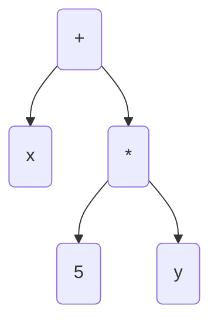

## Programování 2

# 10. cvičení, 22-04-2025


## Farní oznamy

1. Tento text a kódy ke cvičení najdete v repozitáří cvičení na https://github.com/PKvasnick/Programovani-2.
2. **Domácí úkoly** 
   1. Mrkev a petržel - omlouvám se, přehlédl jsem špatně nastavený limit na paměť. U všech řešení jsem ale manuálně nastavil správné body (pokud u vás ne, stěžujte si)
   2. Výpočet postfixového výrazu - většinou jste zvládli úplne správně.
3. **Zápočtový program**:  

   - Zatím mám dva návrhy na téma zápočtového programu - nezapomeňte na to.
   - V květnu začnu oslovovat opožděnce.


---

**Dnešní program**:

- Kvíz  
- Pythonské okénko
- Rekurze: kombinace a permutace
- Výpočet infixového výrazu
- Stromy aritmetických výrazů

---

## Na zahřátí

> Writing the first 90 percent of a computer program takes 90 percent of  the time. The remaining ten percent also takes 90 percent of the time  and the final touches also take 90 percent of the time. 
>
> **N.J. Rubenking**


---

### Co dělá tento kód

```python
def whoops():
    try:
        return True
    finally:
        return False
    
print(whoops())
```

Python takovýto kód explicitně nezakazuje, mnohé jiné jazyky ale ano. 

---

## Rekurze: Permutace, kombinace a podobná zviřátka

### Permutace

Chceme vygenerovat všechny permutace množiny (rozlišitelných) prvků. Nejjednodušší je použít rekurzivní metodu:

```python
def getPermutations(array):
    if len(array) == 1:
        return [array]
    permutations = []
    for i in range(len(array)): 
        # get all perm's of subarray w/o current item
        perms = getPermutations(array[:i] + array[i+1:])  
        for p in perms:
            permutations.append([array[i], *p])
    return permutations

print(getPermutations([1,2,3]))
```

Výhoda je, že dostáváme permutace setříděné podle původního pořadí. 

Nevýhoda je, že dostáváme potenciálně obrovský seznam, který se nám musí vejít do paměti. Nešlo by to vyřešít tak, že bychom dopočítávali permutace po jedné podle potřeby? 

```python
def getPermutations(array):
    if len(array) == 1:
        yield array
    else:
        for i in range(len(array)):
            perms = getPermutations(array[:i] + array[i+1:])
            for p in perms:
                yield [array[i], *p]

for p in getPermutations([1,2,3]):
    print(p)
```

### Kombinace

Kombinace jsou něco jiné než permutace - permutace jsou pořadí, kombinace podmnožiny dané velikosti. 

Začneme se standardní verzí, vracející seznam všech kombinací velikosti n. Všimněte si prosím odlišnosti oproti permutacím:

```python
def combinations(a, n):
    result = []
    if n == 1:
        for x in a:
            result.append([x])
    else:
        for i in range(len(a)):
            for x in combinations(a[i+1:], n-1):
                result.append([a[i], *x])
    return result

print(combinations([1,2,3,4,5],2))

[[1, 2], [1, 3], [1, 4], [1, 5], [2, 3], [2, 4], [2, 5], [3, 4], [3, 5], [4, 5]]
```

Teď už lehce vytvoříme generátor:

```python
def combi_gen(a, n):
    if n == 1:
        for x in a:
            yield [x]
    else:
        for i in range(len(a)):
            for x in combi_gen(a[i+1:], n-1):
                yield [a[i]] + x

for c in combi_gen([1,2,3,4,5],3):
    print(c)
```

Další variace: kombinace s opakováním pro bootstrap.

Generátory najdete v modulu `itertools`.

---

## Výpočet infixového výrazu

Máme výraz typu 

```python
1 + 4 * 3 / 2 - 2 * 8 =
```

a máme vypočíst jeho hodnotu.

*Poznámka*: "/" je pro jednoduchost operátor celočíselného dělení.

**První možnost** (poněkud podvratná): `eval`

```python
In[1]: eval("1 + 4 * 3 // 2 - 2 * 8")
Out[1]: -9
```

**Druhá možnost**: *shunting yard* algoritmus (Edsger Dijkstra): dva zásobníky (hodnoty a operátory).

```python
import re

def is_number(s):
    """
    Determines if a given string represents a number.
    """
    try:
        int(s)
        return True
    except ValueError:
        return False

def is_name(s):
    """
    Determines if a string matches a regular alphanumeric pattern.
    """
    return bool(re.match(r'\w+', s))

def peek(stack):
    """
    Peeks at the top element of a stack without popping it.
    """
    return stack[-1] if stack else None

def apply_operator(operators, values):
    """
    Applies an operator to the two most recent values in the values stack.
    """
    operator = operators.pop()
    right = values.pop()
    left = values.pop()
    formula = "{0}{1}{2}".format(left, operator, right)
    values.append(eval(formula))

def greater_precedence(op1, op2):
    """
    Determines if the precedence of op1 is greater than op2.
    """
    precedences = {'+' : 0, '-' : 0, '*' : 1, '/' : 1}
    return precedences[op1] > precedences[op2]

def evaluate(expression):
    """
    Evaluates a mathematical expression using the Shunting Yard Algorithm.
    """
    tokens = re.findall(r'[+/*()-]|\d+', expression)
    values, operators = [], []
    for token in tokens:
        if is_number(token):
            values.append(int(token))
        elif token == '(':
            operators.append(token)
        elif token == ')':
            while peek(operators) and peek(operators) != '(':
                apply_operator(operators, values)
            operators.pop() # Discard the '('
        else:
            while peek(operators) and peek(operators) not in "()" and greater_precedence(peek(operators), token):
                apply_operator(operators, values)
            operators.append(token)
    while peek(operators):
        apply_operator(operators, values)
    return values[0]

# Example demonstration:
def main():
    expression = '((20 - 10 ) * (30 - 20) / 10 + 10 ) * 2'
    print("Shunting Yard Algorithm Result:", evaluate(expression))
    print("Native Python Evaluation:", eval(expression))

if __name__ == '__main__':
    main()
```


### Operace se stromy výrazů



```python
class Expression:
    ...


class Constant(Expression):
    def __init__(self, value):
        self.value = value

    def __str__(self):
        return str(self.value)

    def eval(self, env):
        return self.value

    def derivative(self, by):
        return Constant(0)


class Variable(Expression):
    def __init__(self, name):
        self.name = name

    def __str__(self):
        return self.name

    def eval(self, env):
        return env[self.name]

    def derivative(self, by):
        if by == self.name:
            return Constant(1)
        else:
            return Constant(0)


class Plus(Expression):
    def __init__(self, left, right):
        self.left = left
        self.right = right

    def __str__(self):
        return f"({self.left} + {self.right})"

    def eval(self, env):
        return self.left.eval(env) + self.right.eval(env)

    def derivative(self, by):
        return Plus(
            self.left.derivative(by),
            self.right.derivative(by)
        )


class Times(Expression):
    def __init__(self, left, right):
        self.left = left
        self.right = right

    def __str__(self):
        return f"({self.left} * {self.right})"

    def eval(self, env):
        return self.left.eval(env) * self.right.eval(env)

    def derivative(self, by):
        return Plus(
            Times(
                self.left.derivative(by),
                self.right
            ),
            Times(
                self.left,
                self.right.derivative(by)
            )
        )

        
def main():
    vyraz = Plus(
        Variable("x"),
        Times(
            Constant(5),
            Variable("y")
        )
    )
    print(vyraz)
    print(vyraz.eval({"x": 2, "y": 4}))
    print(vyraz.derivative(by="x"))
    print(vyraz.derivative(by="y"))


if __name__ == '__main__':
    main()

```

Můžeme si vytvořit čistící proceduru, která stromy rekurzivně vyčistí, a opět postupujeme tak, že určité uzly či struktury ve stromu rekurzivně nahrazujeme jinými uzly či strukturami. 

```python
class Expression:
    ...


class Constant(Expression):
    def __init__(self, value):
        self.value = value

    def __str__(self):
        return str(self.value)

    def eval(self, env):
        return self.value

    def derivative(self, by):
        return Constant(0)

    def prune(self):
        return self

# Testování konstanty, zdali je či není 0 nebo 1 !!

def is_zero_constant(x):
    return isinstance(x, Constant) and x.value == 0


def is_unit_constant(x):
    return isinstance(x, Constant) and x.value == 1


class Variable(Expression):
    def __init__(self, name):
        self.name = name

    def __str__(self):
        return self.name

    def eval(self, env):
        return env[self.name]

    def derivative(self, by):
        if by == self.name:
            return Constant(1)
        else:
            return Constant(0)

    def prune(self):
        return self


class Plus(Expression):
    def __init__(self, left, right):
        self.left = left
        self.right = right

    def __str__(self):
        return "(" + str(self.left) + " + " + str(self.right) + ")"

    def eval(self, env):
        return self.left.eval(env) + self.right.eval(env)

    def derivative(self, by):
        return Plus(
            self.left.derivative(by),
            self.right.derivative(by)
        )

    def prune(self):
        self.left = self.left.prune()
        self.right = self.right.prune()
        if is_zero_constant(self.left):
            if is_zero_constant(self.right):
                return Constant(0)
            else:
                return self.right
        if is_zero_constant(self.right):
            return self.left
        return self


class Times(Expression):
    def __init__(self, left, right):
        self.left = left
        self.right = right

    def __str__(self):
        return "(" + str(self.left) + " * " + str(self.right) + ")"

    def eval(self, env):
        return self.left.eval(env) * self.right.eval(env)

    def derivative(self, by):
        return Plus(
            Times(
                self.left.derivative(by),
                self.right
            ),
            Times(
                self.left,
                self.right.derivative(by)
            )
        )

    def prune(self):
        self.left = self.left.prune()
        self.right = self.right.prune()
        if is_zero_constant(self.left) | is_zero_constant(self.right):
            return Constant(0)
        if is_unit_constant(self.left):
            if is_unit_constant(self.right):
                return Constant(1)
            else:
                return self.right
        if is_unit_constant(self.right):
            return self.left
        return self


def main():
    vyraz = Plus(
        Variable("x"),
        Times(
            Constant(5),
            Variable("y")
        )
    )
    print(vyraz)
    print(vyraz.derivative(by="x"))
    print(vyraz.derivative(by="x").prune())
    print(vyraz.derivative(by="y"))
    print(vyraz.derivative(by="y").prune())


if __name__ == '__main__':
    main()
-----------    
(x + (5 * y))
(1 + ((0 * y) + (5 * 0)))
1
(0 + ((0 * y) + (5 * 1)))
5
```

- Všimněte si post-order procházení stromu při prořezáváni.
- Metodu `prune` definujeme také pro konstanty a proměnné, i když s nimi nedělá nic. Ulehčuje to rekurzivní volání metody.
- Musíme být pozorní při testování, zda je daný uzel/výraz nulová nebo jedničková konstanta. Nestačí operátor rovnosti, musíme nejdřív zjistit, zda se jedná o konstantu a pak otestovat její hodnotu. V principu bychom mohli dvě testovací funkce proměnit v metody třídy `Expression`.

---


### Domácí úkoly

1. **Následující permutace** - máte k dané permutaci vypočíst permutaci, která následuje v abecedním pořadí bezprostředně za ní. Musíte objevit, jak to udělat., a musíte to objevit správně. 
2. **Věže na šachovnici** - modifikace úlohy o nekolizním rozmístění n dam na šachovnici n x n. Klasická úloha na backtracking - tedy prohledávání do hloubky. 

