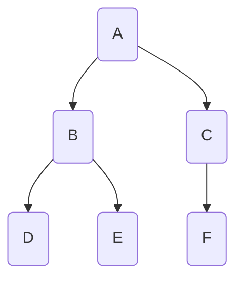
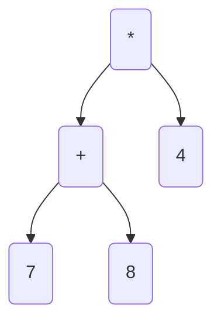
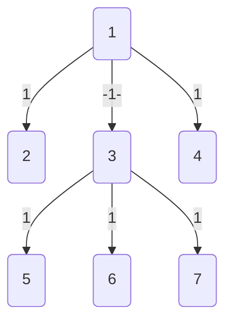
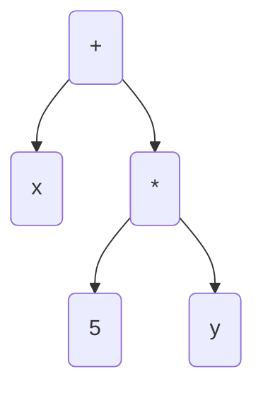
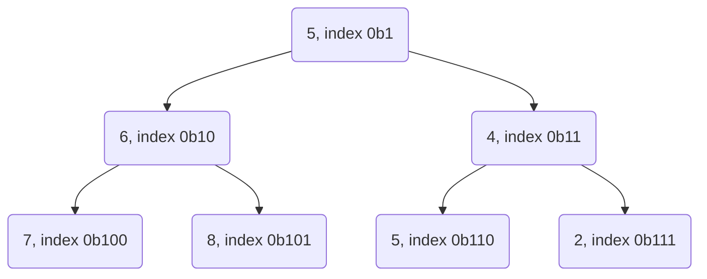

## Programování 2

# 11. cvičení, 05-05-2022

###### tags: `Programovani 2`,  `čtvrtek 1` `čtvrtek 2`

## Farní oznamy

1. Tento text a kódy ke cvičení najdete v repozitáří cvičení na https://github.com/PKvasnick/Programovani-2.
2. **Domácí úkoly** Dostali jste tři nové úkoly - komentář níže.
3. **Zápočtový program**:  

   - skupina Čt 10:40: 2 / 11

   - skupina Čt 12:20: 13 / 20.
   - Je opravdu důležité, abyste měli téma **co nejdříve**. Myslete na to, že specifikace budeme muset upřesňovat, takže to nejspíš nevyřídíte za jedno odpoledne.


---

**Dnešní program**:

- Kvíz  
- Pythonské okénko
- Domácí úkoly
- Opakování a rozšíření: Vyhodnocení reverzní polské notace, třídící stromy, halda
- Grafy a grafové algoritmy - úvod

---

## Na zahřátí

> Writing the first 90 percent of a computer program takes 90 percent of  the time. The remaining ten percent also takes 90 percent of the time  and the final touches also take 90 percent of the time. 
>
> **N.J. Rubenking**


---

### Co dělá tento kód

```html
<!DOCTYPE html>
<link rel="stylesheet" href="https://pyscript.net/alpha/pyscript.css" />
<script defer src="https://pyscript.net/alpha/pyscript.js"></script>

<html lang="en">
<head>
    <meta charset="UTF-8">
    <title>PyScript</title>
</head>
<body>
<py-script>
import math
print(f"This is square root of 2: {math.sqrt(2):6.4f}")
</py-script>
</body>
</html>
```

*PyScript* je docela horká novinka. Jestli se něco takové může uchytit, uvidíme časem. 

---

## Pythonské okénko: Permutace, kombinace a podobná zviřátka

### Permutace

Chceme vygenerovat všechny permutace množiny (rozlišitelných) prvků. Nejjednodušší je použít rekurzivní metodu:

```python
def getPermutations(array):
    if len(array) == 1:
        return [array]
    permutations = []
    for i in range(len(array)): 
        # get all perm's of subarray w/o current item
        perms = getPermutations(array[:i] + array[i+1:])  
        for p in perms:
            permutations.append([array[i], *p])
    return permutations

print(getPermutations([1,2,3]))
```

Výhoda je, že dostáváme permutace setříděné podle původního pořadí. 

Nevýhoda je, že dostáváme potenciálně obrovský seznam, který se nám musí vejít do paměti. Nešlo by to vyřešít tak, že bychom dopočítávali permutace po jedné podle potřeby? 

```python
def getPermutations(array):
    if len(array) == 1:
        yield array
    else:
        for i in range(len(array)):
            perms = getPermutations(array[:i] + array[i+1:])
            for p in perms:
                yield [array[i], *p]

for p in getPermutations([1,2,3]):
    print(p)
```

### Kombinace

Kombinace jsou něco jiné než permutace - permutace jsou pořadí, kombinace podmnožiny dané velikosti. 

Začneme se standardní verzí, vracející seznam všech kombinací velikosti n. Všimněte si prosím odlišnosti oproti permutacím:

```python
def combinations(a, n):
    result = []
    if n == 1:
        for x in a:
            result.append([x])
    else:
        for i in range(len(a)):
            for x in combinations(a[i+1:], n-1):
                result.append([a[i], *x])
    return result

print(combinations([1,2,3,4,5],2))

[[1, 2], [1, 3], [1, 4], [1, 5], [2, 3], [2, 4], [2, 5], [3, 4], [3, 5], [4, 5]]
```

Teď už lehce vytvoříme generátor:

```python
def combi_gen(a, n):
    if n == 1:
        for x in a:
            yield [x]
    else:
        for i in range(len(a)):
            for x in combi_gen(a[i+1:], n-1):
                yield [a[i]] + x

for c in combi_gen([1,2,3,4,5],3):
    print(c)
```

Další variace: kombinace s opakováním pro bootstrap.

Generátory najdete v modulu `itertools`:


## Domácí úkoly

Tři úkoly:

1. **Post-order výpis z in-order a pre-order**



D B E **A** F C	in-order
**A** B D E C F	pre-order

D E B F C **A**	post-order

Pre-order nám dává kořen, in-order nám umožňuje separovat levý a pravý podstrom.

2. **Evaluace prefixní notace**

Prefixní notace *není* RPL. 

*Vstup:*

```
/ + 1 2 2 
```

*Výstup:*

```
1
```




Výraz ve tvaru binárního stromu je jednoznačný a nepotřebuje závorky. Podle toho, jak výraz ze stromu přečteme, dostáváme různé typy notace: 

- in-order --> infixová notace (běžná notace, potřebuje závorky) (7+8) x 4
- Pre-order --> prefixová notace (polská logika, nepotřebuje závorky) * 4 +7 8
- Post-order --> postfixová notace (reverzní polská logika, nepotřebuje závorky) 7 8 + 4 *

Pro binární operátory je binární graf jednoznačným zápisem výrazu a nepotŕebuje závorky. P

Zásobník:

```
/
/ +
/ + 1
/ + 1 2 <-- dvě čísla na vrchu : 1 + 2 = 3
/ 3
/ 3 2   <-- dvě čísla na vrchu : 3 // 2 = 1
1       <-- jediné číslo v zásobníku = výsledek.
```


3. **Ořezávání stromu**

Vstup:

```
 7 <-- počet uzlů
 1 2 1 <-- od do cena
 1 3 1
 1 4 1
 3 5 1
 6 3 1
 7 3 1
```

Výsledný graf:




## Opakování

### Operace s výrazy ve tvaru stromů



Takovýto strom definuje polynom. Naučili jsme se počítat její *derivaci* přeměnou na jiný strom. Toto nám ale dává obecně větší strom, ve kterém bude spousta hlušiny:

```
(x + (5 * y))				<-- funkce
(1 + ((0 * y) + (5 * 0)))	<-- derivace podle x
(0 + ((0 * y) + (5 * 1)))   <-- derivace podle y
```

- příčítání nuly a násobení nulou
- násobení jedničkou

Můžeme si vytvořit čistící proceduru, která stromy rekurzivně vyčistí, a opět postupujeme tak, že určité uzly či struktury ve stromu rekurzivně nahrazujeme jinými uzly či strukturami. 

```python
class Expression:
    ...


class Constant(Expression):
    def __init__(self, value):
        self.value = value

    def __str__(self):
        return str(self.value)

    def eval(self, env):
        return self.value

    def derivative(self, by):
        return Constant(0)

    def prune(self):
        return self

# Testování konstanty, zdali je či není 0 nebo 1 !!

def is_zero_constant(x):
    return isinstance(x, Constant) and x.value == 0


def is_unit_constant(x):
    return isinstance(x, Constant) and x.value == 1


class Variable(Expression):
    def __init__(self, name):
        self.name = name

    def __str__(self):
        return self.name

    def eval(self, env):
        return env[self.name]

    def derivative(self, by):
        if by == self.name:
            return Constant(1)
        else:
            return Constant(0)

    def prune(self):
        return self


class Plus(Expression):
    def __init__(self, left, right):
        self.left = left
        self.right = right

    def __str__(self):
        return "(" + str(self.left) + " + " + str(self.right) + ")"

    def eval(self, env):
        return self.left.eval(env) + self.right.eval(env)

    def derivative(self, by):
        return Plus(
            self.left.derivative(by),
            self.right.derivative(by)
        )

    def prune(self):
        self.left = self.left.prune()
        self.right = self.right.prune()
        if is_zero_constant(self.left):
            if is_zero_constant(self.right):
                return Constant(0)
            else:
                return self.right
        if is_zero_constant(self.right):
            return self.left
        return self


class Times(Expression):
    def __init__(self, left, right):
        self.left = left
        self.right = right

    def __str__(self):
        return "(" + str(self.left) + " * " + str(self.right) + ")"

    def eval(self, env):
        return self.left.eval(env) * self.right.eval(env)

    def derivative(self, by):
        return Plus(
            Times(
                self.left.derivative(by),
                self.right
            ),
            Times(
                self.left,
                self.right.derivative(by)
            )
        )

    def prune(self):
        self.left = self.left.prune()
        self.right = self.right.prune()
        if is_zero_constant(self.left) | is_zero_constant(self.right):
            return Constant(0)
        if is_unit_constant(self.left):
            if is_unit_constant(self.right):
                return Constant(1)
            else:
                return self.right
        if is_unit_constant(self.right):
            return self.left
        return self


def main():
    vyraz = Plus(
        Variable("x"),
        Times(
            Constant(5),
            Variable("y")
        )
    )
    print(vyraz)
    print(vyraz.derivative(by="x"))
    print(vyraz.derivative(by="x").prune())
    print(vyraz.derivative(by="y"))
    print(vyraz.derivative(by="y").prune())


if __name__ == '__main__':
    main()
-----------    
(x + (5 * y))
(1 + ((0 * y) + (5 * 0)))
1
(0 + ((0 * y) + (5 * 1)))
5
```

- Všimněte si post-order procházení stromu při prořezáváni.
- Metodu `prune` definujeme také pro konstanty a proměnné, i když s nimi nedělá nic. Ulehčuje to rekurzivní volání metody.
- Musíme být pozorní při testování, zda je daný uzel/výraz nulová nebo jedničková konstanta. Nestačí operátor rovnosti, musíme nejdřív zjistit, zda se jedná o konstantu a pak otestovat její hodnotu. V principu bychom mohli dvě testovací funkce proměnit v metody třídy `Expression`.

**Domácí úkol**

Implementujte konstrukci, která ze stromu, kódujícího polynomiální funkci, vytvoří strom, kódující její primitivní funkci (podle některé proměnné). 

## Třídící stromy

Třídící bude binární strom, který bude mít v levém potomku menší hodnotu než ve vrcholu a v pravém větší.  Infixový výpis třídícího stromu je utříděný.

```python
# Binary search tree class


class BSTnode:
    def __init__(self, value = None, prev = None, left = None, right = None):
        self.value = value
        self.prev = prev
        self.left = left
        self.right = right

    def insert(self, value):
        if value > self.value:
            if self.right:
                self.right.insert(value)
            else:
                self.right = BSTnode(value, self, None, None)
        else:
            if self.left:
                self.left.insert(value)
            else:
                self.left = BSTnode(value, self, None, None)

    def to_string(self, level):
        strings = []
        if self.left:
            strings.append(self.left.to_string(level + 1))
        strings.append(" " * 4 * level + "->" + str(self.value))
        if self.right:
            strings.append(self.right.to_string(level + 1))
        return "\n".join(strings)

    def __repr__(self):
        return self.to_string(level = 0)

    def to_list_inorder(self):
        values = []
        if self.left:
            values.extend(self.left.to_list_inorder())
        values.append(self.value)
        if self.right:
            values.extend(self.right.to_list_inorder())
        return values

    def find(self, value):
        if self.value == value:
            return self
        if self.value < value:
            if self.right:
                return self.right.find(value)
        else:
            if self.left:
                return self.left.find(value)
        return None

    def depth(self):
        left_depth = 1
        if self.left:
            left_depth += self.left.depth()
        right_depth = 1
        if self.right:
            right_depth += self.right.depth()
        return max(left_depth, right_depth)

    def asymmetry(self):
        left_depth = 0
        if self.left:
            left_depth = self.left.depth()
        right_depth = 0
        if self.right:
            right_depth = self.right.depth()
        return right_depth - left_depth

    def rotate(self):
        new_tree = self.right
        new_tree.insert(self.value)
        print(new_tree)
        print(new_tree.asymmetry())
        return new_tree


def main() -> None:
    vals = [3, 6, 5, 2, 1, 8, 4, 9, 7, 0]
    tree = BSTnode(vals.pop())
    for val in vals:
        tree.insert(val)
    print(tree)
    print(tree.to_list_inorder())
    print(tree.find(11))
    print(tree.depth())
    print(tree.asymmetry())
    tree = tree.rotate()
    print(tree)
    print(tree.depth())
    print(tree.asymmetry())
    print(tree.to_list_inorder())


if __name__ == '__main__':
    main()
```

### Halda - heap

Binární strom, implementovaný v seznamu. Namísto struktury stromu používámee vztahy přes indexy:



- Potomci uzlu na indexu k jsou 2k a 2k+1
- Předek uzlu na indexu k je k // 2
- Uzel k je levý potomek svého předka, pokud k % 2 == 0, jinak je to pravý potomek.

```python
# heap implementation
from random import randint

def add(h:list[int], x:int) -> None:
    """Add x to the heap"""
    h.append(x)
    j = len(h)-1
    while j > 1 and h[j] < h[j//2]:
        h[j], h[j//2] = h[j//2], h[j]
        j //= 2


def pop_min(h: list[int]) -> int:
    """remove minimum element from the heap"""
    if len(h) == 1: # empty heap
        return None
    result = h[1]   # we have the value, but have to tidy up
    h[1] = h.pop()  # pop the last value and find a place for it
    j = 1
    while 2*j < len(h):
        n = 2 * j
        if n < len(h) - 1:
            if h[n + 1] < h[n]:
                n += 1
        if h[j] > h[n]:
            h[j], h[n] = h[n], h[j]
            j = n
        else:
            break
    return result


def main() -> None:
    heap = [None]  # no use for element 0
    for i in range(10):
        add(heap, randint(1, 100))
        print(heap)
    for i in range(len(heap)):
        print(pop_min(heap))
        print(heap)


if __name__ == '__main__':
    main()
```

