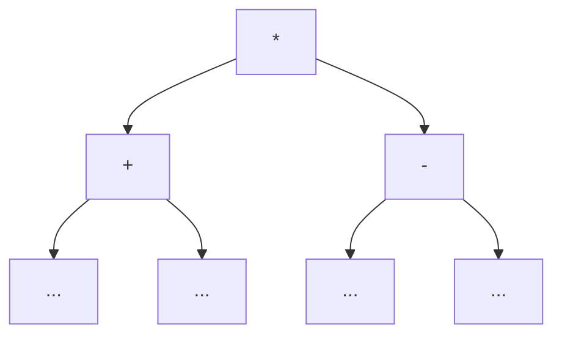
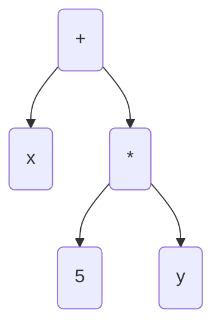

## Programování 2

# 11. cvičení, 27-04-2023

###### tags: `Programovani 2`,  `čtvrtek 1` `čtvrtek 2`

## Farní oznamy

1. Tento text a kódy ke cvičení najdete v repozitáří cvičení na https://github.com/PKvasnick/Programovani-2.
2. **Domácí úkoly**: 
   - Jedna úloha na zpracování řetězců - lehká
   - Výpočet prefixového výrazu
   - Přepis z postfixové do infixové notace: závorky. Promluvíme podrobněji.

3. **Zápočtový program**:  Pokud jste si ještě nezvolili téma, udělejte tak co nejdřív. Klidně mi také napište, pokud si neumíte vybrat nebo máte jiné nejasnosti.


---

**Dnešní program**:

- Kvíz  

- Pythonské okénko

- Domácí úkoly

- Min-max: Piškvorky

  

---

## Na zahřátí

> In order to understand recursion, one must first understand recursion. 

---

### Co dělá tento kód


Rozlišujeme, co je hodnota a co je pointer.

---

## Domácí úkoly

#### Evaluace prefixového výrazu

*Vstup:*

```
/ + 1 2 2 
```

*Výstup:*

```
1
```

Jak na to:

**Nerekurzivní řešení**

```python
from operator import add, sub, mul   # pro Pythonský způsob volby funkce

ops = {"+":add, "-":sub, "*":mul}    # znaménko: operace


def read_prefix() -> list[str]:
    return input().split()


def process_prefix(terms: list[str]) -> int:
    stack = []
    for t in reversed(terms):    # možno i t = terms.pop()
        if t in ops:
            stack.append(ops[t](stack.pop(), stack.pop()))
        else:
            stack.append(int(t))
    return stack[0]


def main() -> None:
    print(process_prefix(read_prefix()))

```

**Rekurzivní řešení** (Petro Velychko)

```python
from collections import deque


def parse(tokens):
    token = tokens.popleft()
    if token == '+':
        return parse(tokens) + parse(tokens)
    elif token == '-':
        return parse(tokens) - parse(tokens)
    elif token == '*':
        return parse(tokens) * parse(tokens)
    else:
        return int(token)


if __name__ == '__main__':
    print(parse(deque(input().split())))

```

#### Převod z postfixové do infixové notace

Vstup:

```
1 2 * 3 4 * 5 6 * 7 8 * - - -
```

Výstup:

```
1*2-(3*4-(5*6-7*8))
```

Největší problém je, kam dát závorky: pro rozhodnutí potřebujeme mít k dispozici správný kontext - operátor a nadřízený operátor. 



Tedy pro rozhodnutí, zda mají být kolem podvýrazu závorky, potřebuji nadřízený uzel. Jednodušší je nejdřív z výrazu vystavět strom:

```python
import sys

ops = ["+", "-", "*", "/"]


class Node:
    ...


class Constant(Node):
    def __init__(self, value: int):
        self.value = value


    def __str__(self):
        return str(self.value)


class Operation(Node):
    def __init__(self, op:str, left:Node=None, right:Node=None):
        self.op = op
        self.left = left
        self.right = right

    def needs_brackets_left(self) -> bool:
        left_op = "."
        if isinstance(self.left, Operation):
            left_op = self.left.op
        if self.op in ["*", "/"]:
            if left_op in ["+", "-"]:
                return True
            else:
                return False
        return False

    def needs_brackets_right(self) -> bool:
        right_op = "."
        if isinstance(self.right, Operation):
            right_op = self.right.op
        if self.op == "*":
            if right_op in ["+", "-"]:
                return True
            else:
                return False
        if self.op == "/":
            if right_op in ops:
                return True
            else:
                return False
        if self.op == "-":
            if right_op in ["+", "-"]:
                return True
            else:
                return False
        return False

    def __str__(self):
        left_string = f"{self.left}"
        if self.needs_brackets_left():
            left_string = "(" + left_string + ")"
        right_string = f"{self.right}"
        if self.needs_brackets_right():
            right_string = "(" + right_string + ")"

        return left_string + f"{self.op}" + right_string


def postfix_to_tree() -> Node:
    stack = []
    for term in input().split():
        if term in ops:
            right = stack.pop()
            left = stack.pop()
            stack.append(Operation(term, left, right))
        else:
            stack.append(Constant(int(term)))
    return stack.pop()


def main() -> None:
    tree = postfix_to_tree()
    print(tree)


if __name__ == "__main__":
    sys.setrecursionlimit(10000)
    main()

```

Pro delší výrazy si toto vyžaduje velikou rekurzní hloubku. 

**Nerekurzivní řešení**

Opět vybudujeme strom, ale nebudeme rekurzivně volat metodu `__str__()`. Namísto toho projdeme stromem a od každého operátoru, který potřebuje závorky, tyto posuneme k příslušnému levému a pravému listu. Pak in-order průchodem pomocí zásobníku vypíšeme výraz:

```python
import sys

ops = ["+", "-", "*", "/"]


class Node:
    ...


class Constant(Node):
    def __init__(self, value: int):
        self.value = value
        self.left = None
        self.right = None
        self.left_brackets = 0
        self.right_brackets = 0

    def __str__(self):
        return "(" * self.left_brackets + str(self.value) + ")" * self.right_brackets


class Operation(Node):
    def __init__(self, op:str, left: Node = None, right: Node = None):
        self.op = op
        self.left = left
        self.right = right
        self.left_brackets = 0
        self.right_brackets = 0

    def needs_brackets_left(self) -> bool:
        left_op = "."
        if isinstance(self.left, Operation):
            left_op = self.left.op
        if self.op in ["*", "/"]:
            if left_op in ["+", "-"]:
                return True
            else:
                return False
        return False

    def needs_brackets_right(self) -> bool:
        right_op = "."
        if isinstance(self.right, Operation):
            right_op = self.right.op
        if self.op == "*":
            if right_op in ["+", "-"]:
                return True
            else:
                return False
        if self.op == "/":
            if right_op in ops:
                return True
            else:
                return False
        if self.op == "-":
            if right_op in ["+", "-"]:
                return True
            else:
                return False
        return False

    def __str__(self):
        return self.op


def postfix_to_tree() -> Node:
    stack = []
    for term in input().split():
        if term in ops:
            right = stack.pop()
            left = stack.pop()
            stack.append(Operation(term, left, right))
        else:
            stack.append(Constant(int(term)))
    return stack.pop()


def set_brackets(tree) -> Node:
    stack = [tree]
    while stack:
        node = stack.pop()
        if node.left:
            if node.needs_brackets_left():
                node.left.left_brackets = node.left_brackets + 1
                node.left.right_brackets = 1
            else:
                node.left.left_brackets = node.left_brackets
            stack.append(node.left)
        if node.right:
            if node.needs_brackets_right():
                node.right.left_brackets = 1
                node.right.right_brackets = node.right_brackets + 1
            else:
                node.right.right_brackets = node.right_brackets
            stack.append(node.right)
    return tree


def tree_to_infix(tree: Node):
    stack = []
    current = tree
    while True:
        if current is not None:
            stack.append(current)
            current = current.left
        elif stack:
            current = stack.pop()
            yield str(current)
            current = current.right
        else:
            break


def main() -> None:
    tree = postfix_to_tree()
    tree = set_brackets(tree)
    print("".join(tree_to_infix(tree)))


if __name__ == "__main__":
    main()

```


## Opakování

### Operace s výrazy ve tvaru stromů



Takovýto strom definuje polynom. Naučili jsme se počítat její *derivaci* přeměnou na jiný strom. Toto nám ale dává obecně větší strom, ve kterém bude spousta hlušiny:

```
(x + (5 * y))				<-- funkce
(1 + ((0 * y) + (5 * 0)))	<-- derivace podle x
(0 + ((0 * y) + (5 * 1)))   <-- derivace podle y
```

- příčítání nuly a násobení nulou
- násobení jedničkou

Můžeme si vytvořit čistící proceduru, která stromy rekurzivně vyčistí, a opět postupujeme tak, že určité uzly či struktury ve stromu rekurzivně nahrazujeme jinými uzly či strukturami. 

```python
class Expression:
    ...


class Constant(Expression):
    def __init__(self, value):
        self.value = value

    def __str__(self):
        return str(self.value)

    def eval(self, env):
        return self.value

    def derivative(self, by):
        return Constant(0)

    def prune(self):
        return self

# Testování konstanty, zdali je či není 0 nebo 1 !!

def is_zero_constant(x):
    return isinstance(x, Constant) and x.value == 0


def is_unit_constant(x):
    return isinstance(x, Constant) and x.value == 1


class Variable(Expression):
    def __init__(self, name):
        self.name = name

    def __str__(self):
        return self.name

    def eval(self, env):
        return env[self.name]

    def derivative(self, by):
        if by == self.name:
            return Constant(1)
        else:
            return Constant(0)

    def prune(self):
        return self


class Plus(Expression):
    def __init__(self, left, right):
        self.left = left
        self.right = right

    def __str__(self):
        return "(" + str(self.left) + " + " + str(self.right) + ")"

    def eval(self, env):
        return self.left.eval(env) + self.right.eval(env)

    def derivative(self, by):
        return Plus(
            self.left.derivative(by),
            self.right.derivative(by)
        )

    def prune(self):
        self.left = self.left.prune()
        self.right = self.right.prune()
        if is_zero_constant(self.left):
            if is_zero_constant(self.right):
                return Constant(0)
            else:
                return self.right
        if is_zero_constant(self.right):
            return self.left
        return self


class Times(Expression):
    def __init__(self, left, right):
        self.left = left
        self.right = right

    def __str__(self):
        return "(" + str(self.left) + " * " + str(self.right) + ")"

    def eval(self, env):
        return self.left.eval(env) * self.right.eval(env)

    def derivative(self, by):
        return Plus(
            Times(
                self.left.derivative(by),
                self.right
            ),
            Times(
                self.left,
                self.right.derivative(by)
            )
        )

    def prune(self):
        self.left = self.left.prune()
        self.right = self.right.prune()
        if is_zero_constant(self.left) | is_zero_constant(self.right):
            return Constant(0)
        if is_unit_constant(self.left):
            if is_unit_constant(self.right):
                return Constant(1)
            else:
                return self.right
        if is_unit_constant(self.right):
            return self.left
        return self


def main():
    vyraz = Plus(
        Variable("x"),
        Times(
            Constant(5),
            Variable("y")
        )
    )
    print(vyraz)
    print(vyraz.derivative(by="x"))
    print(vyraz.derivative(by="x").prune())
    print(vyraz.derivative(by="y"))
    print(vyraz.derivative(by="y").prune())


if __name__ == '__main__':
    main()
-----------    
(x + (5 * y))
(1 + ((0 * y) + (5 * 0)))
1
(0 + ((0 * y) + (5 * 1)))
5
```

- Všimněte si post-order procházení stromu při prořezáváni.
- Metodu `prune` definujeme také pro konstanty a proměnné, i když s nimi nedělá nic. Ulehčuje to rekurzivní volání metody.
- Musíme být pozorní při testování, zda je daný uzel/výraz nulová nebo jedničková konstanta. Nestačí operátor rovnosti, musíme nejdřív zjistit, zda se jedná o konstantu a pak otestovat její hodnotu. V principu bychom mohli dvě testovací funkce proměnit v metody třídy `Expression`.


## Min-max: Piškvorky

Toto je jednoduchá hra, a chceme najít optimální strategii. Kam dát následující kroužek?


Data: seznam znaků x, o, . o délce 9 (nechceme 2D pole)

Hodnocení: Pokud se mřížce nachází trojice xxx, plus nekonečno. Pokud se v mřížce nachází trojice ooo, plus nekonečno. Jinak 0.

Detekce: Pro každý znak najdeme všechna místa, kde se nachází, a porovnáme se seznamem 8 možných trojic:

```python
INFINITY = 1
MINUS_INFINITY = - INFINITY

empty_grid = ["."] * 9
triples = [{0, 1, 2}, {3, 4, 5}, {6, 7, 8}, {0, 3, 6}, {1, 4, 7}, {2, 5, 8}, {0, 4, 8}, {2, 4, 6}]


def find_triple(grid, sign):
    positions = {i for i in range(9) if grid[i] == sign}
    result = [t for t in triples if t.issubset(positions)]
    return result


def grade(grid) -> int:
    if find_triple(grid, "x"):
        return INFINITY
    elif find_triple(grid, "o"):
        return MINUS_INFINITY
    else:
        return 0


def get_sign(player: bool) -> str:
    return "o" if player else "x"

```

Tisk mřížky:

```python
def print_grid(grid) -> None:
    print()
    for i in range(3):
        for j in range(3):
            print(grid[3*i + j], end = " ")
        print()
    print(grade(grid))
    print()
```

Strom:

```python
class Node:
    def __init__(self, grid):
        self.grid = grid
        self.df = self.grid.count(".")
        self.player = (9 - self.df) % 2
        self.score = grade(self.grid)
        self.children = []
```

Stavíme strom: 

Musíme dát pozor na kombinatoriku. Mnohé pozice můžeme dosáhnout několika způsoby, takže pro pozici, kterou jsme již viděli, použijeme existující uzel stromu:

```python
def build_tree(start_grid:list[int] = empty_grid) -> Node:
    node_dict = {}
    root = Node(start_grid)
    queue = deque([root])
    node_dict[tuple(start_grid)] = root
    n_nodes = 1
    while queue:
        node = queue.popleft()
        if node.score != 0:
            continue
        sign = get_sign(node.player)
        for pos in range(9):
            if node.grid[pos] == ".":
                new_grid = node.grid.copy()
                new_grid[pos] = sign
                if tuple(new_grid) in node_dict:
                    new_node = node_dict[tuple(new_grid)]
                else:
                    new_node = Node(new_grid)
                    node_dict[tuple(new_grid)] = new_node
                    queue.append(new_node)
                    n_nodes += 1
                node.children.append(new_node)
    print(n_nodes)
    return root

```

A konečně min-max:

```python
class Choice:
    def __init__(self, choice, value):
        self.choice = choice
        self.value = value


def minmax(node):
    if not node.children:
        return Choice("end", node.score)

    choices = [minmax(c) for c in node.children]
    if node.player == 0:
        max_result = max(c.value for c in choices)
        max_choices = [i for i in range(len(node.children)) if choices[i].value == max_result]
        return Choice(max_choices, max_result)
    else:
        min_result = min(c.value for c in choices)
        min_choices = [i for i in range(len(node.children)) if choices[i].value == min_result]
        return Choice(min_choices, min_result)


def play(start_grid = empty_grid):
    tree = build_tree(start_grid)
    current_node = tree
    while True:
        print_grid(current_node.grid)
        choice = minmax(current_node)
        if choice.choice == "end":
            print("Game finished")
            break
        select = random.choice(choice.choice)
        current_node = current_node.children[select]

```

Výsledný program:

```python
from collections import deque
import random

INFINITY = 1
MINUS_INFINITY = - INFINITY

empty_grid = ["."] * 9
triples = [{0, 1, 2}, {3, 4, 5}, {6, 7, 8}, {0, 3, 6}, {1, 4, 7}, {2, 5, 8}, {0, 4, 8}, {2, 4, 6}]


def find_triple(grid, sign):
    positions = {i for i in range(9) if grid[i] == sign}
    result = [t for t in triples if t.issubset(positions)]
    return result


def grade(grid) -> int:
    if find_triple(grid, "x"):
        return INFINITY
    elif find_triple(grid, "o"):
        return MINUS_INFINITY
    else:
        return 0


def get_sign(player: bool) -> str:
    return "o" if player else "x"


def print_grid(grid) -> None:
    print()
    for i in range(3):
        for j in range(3):
            print(grid[3*i + j], end = " ")
        print()
    print(grade(grid))
    print()


class Node:
    def __init__(self, grid):
        self.grid = grid
        self.df = self.grid.count(".")
        self.player = (9 - self.df) % 2
        self.score = grade(self.grid)
        self.children = []


def build_tree(start_grid:list[int] = empty_grid) -> Node:
    node_dict = {}
    root = Node(start_grid)
    queue = deque([root])
    node_dict[tuple(start_grid)] = root
    n_nodes = 1
    while queue:
        node = queue.popleft()
        if node.score != 0:
            continue
        sign = get_sign(node.player)
        for pos in range(9):
            if node.grid[pos] == ".":
                new_grid = node.grid.copy()
                new_grid[pos] = sign
                if tuple(new_grid) in node_dict:
                    new_node = node_dict[tuple(new_grid)]
                else:
                    new_node = Node(new_grid)
                    node_dict[tuple(new_grid)] = new_node
                    queue.append(new_node)
                    n_nodes += 1
                node.children.append(new_node)
    print(n_nodes)
    return root


class Choice:
    def __init__(self, choice, value):
        self.choice = choice
        self.value = value

    def __str__(self):
        return f"Choosing {self.choice} to reach {self.value}"


def minmax(node):
    if not node.children:
        return Choice("end", node.score)

    choices = [minmax(c) for c in node.children]
    if node.player == 0:
        max_result = max(c.value for c in choices)
        max_choices = [i for i in range(len(node.children)) if choices[i].value == max_result]
        return Choice(max_choices, max_result)
    else:
        min_result = min(c.value for c in choices)
        min_choices = [i for i in range(len(node.children)) if choices[i].value == min_result]
        return Choice(min_choices, min_result)


def play(start_grid = empty_grid):
    tree = build_tree(start_grid)
    current_node = tree
    while True:
        print_grid(current_node.grid)
        choice = minmax(current_node)
        if choice.choice == "end":
            print("Game finished")
            break
        select = random.choice(choice.choice)
        current_node = current_node.children[select]


def main() -> None:
    start_grid = input().split()
    play(start_grid)


if __name__ == "__main__":
    main()

```

