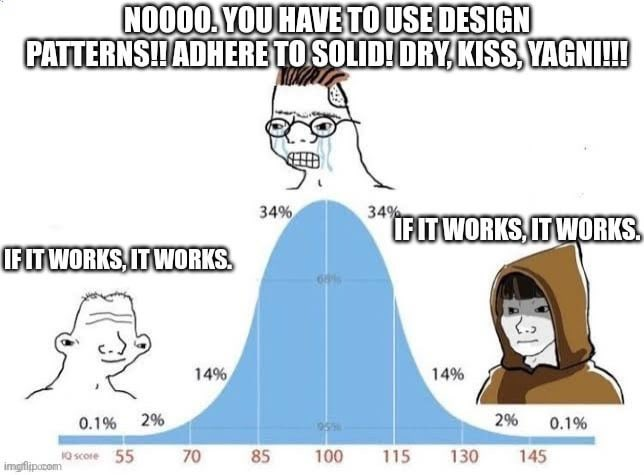
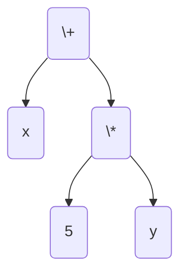
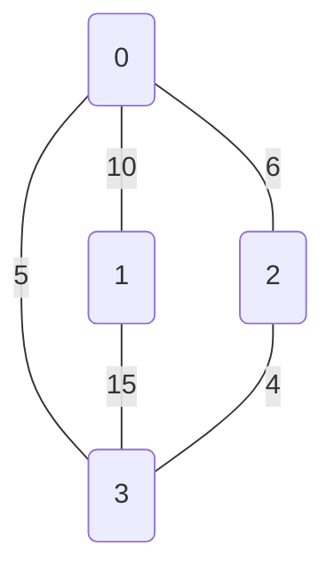

## Programování 2

# 11. cvičení, 28-04-2026


## Farní oznamy

1. Tento text a kódy ke cvičení najdete v repozitáří cvičení na https://github.com/PKvasnick/Programovani-2.

2. **Domácí úkoly** 

   - Následující permutace
   - Věže na šachovnici

   Poradili jste si dobře, víc níže.

3. Zápočtový program

   Zatím jsem se domluvil se třemi z vás na tématu zápočtového programu a jeden hotový zápočtový program jsem dokonce dostal. Příklad, jak může váš zápočtový program vypadat, najdete na https://github.com/kolik95/pexeso

   

4. **Průběh semestru**:

   * Ještě nás - kromě tohoto - čekají poslední dvě cvičení.

   * 19. května bude zápočtový test:
     
     * Přijdete na cvičení v obvyklém termínu 10:40, místnost N11.
     * Dostanete jedinou programovací úlohu, kterou vyřešíte přímo na cvičení ve vymezeném čase 75 minut.
     * Řešení nahrajete do ReCodExu a tam najdete i hodnocení. 
     
   * Zápočet za teoretické a praktické cvičení dostanete ode mne. Podmínky:
     * schválení od Dr. Forstové na teoretickém cvičení
     * domácí úkoly
     * zápočtový test
     * zápočtový program
     
   * Opravné prostředky: 
     * Umíme dát do pořádku mírná selhání v některých disciplínách - domácí úkoly, zápočtový test. U zápočtového programu máme poměrně široký prostor pro jednání i po zadání tématu.


---

**Dnešní program**:

- PathLib
- Domácí úkoly
- Operace se stromy výrazů
- Grafy a grafové algoritmy

---



Měli byste hlavně psát čistý a robustní kód.

---

## Práce v souborovém systému: `pathlib`

Třída `Path`: adresa objektu v souborovém systému.

```python
from pathlib import Path

Path("main.py").exists()
Out[3]: True

Path("img").mkdir()         # Nový adresář

Path("img").mkdir()         # Už existuje - chyba
Traceback (most recent call last):
  File "C:\ProgramData\Anaconda3\lib\site-packages\IPython\core\interactiveshell.py", line 3369, in run_code
    exec(code_obj, self.user_global_ns, self.user_ns)
  File "<ipython-input-5-c6fb86db84a7>", line 1, in <cell line: 1>
    Path("img").mkdir()
  File "C:\ProgramData\Anaconda3\lib\pathlib.py", line 1323, in mkdir
    self._accessor.mkdir(self, mode)
FileExistsError: [WinError 183] Cannot create a file when that file already exists: 'img'

Path("img").mkdir(exist_ok=True) # nedojde k chybě

```

Soubory můžeme také přesouvat. `pathlib` rozumí, v jakém operačním sytému pracuje:

```python
file = Path("sk.py").replace("img/sk.py")
file
Out[8]: WindowsPath('img/sk.py')
 
```

`.parent`, `.name`a další:

```python
Path("img").parent
Out[10]: WindowsPath('.')
Path("img").parent.parent
Out[11]: WindowsPath('.')
```

V jakém adresáři běží můj skript?

```python
from pathlib import Path

folder = Path("__file__").parent
print(folder)
```

---

## Domácí úkoly

Nic ke věžím, ty byly docela lehké. 

#### Následující permutace

Tato úloha je docela významná, protože umožňuje *nerekurzivně* generovat permutace. 

Typické řešení je takovéto:

```python
def next_permutation(arr):
    # 1. Najdi nejdelší neklesající posloupnost směrem od konce
    i = len(arr) - 2
    while i >= 0 and arr[i] >= arr[i + 1]:
        i -= 1
    if i == -1:
        return False  # Skončili jsme

    # 2. Najdi pivot (první větší hodnota než arr[i])
    j = len(arr) - 1
    while arr[j] <= arr[i]:
        j -= 1

    # 3. Prohoď s pivotem
    arr[i], arr[j] = arr[j], arr[i]

    # 4. Obrať pořadí
    arr[i + 1 :] = reversed(arr[i + 1 :])
    return True


def main() -> None:
    size = int(input())
    data = [int(s) for s in input().split()]
    if next_permutation(data):
        print(*data)
    else:
        print("Neexistuje.")


if __name__ == "__main__":
    main()

```

Toto není úplně dobrý kód, protože pracuje na globálním poli. Ale můžeme ho lehko uzavřít do generátoru a všechno bude v pořádku. Na podobném algoritmu je založen také generátor `permutations` v `itertools`.

#### A co kombinace?

Podobný algoritmus existuje i pro kombinace:

- Kombinace n prvků o velikosti k je k-tice indexů $0 \le k_0 \lt k_2 \lt \dots \lt k_r \lt n$ do výchozího pole. 
- Najdeme největší index, který lze inkrementovat. Pokud takový neexistuje, skončili jsme.
- Inkrementujeme nalezený index $k_i \rarr k_i + 1$
- Přestavím indexy vpravo podle inkrementovaného indexu: $k_{i+1} \rarr k_i + 1, k_{i+2} \rarr k_{i+1} + 1, \dots$.

Tedy pro kombinaci (1, 2, 4) z prvků (1, 2, 3, 4) sestrojíme následující kombinaci takto:

- Této kombinaci odpovídají indexy (0, 1, 3).
- Inkrementujeme prostřední index $1 \rarr$ 2, protože poslední index už nelze inkrementovat.
- Poslední index nastavíme na $2 + 1 = 3$.
- Výsledná kombinace má indexy (0, 2, 3) a tvoří ji prvky (1, 3, 4).

```python
def combinations_iterative(pool, r):
    n = len(pool)
    if r > n:
        return
    indices = list(range(r))
    # Pošli první kombinaci
    yield tuple(pool[i] for i in indices)
    while True:
        # Najdi index nejvíc vpravo, který lze inkrementovat-
        for i in reversed(range(r)):
            if indices[i] != i + n - r:
                break
        else:
            return # Skončili jsme
        indices[i] += 1
        # Nastav všechny indexy vpravo
        for j in range(i+1, r):
            indices[j] = indices[j-1] + 1
        yield tuple(pool[i] for i in indices)

# Použití:
# list(combinations_iterative("1234", 3))
# --> [('1', '2', '3'), ('1', '2', '4'), ('1', '3', '4'), ('2', '3', '4')]

```

---

### Operace se stromy výrazů



```python
class Expression:
    ...


class Constant(Expression):
    def __init__(self, value):
        self.value = value

    def __str__(self):
        return str(self.value)

    def eval(self, env):
        return self.value

    def derivative(self, by):
        return Constant(0)


class Variable(Expression):
    def __init__(self, name):
        self.name = name

    def __str__(self):
        return self.name

    def eval(self, env):
        return env[self.name]

    def derivative(self, by):
        if by == self.name:
            return Constant(1)
        else:
            return Constant(0)


class Plus(Expression):
    def __init__(self, left, right):
        self.left = left
        self.right = right

    def __str__(self):
        return f"({self.left} + {self.right})"

    def eval(self, env):
        return self.left.eval(env) + self.right.eval(env)

    def derivative(self, by):
        return Plus(
            self.left.derivative(by),
            self.right.derivative(by)
        )


class Times(Expression):
    def __init__(self, left, right):
        self.left = left
        self.right = right

    def __str__(self):
        return f"({self.left} * {self.right})"

    def eval(self, env):
        return self.left.eval(env) * self.right.eval(env)

    def derivative(self, by):
        return Plus(
            Times(
                self.left.derivative(by),
                self.right
            ),
            Times(
                self.left,
                self.right.derivative(by)
            )
        )

        
def main():
    vyraz = Plus(
        Variable("x"),
        Times(
            Constant(5),
            Variable("y")
        )
    )
    print(vyraz)
    print(vyraz.eval({"x": 2, "y": 4}))
    print(vyraz.derivative(by="x"))
    print(vyraz.derivative(by="y"))


if __name__ == '__main__':
    main()

```

Můžeme si vytvořit čistící proceduru, která stromy rekurzivně vyčistí, a opět postupujeme tak, že určité uzly či struktury ve stromu rekurzivně nahrazujeme jinými uzly či strukturami. 

```python
class Expression:
    ...


class Constant(Expression):
    def __init__(self, value):
        self.value = value

    def __str__(self):
        return str(self.value)

    def eval(self, env):
        return self.value

    def derivative(self, by):
        return Constant(0)

    def prune(self):
        return self

# Testování konstanty, zdali je či není 0 nebo 1 !!

def is_zero_constant(x):
    return isinstance(x, Constant) and x.value == 0


def is_unit_constant(x):
    return isinstance(x, Constant) and x.value == 1


class Variable(Expression):
    def __init__(self, name):
        self.name = name

    def __str__(self):
        return self.name

    def eval(self, env):
        return env[self.name]

    def derivative(self, by):
        if by == self.name:
            return Constant(1)
        else:
            return Constant(0)

    def prune(self):
        return self


class Plus(Expression):
    def __init__(self, left, right):
        self.left = left
        self.right = right

    def __str__(self):
        return "(" + str(self.left) + " + " + str(self.right) + ")"

    def eval(self, env):
        return self.left.eval(env) + self.right.eval(env)

    def derivative(self, by):
        return Plus(
            self.left.derivative(by),
            self.right.derivative(by)
        )

    def prune(self):
        self.left = self.left.prune()
        self.right = self.right.prune()
        if is_zero_constant(self.left):
            if is_zero_constant(self.right):
                return Constant(0)
            else:
                return self.right
        if is_zero_constant(self.right):
            return self.left
        return self


class Times(Expression):
    def __init__(self, left, right):
        self.left = left
        self.right = right

    def __str__(self):
        return "(" + str(self.left) + " * " + str(self.right) + ")"

    def eval(self, env):
        return self.left.eval(env) * self.right.eval(env)

    def derivative(self, by):
        return Plus(
            Times(
                self.left.derivative(by),
                self.right
            ),
            Times(
                self.left,
                self.right.derivative(by)
            )
        )

    def prune(self):
        self.left = self.left.prune()
        self.right = self.right.prune()
        if is_zero_constant(self.left) | is_zero_constant(self.right):
            return Constant(0)
        if is_unit_constant(self.left):
            if is_unit_constant(self.right):
                return Constant(1)
            else:
                return self.right
        if is_unit_constant(self.right):
            return self.left
        return self


def main():
    vyraz = Plus(
        Variable("x"),
        Times(
            Constant(5),
            Variable("y")
        )
    )
    print(vyraz)
    print(vyraz.derivative(by="x"))
    print(vyraz.derivative(by="x").prune())
    print(vyraz.derivative(by="y"))
    print(vyraz.derivative(by="y").prune())


if __name__ == '__main__':
    main()
-----------    
(x + (5 * y))
(1 + ((0 * y) + (5 * 0)))
1
(0 + ((0 * y) + (5 * 1)))
5
```

- Všimněte si post-order procházení stromu při prořezáváni.
- Metodu `prune` definujeme také pro konstanty a proměnné, i když s nimi nedělá nic. Ulehčuje to rekurzivní volání metody.
- Musíme být pozorní při testování, zda je daný uzel/výraz nulová nebo jedničková konstanta. Nestačí operátor rovnosti, musíme nejdřív zjistit, zda se jedná o konstantu a pak otestovat její hodnotu. V principu bychom mohli dvě testovací funkce proměnit v metody třídy `Expression`.

---


## Grafové algoritmy 1

### Faktorová množina - Disjoint set Union / Union Find

Spravujeme několik disjunktních množin prvků. Tato struktura umožňuje sloučit dvě množiny a říct, do které množiny patří daný prvek. 

Tři základní operace:

- `make_set(v)` - vytvoř set z daného prvku
- `union_sets(a, b)` - spojí množiny a, b do nové množiny
- `find_set(v)` - zjistí, do které množiny patří prvek v.

Jednotlivé množiny jsou strukturované jako stromy a kořen stromu je reprezentantem dané množiny. 


Faktorová množina umožňuje provádět základní operace v přibližně konstantním čase. 

Pro spravování struktury zavedeme pole `parent`, které pro každý prvek obsahuje referenci na bezprostředního předka.

**Naivní implementace**

```python
def make_set(v: int) -> int:
    parent[v] = v;


def find_set(v: int) -> int:
    if v == parent[v]:
        return v
    return find_set(parent[v])


def union_sets(a: int, b: int) -> None:
    a = find_set(a)
    b = find_set(b)
    if a != b:
        parent[b] = a

```

Takováto implementace může potřebovat čas O(n) pro nalezení prvku, pokud nám stromy zdegenerují na dlouhé řetězce prvků.

**Komprese cest - Path compression**

Když zavoláme `find_set(v)` pro nějaký prvek, cestou ke kořenu `p` fakticky najdeme reprezentanta pro každý prvek,  navštívený cestou. Optimalizace spočívá v tom, že u všech takto navštívených prvků nastavíme jako předka kořen `p`. Je potřeba vidět, že tento postup sice optimalizuje `find_set(v)`, ale ruší strukturu. 


Nová implementace `find_set` pak bude vypadat takto:

```python
def find_set(v: int) -> int:
    if v == parent[v]:
        return v
    parent[v] = find_set(parent[v])
    return parent[v]
}
```

Další optimalizace spočívá v zabezpečení toho, aby stromy při spojování množin zůstávaly dostatečně košaté. 

(doplnit)

### Minimální kostra - Minimum spanning tree


**Kruskalův algoritmus**:

- Každý vrchol začíná jako samostatná komponenta
- Komponenty vzájemně spojujeme nejlehčí hranou, ale tak, abychom nevytvářeli cykly.


Definice grafu (kód v `Ex11/kruskal_mst.py`)

```python
class Graph:

    def __init__(self, vertices):
        self.n_vertices = vertices  # No. of vertices
        self.graph = []  # triples from, to, weight

    def add_edge(self, start, end, weight):
        self.graph.append([start, end, weight])

        
def main() -> None:
    g = Graph(4)
    g.add_edge(0, 1, 10)
    g.add_edge(0, 2, 6)
    g.add_edge(0, 3, 5)
    g.add_edge(1, 3, 15)
    g.add_edge(2, 3, 4)

    g.kruskal_mst()


if __name__ == '__main__':
    main() 
```

Výchozí graf:



```python
# A utility function to find set of an element i
    # (uses path compression technique)
    def find(self, parent, i):
        if parent[i] == i:
            return i
        return self.find(parent, parent[i])
```

Hledáme, ke které komponentě grafu patří vrchol `i`.  Je-li samostatnou komponentou, vracíme samotný vrchol. Pokud ne, rekurzivně prohledáváme předky vrcholu.

```python
# A function that does union of two sets of x and y
    # (uses union by rank)
    def union(self, parent, rank, x, y):
        xroot = self.find(parent, x)
        yroot = self.find(parent, y)

        # Attach smaller rank tree under root of
        # high rank tree (Union by Rank)
        if rank[xroot] < rank[yroot]:
            parent[xroot] = yroot
        elif rank[xroot] > rank[yroot]:
            parent[yroot] = xroot

        # If ranks are same, then make one as root
        # and increment its rank by one
        else:
            parent[yroot] = xroot
            rank[xroot] += 1

```

Sjednocení komponent grafu: "Věšíme" menší na větší, `rank` je počet spojených prvků, není nutně rovný výšce stromu.

Výsledný algoritmus:

```python
    def kruskal_mst(self):

        result = []  # This will store the resultant MST

        # An index variable, used for sorted edges
        i_sorted_edges = 0

        # An index variable, used for result[]
        i_result = 0

        # Step 1:  Sort all the edges in
        # non-decreasing order of their
        # weight.  If we are not allowed to change the
        # given graph, we can create a copy of graph
        self.graph = sorted(self.graph,
                            key=lambda item: item[2])

        parent = []
        rank = []

        # Create V subsets with single elements
        for node in range(self.n_vertices):
            parent.append(node)
            rank.append(0)

        # Number of edges to be taken is equal to V-1
        while i_result < self.n_vertices - 1:

            # Step 2: Pick the smallest edge and increment
            # the index for next iteration
            u, v, w = self.graph[i_sorted_edges]
            i_sorted_edges = i_sorted_edges + 1
            x = self.find(parent, u)
            y = self.find(parent, v)

            # If including this edge doesn't
            #  cause cycle, include it in result
            #  and increment the indexof result
            # for next edge
            if x != y:
                i_result = i_result + 1
                result.append([u, v, w])
                self.union(parent, rank, x, y)
            # Else discard the edge

        minimumCost = 0
        print("Edges in the constructed MST")
        for u, v, weight in result:
            minimumCost += weight
            print("%d -- %d == %d" % (u, v, weight))
        print("Minimum Spanning Tree", minimumCost)

```

Výsledek pro náš graf:

```
Edges in the constructed MST
2 -- 3 == 4
0 -- 3 == 5
0 -- 1 == 10
Minimum Spanning Tree 19

```

---


## Domácí úkoly

- **Cesta věže** (co furt věže?) - hledání optimální dráhy věže na šachovnici s překážkami.
- **Domino** - další prohledávání

