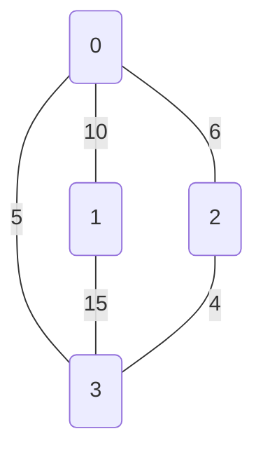

## Programování 2

# 12. cvičení, 12-05-2022

###### tags: `Programovani 2`,  `čtvrtek 1` `čtvrtek 2`

## Farní oznamy

1. Tento text a kódy ke cvičení najdete v repozitáří cvičení na https://github.com/PKvasnick/Programovani-2.
2. **Domácí úkoly** Zatím přibývají dobrá řešení, pochvala všem.
3. **Zápočtový program**:  
   - Je opravdu důležité, abyste měli téma **co nejdříve**. Myslete na to, že specifikace budeme muset upřesňovat, takže to nejspíš nevyřídíte za jedno odpoledne.

4. **Průběh semestru**:
   * Toto je poslední praktické cvičení
   * Příští týden bude zápočtový test:
     * Dostanete jedinou programovací úlohu, kterou vyřešíte přímo na cvičení ve vymezeném čase 75 minut.
     * Řešení nahrajete do ReCodExu a tam najdete i hodnocení. 
   * Zápočet za teoretické a praktické cvičení dostanete ode mne. Podmínky:
     * schválení od cvičícího na teoretickém cvičení
     * domácí úkoly
     * zápočtový test
     * zápočtový program
   * Opravné prostředky: 
     * Umíme dát do pořádku mírná selhání v některých disciplínách - domácí úkoly, zápočtový test a třeba i zápočtový program.


---

**Dnešní program**:

- Kvíz  
- Jedna úloha na zahřátí
- Grafy a grafové algoritmy

---

## Na zahřátí

> In order to understand recursion, one must first understand recursion. 
>

---

### Co dělá tento kód


Rozlišujeme, co je hodnota a co je pointer.

## Ještě rekurze: Problém osmi dam


**Řešení:**

V každém řádku, sloupci a na každé levo-pravé a pravo-levé diagonále máme maximálně jednu dámu.

- Implementujeme šachovnici jako _*slovník*_ s klíčem `(sloupec, radek)` a seznamem dam, které mají dané pole pod kontrolou.
- Pozice dam si pamatujeme v seznamu.
- Toto není optimální řešení, o možných zlepšeních si povíme. 

Kód v `Ex12/eight_queens.py`

```python
class Chessboard:
    def __init__(self):
        """Just create chessboard"""
        self.chessboard = dict([((i,j),set()) for i, j in product(range(SIZE), range(SIZE))])
        self.queens = []

    def is_in_range(self, k, l):
        return (k,l) in self.chessboard.keys()

    def is_available(self, i, j):
        """Is this field available for a queen?"""
        return len(self.chessboard[i,j]) == 0

```

Hodí se umět vytisknout šachovnici:

```python
    def print(self):
        chart = [["_" for _ in range(SIZE)] for _ in range(SIZE)]
        for pos, occ in self.chessboard.items():
            if len(occ) > 0:
                i, j = pos
                chart[i][j] = "o"
        for i, j in self.queens:
            chart[i][j] = "O"
        for i in range(SIZE):
            print(*chart[i])
            
o o o o o o o _
o o o O o o o o
O o o o o o o o
o o O o o o o o
o o o o o O o o
o O o o o o o o
o o o o o o O o
o o o o O o o o
```

Další věcí, kterou budeme potřebovat, je funkce, která položí dámu na dané pole a zapamatuje si dámou kontrolovaná pole tak, že dámu půjde lehce odstranit. 

První věcí je seznam polí, která kontroluje daná dáma: Od polohy dámy bookujeme pole v osmi směrech. 

```python
    def queen_fields(self, i, j):
        """Return a list of fields controlled by a queen at (i, j)"""
        steps = [(s, t) for s, t in product([-1,0,1], repeat=2) if not s==t==0]
        fields = set()
        for s, t in steps:
            k = i
            l = j
            while self.is_in_range(k, l):
                fields.add((k, l))
                k = k + s
                l = l + t
        return fields
```

Umístění a zrušení dámy:

```python
    def place_queen(self, i, j):
        """Place a new queen at i, j"""
        self.queens.append((i,j))
        for k,l in self.queen_fields(i, j):
            self.chessboard[k, l].add((i,j))

    def remove_queen(self):
        """Remove most recently added queen"""
        i, j = self.queens.pop()
        for k, l in self.queen_fields(i, j):
            try:
                self.chessboard[k, l].remove((i,j))
            except KeyError:
                print(f"Error removing ({i=}, {j=} from {self.chessboard[k, l]}")

```

Budeme postupně umísťovat dámy do sloupců šachovnice a hledat pozice, v nichž nebudou kolidovat. Prohledáváme do hloubky - když nic nenajdeme, vrátíme se o krok zpět. 

```python
def place_queens(k = 0):
    global Chessboard
    if k == 8:
        print("\nSolution:")
        Chessboard.print()
        return 8
    for i in range(SIZE):
        if not Chessboard.is_available(k, i):
            continue
        Chessboard.place_queen(k,i)
        place_queens(k+1)
        Chessboard.remove_queen()
    return k

```

Nakonec všechno sestavíme. 

```python
# Place SIZE queens on a chessboard such that
# 1. No pair of queens attack each other
# 2. Each field is under control of a queen

from itertools import product

SIZE = 8


@lambda cls: cls()  # Create class instance immediately
class Chessboard:
    def __init__(self):
        """Just create chessboard"""
        self.chessboard = dict([((i,j),set()) for i, j in product(range(SIZE), range(SIZE))])
        self.queens = []

    def is_in_range(self, k, l):
        return (k,l) in self.chessboard.keys()

    def is_available(self, i, j):
        """Is this field available for a queen?"""
        return len(self.chessboard[i,j]) == 0

    def queen_fields(self, i, j):
        """Return a list of fields controlled by a queen at (i, j)"""
        steps = [(s, t) for s, t in product([-1,0,1], repeat=2) if not s==t==0]
        fields = set()
        for s, t in steps:
            k = i
            l = j
            while self.is_in_range(k, l):
                fields.add((k, l))
                k = k + s
                l = l + t
        return fields

    def place_queen(self, i, j):
        """Place a new queen at i, j"""
        self.queens.append((i,j))
        for k,l in self.queen_fields(i, j):
            self.chessboard[k, l].add((i,j))

    def remove_queen(self):
        """Remove most recently added queen"""
        i, j = self.queens.pop()
        for k, l in self.queen_fields(i, j):
            try:
                self.chessboard[k, l].remove((i,j))
            except KeyError:
                print(f"Error removing ({i=}, {j=} from {self.chessboard[k, l]}")

    def print(self):
        chart = [["_" for _ in range(SIZE)] for _ in range(SIZE)]
        for pos, occ in self.chessboard.items():
            if len(occ) > 0:
                i, j = pos
                chart[i][j] = "o"
        for i, j in self.queens:
            chart[i][j] = "O"
        for i in range(SIZE):
            print(*chart[i])


def place_queens(k = 0):
    global Chessboard
    if k == 8:
        print("\nSolution:")
        Chessboard.print()
        return 8
    for i in range(SIZE):
        if not Chessboard.is_available(k, i):
            continue
        Chessboard.place_queen(k,i)
        place_queens(k+1)
        Chessboard.remove_queen()
    return k


def main():
    place_queens(0)


if __name__ == '__main__':
    main()

```

Řešení je hodně, takže se u nalezeného řešení nazastavujeme a pokračujeme dál. 

Vylepšení:

- Namísto obsazenosti polí šachovnice sledovat obsazení řádků, sloupů a diagonál. 

  Výhoda: 

  - 1D pole
  - Unikátní obsazenost, takže stačí logická pole.
  - Rychlejší nastavování a vyhledávání.

---

### Grafové algoritmy 1: 

## Minimální kostra - Minimum spanning tree


**Kruskalův algoritmus**:

- Každý vrchol začíná jako samostatná komponenta
- Komponenty vzájemně spojujeme nejlehčí hranou, ale tak, abychom nevytvářeli cykly.


Definice grafu (kód v `Ex12/kruskal_mst.py`)

```python
class Graph:

    def __init__(self, vertices):
        self.n_vertices = vertices  # No. of vertices
        self.graph = []  # triples from, to, weight

    def add_edge(self, start, end, weight):
        self.graph.append([start, end, weight])

        
def main() -> None:
    g = Graph(4)
    g.add_edge(0, 1, 10)
    g.add_edge(0, 2, 6)
    g.add_edge(0, 3, 5)
    g.add_edge(1, 3, 15)
    g.add_edge(2, 3, 4)

    g.kruskal_mst()


if __name__ == '__main__':
    main() 
```

Výchozí graf:



```python
# A utility function to find set of an element i
    # (uses path compression technique)
    def find(self, parent, i):
        if parent[i] == i:
            return i
        return self.find(parent, parent[i])
```

Hledáme, ke které komponentě grafu patří vrchol `i`.  Je-li samostatnou komponentou, vracíme samotný vrchol. Pokud ne, rekurzivně prohledáváme předky vrcholu.

```python
# A function that does union of two sets of x and y
    # (uses union by rank)
    def union(self, parent, rank, x, y):
        xroot = self.find(parent, x)
        yroot = self.find(parent, y)

        # Attach smaller rank tree under root of
        # high rank tree (Union by Rank)
        if rank[xroot] < rank[yroot]:
            parent[xroot] = yroot
        elif rank[xroot] > rank[yroot]:
            parent[yroot] = xroot

        # If ranks are same, then make one as root
        # and increment its rank by one
        else:
            parent[yroot] = xroot
            rank[xroot] += 1

```

Sjednocení komponent grafu: "Věšíme" menší na větší, `rank` je počet spojených prvků, není nutně rovný výšce stromu.

Výsledný algoritmus:

```python
    def kruskal_mst(self):

        result = []  # This will store the resultant MST

        # An index variable, used for sorted edges
        i_sorted_edges = 0

        # An index variable, used for result[]
        i_result = 0

        # Step 1:  Sort all the edges in
        # non-decreasing order of their
        # weight.  If we are not allowed to change the
        # given graph, we can create a copy of graph
        self.graph = sorted(self.graph,
                            key=lambda item: item[2])

        parent = []
        rank = []

        # Create V subsets with single elements
        for node in range(self.n_vertices):
            parent.append(node)
            rank.append(0)

        # Number of edges to be taken is equal to V-1
        while i_result < self.n_vertices - 1:

            # Step 2: Pick the smallest edge and increment
            # the index for next iteration
            u, v, w = self.graph[i_sorted_edges]
            i_sorted_edges = i_sorted_edges + 1
            x = self.find(parent, u)
            y = self.find(parent, v)

            # If including this edge doesn't
            #  cause cycle, include it in result
            #  and increment the indexof result
            # for next edge
            if x != y:
                i_result = i_result + 1
                result.append([u, v, w])
                self.union(parent, rank, x, y)
            # Else discard the edge

        minimumCost = 0
        print("Edges in the constructed MST")
        for u, v, weight in result:
            minimumCost += weight
            print("%d -- %d == %d" % (u, v, weight))
        print("Minimum Spanning Tree", minimumCost)

```

Výsledek pro náš graf:

```
Edges in the constructed MST
2 -- 3 == 4
0 -- 3 == 5
0 -- 1 == 10
Minimum Spanning Tree 19

```

### Grafové algoritmy 2: 

## Nejkratší cesta

**Dijkstrův algoritmus**

