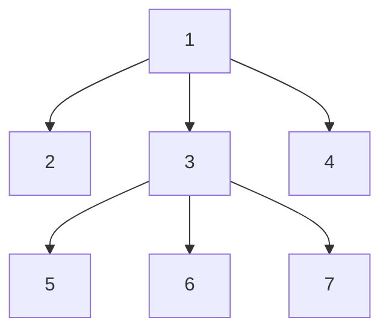
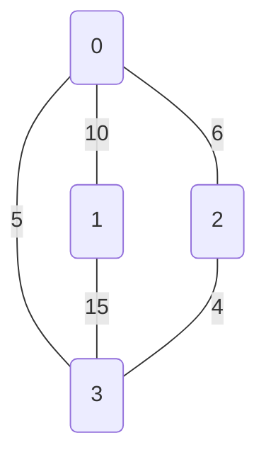

## Programování 2

# 12. cvičení, 04-05-2023

###### tags: `Programovani 2`,  `čtvrtek 1` `čtvrtek 2`

## Farní oznamy

1. Tento text a kódy ke cvičení najdete v repozitáří cvičení na https://github.com/PKvasnick/Programovani-2.
2. **Domácí úkoly** 

   - Piškvorky - lehké, ale dalo se vymyslet i těžké řešení a dokonce i nefungující řešení
   - Domino - velice typická úloha na prohledávání do hloubky. 
   - Řez stromu - těžší úloha, potřebovala promyslet postup.
3. **Zápočtový program**:  

   Většina z vás má už domluvené téma zápočtového programu. 

4. **Průběh semestru**:
   * Toto je předposlední praktické cvičení
   * 18. 5. bude zápočtový test:
     
     * Přijdete na cvičení v obvyklém termínu 10:40, resp. 15:40
     * Dostanete jedinou programovací úlohu, kterou vyřešíte přímo na cvičení ve vymezeném čase 75 minut.
     * Řešení nahrajete do ReCodExu a tam najdete i hodnocení. 
   * Zápočet za teoretické a praktické cvičení dostanete ode mne. Podmínky:
     * schválení od cvičícího na teoretickém cvičení
     * domácí úkoly
     * zápočtový test
     * zápočtový program
   * Opravné prostředky: 
     * Umíme dát do pořádku mírná selhání v některých disciplínách - domácí úkoly, zápočtový test a třeba i zápočtový program.


---

**Dnešní program**:

- Piškvorky
- Domácí úkoly
- Prohledávání stavového prostoru: 8 dam
- Grafy a grafové algoritmy

---

### Piškvorky

Opakování a doplnění z minula


Na minulém cvičení jsme dospěli k následující implementaci (min-max strategie):

Data: seznam znaků x, o, . o délce 9 (nechceme 2D pole)

Hodnocení: Pokud se mřížce nachází trojice xxx, plus nekonečno. Pokud se v mřížce nachází trojice ooo, plus nekonečno. Jinak 0.

Detekce: Pro každý znak najdeme všechna místa, kde se nachází, a porovnáme se seznamem 8 možných trojic:

```python
INFINITY = 1
MINUS_INFINITY = - INFINITY

empty_grid = ["."] * 9
triples = [{0, 1, 2}, {3, 4, 5}, {6, 7, 8}, {0, 3, 6}, {1, 4, 7}, {2, 5, 8}, {0, 4, 8}, {2, 4, 6}]


def find_triple(grid, sign):
    positions = {i for i in range(9) if grid[i] == sign}
    result = [t for t in triples if t.issubset(positions)]
    return result


def grade(grid) -> int:
    if find_triple(grid, "x"):
        return INFINITY
    elif find_triple(grid, "o"):
        return MINUS_INFINITY
    else:
        return 0


def get_sign(player: bool) -> str:
    return "o" if player else "x"

```

Tisk mřížky:

```python
def print_grid(grid) -> None:
    print()
    for i in range(3):
        for j in range(3):
            print(grid[3*i + j], end = " ")
        print()
    print(grade(grid))
    print()
```

Strom:

```python
class Node:
    def __init__(self, grid):
        self.grid = grid
        self.df = self.grid.count(".")
        self.player = (9 - self.df) % 2
        self.score = grade(self.grid)
        self.children = []
```

Stavíme strom: 

Musíme dát pozor na kombinatoriku. Mnohé pozice můžeme dosáhnout několika způsoby, takže pro pozici, kterou jsme již viděli, použijeme existující uzel stromu:

```python
def build_tree(start_grid:list[int] = empty_grid) -> Node:
    node_dict = {}
    root = Node(start_grid)
    queue = deque([root])
    node_dict[tuple(start_grid)] = root
    n_nodes = 1
    while queue:
        node = queue.popleft()
        if node.score != 0:
            continue
        sign = get_sign(node.player)
        for pos in range(9):
            if node.grid[pos] == ".":
                new_grid = node.grid.copy()
                new_grid[pos] = sign
                if tuple(new_grid) in node_dict:
                    new_node = node_dict[tuple(new_grid)]
                else:
                    new_node = Node(new_grid)
                    node_dict[tuple(new_grid)] = new_node
                    queue.append(new_node)
                    n_nodes += 1
                node.children.append(new_node)
    print(n_nodes)
    return root

```

A konečně min-max:

```python
class Choice:
    def __init__(self, choice, value):
        self.choice = choice
        self.value = value


def minmax(node):
    if not node.children:
        return Choice("end", node.score)

    choices = [minmax(c) for c in node.children]
    if node.player == 0:
        max_result = max(c.value for c in choices)
        max_choices = [i for i in range(len(node.children)) if choices[i].value == max_result]
        return Choice(max_choices, max_result)
    else:
        min_result = min(c.value for c in choices)
        min_choices = [i for i in range(len(node.children)) if choices[i].value == min_result]
        return Choice(min_choices, min_result)


def play(start_grid = empty_grid):
    tree = build_tree(start_grid)
    current_node = tree
    while True:
        print_grid(current_node.grid)
        choice = minmax(current_node)
        if choice.choice == "end":
            print("Game finished")
            break
        select = random.choice(choice.choice)
        current_node = current_node.children[select]

```

Výsledný program:

```python
from collections import deque
import random

INFINITY = 1
MINUS_INFINITY = - INFINITY

empty_grid = ["."] * 9
triples = [{0, 1, 2}, {3, 4, 5}, {6, 7, 8}, {0, 3, 6}, {1, 4, 7}, {2, 5, 8}, {0, 4, 8}, {2, 4, 6}]


def find_triple(grid, sign):
    positions = {i for i in range(9) if grid[i] == sign}
    result = [t for t in triples if t.issubset(positions)]
    return result


def grade(grid) -> int:
    if find_triple(grid, "x"):
        return INFINITY
    elif find_triple(grid, "o"):
        return MINUS_INFINITY
    else:
        return 0


def get_sign(player: bool) -> str:
    return "o" if player else "x"


def print_grid(grid) -> None:
    print()
    for i in range(3):
        for j in range(3):
            print(grid[3*i + j], end = " ")
        print()
    print(grade(grid))
    print()


class Node:
    def __init__(self, grid):
        self.grid = grid
        self.df = self.grid.count(".")
        self.player = (9 - self.df) % 2
        self.score = grade(self.grid)
        self.children = []


def build_tree(start_grid:list[int] = empty_grid) -> Node:
    node_dict = {}
    root = Node(start_grid)
    queue = deque([root])
    node_dict[tuple(start_grid)] = root
    n_nodes = 1
    while queue:
        node = queue.popleft()
        if node.score != 0:
            continue
        sign = get_sign(node.player)
        for pos in range(9):
            if node.grid[pos] == ".":
                new_grid = node.grid.copy()
                new_grid[pos] = sign
                if tuple(new_grid) in node_dict:
                    new_node = node_dict[tuple(new_grid)]
                else:
                    new_node = Node(new_grid)
                    node_dict[tuple(new_grid)] = new_node
                    queue.append(new_node)
                    n_nodes += 1
                node.children.append(new_node)
    print(n_nodes)
    return root


class Choice:
    def __init__(self, choice, value):
        self.choice = choice
        self.value = value

    def __str__(self):
        return f"Choosing {self.choice} to reach {self.value}"


def minmax(node):
    if not node.children:
        return Choice("end", node.score)

    choices = [minmax(c) for c in node.children]
    if node.player == 0:
        max_result = max(c.value for c in choices)
        max_choices = [i for i in range(len(node.children)) if choices[i].value == max_result]
        return Choice(max_choices, max_result)
    else:
        min_result = min(c.value for c in choices)
        min_choices = [i for i in range(len(node.children)) if choices[i].value == min_result]
        return Choice(min_choices, min_result)


def play(start_grid = empty_grid):
    tree = build_tree(start_grid)
    current_node = tree
    while True:
        print_grid(current_node.grid)
        choice = minmax(current_node)
        if choice.choice == "end":
            print("Game finished")
            break
        select = random.choice(choice.choice)
        current_node = current_node.children[select]


def main() -> None:
    start_grid = input().split()
    play(start_grid)


if __name__ == "__main__":
    main()

```

Zjistili jsme, že se kód chová v některých situacích divně:

```
. * * o . . . . . 
200

. * * 
o . . 
. . . 
0


o * * 
o . . 
. . . 
0


o * * 
o * . 
. . . 
0


o * * 
o * . 
o . . 
-1

Game finished

Process finished with exit code 0

```

To je způsobeno tím, že pozice, ze které vycházíme, je pro hráče * prohrávající a tedy všechno, co udělá, je stejně účinné. Abychom situaci trošku vylepšili, můžeme upřednostnit agresivní řešení - tedy cesty, které vedou k výhře rychleji:

```python
def minmax(node):
    aggresivity = 0.8
    if not node.children:
        return Choice("end", node.score)

    choices = [minmax(c) for c in node.children]
    if node.player == 0:
        max_result = max(c.value for c in choices)
        max_choices = [i for i in range(len(node.children)) if choices[i].value == max_result]
        return Choice(max_choices, aggresivity * max_result)
    else:
        min_result = min(c.value for c in choices)
        min_choices = [i for i in range(len(node.children)) if choices[i].value == min_result]
        return Choice(min_choices, aggresivity * min_result)


```

---

## Domácí úkoly

#### Domino

Toto je typická úloha na backtracking (vzpomeňte na Sudoku). Proto nebudu mluvit o řešení, ale  o  dvou technických detailech: 

- "obojakosti" kostek domina: kostka AB je zároveň také kostkou BA. 
- vícenásobných výskytech některých kostek

Tady to chce dobré designové rozhodnutí, jedna z možností je ukládat kostky domina do matice 7 x 7 (0-6 teček). Pokud se rozhodnete špatně, váš kód bude úpět. 

#### Piškvorková remíza

Základní postup: 

1. Funkce pro kontrolu správnosti mřížky
2. Systém pro generování mřížek

Toto stačí a je to velmi obecný princip.

#### Řezání stromu



Řez = odstranění hrany

Váha řezu = max((váha levého podstromu), (váha pravého podstromu))

K této úloze jsou kromě toho vyloženě podlé testy.  

**Řešení**: Fungují běžné postupy s rekurzivním i nerekurzivním prohledáváním, jenomže jsou $O(n^2)$.   Řešení, které je $O(n)$, se zakládá na "olupování listů".

```python

class Vertex:
    def __init__(self):
        self.edges = set()
        self.subtree_cost = 0

    def add_edge(self, end, cost):
        self.edges.add((end, cost))

    def remove_edge(self, end, cost):
        self.edges.remove((end, cost))

    def add_subtree_cost(self, cost):
        self.subtree_cost += cost

    def get_subtree_cost(self):
        return self.subtree_cost


n = int(input())
vertex_edges = [Vertex() for _ in range(n+1)]


def main() -> None:
    global n
    global vertex_edges
    total_cost = 0
    for i in range(n-1):
        start, end, cost = [int(c) for c in input().split()]
        vertex_edges[start].add_edge(end, cost)
        vertex_edges[end].add_edge(start, cost)
        total_cost += cost
    min_cost = 1.0e20
    leaves = [i for i in range(1, n+1) if len(vertex_edges[i].edges) == 1]
    while len(leaves) > 2:
        new_leaves = set()
        for leaf in leaves:
            end, cost = vertex_edges[leaf].edges.pop()
            leaf_cost = vertex_edges[leaf].get_subtree_cost()
            cut_cost = max(total_cost - cost - leaf_cost, leaf_cost)
            if cut_cost < min_cost:
                min_cost = cut_cost
            vertex_edges[end].add_subtree_cost(leaf_cost + cost)
            vertex_edges[end].remove_edge(leaf, cost)
            if len(vertex_edges[end].edges) == 1:
                new_leaves.add(end)
        leaves = new_leaves
    if len(leaves) == 2:
        current = leaves.pop()
        last = leaves.pop()
        while current != last:
            other, cost = vertex_edges[current].edges.pop()
            leaf_cost = vertex_edges[current].get_subtree_cost()
            cut_cost = max(total_cost - cost - leaf_cost, leaf_cost)
            if cut_cost < min_cost:
                min_cost = cut_cost
            if total_cost - cost - leaf_cost < leaf_cost:
                break
            vertex_edges[other].add_subtree_cost(leaf_cost + cost)
            vertex_edges[other].remove_edge(current, cost)
            current = other
    print(min_cost)


if __name__ == "__main__":
    main()

```


## Ještě rekurze: Problém osmi dam


**Řešení:**

V každém řádku, sloupci a na každé levo-pravé a pravo-levé diagonále máme maximálně jednu dámu.

- Implementujeme šachovnici jako _*slovník*_ s klíčem `(sloupec, radek)` a seznamem dam, které mají dané pole pod kontrolou.
- Pozice dam si pamatujeme v seznamu.
- Toto není optimální řešení, o možných zlepšeních si povíme. 

Kód v `Ex12/eight_queens.py`

```python
class Chessboard:
    def __init__(self):
        """Just create chessboard"""
        self.chessboard = dict([((i,j),set()) for i, j in product(range(SIZE), range(SIZE))])
        self.queens = []

    def is_in_range(self, k, l):
        return (k,l) in self.chessboard.keys()

    def is_available(self, i, j):
        """Is this field available for a queen?"""
        return len(self.chessboard[i,j]) == 0

```

Hodí se umět vytisknout šachovnici:

```python
    def print(self):
        chart = [["_" for _ in range(SIZE)] for _ in range(SIZE)]
        for pos, occ in self.chessboard.items():
            if len(occ) > 0:
                i, j = pos
                chart[i][j] = "o"
        for i, j in self.queens:
            chart[i][j] = "O"
        for i in range(SIZE):
            print(*chart[i])
            
o o o o o o o _
o o o O o o o o
O o o o o o o o
o o O o o o o o
o o o o o O o o
o O o o o o o o
o o o o o o O o
o o o o O o o o
```

Další věcí, kterou budeme potřebovat, je funkce, která položí dámu na dané pole a zapamatuje si dámou kontrolovaná pole tak, že dámu půjde lehce odstranit. 

První věcí je seznam polí, která kontroluje daná dáma: Od polohy dámy bookujeme pole v osmi směrech. 

```python
    def queen_fields(self, i, j):
        """Return a list of fields controlled by a queen at (i, j)"""
        steps = [(s, t) for s, t in product([-1,0,1], repeat=2) if not s==t==0]
        fields = set()
        for s, t in steps:
            k = i
            l = j
            while self.is_in_range(k, l):
                fields.add((k, l))
                k = k + s
                l = l + t
        return fields
```

Umístění a zrušení dámy:

```python
    def place_queen(self, i, j):
        """Place a new queen at i, j"""
        self.queens.append((i,j))
        for k,l in self.queen_fields(i, j):
            self.chessboard[k, l].add((i,j))

    def remove_queen(self):
        """Remove most recently added queen"""
        i, j = self.queens.pop()
        for k, l in self.queen_fields(i, j):
            try:
                self.chessboard[k, l].remove((i,j))
            except KeyError:
                print(f"Error removing ({i=}, {j=} from {self.chessboard[k, l]}")

```

Budeme postupně umísťovat dámy do sloupců šachovnice a hledat pozice, v nichž nebudou kolidovat. Prohledáváme do hloubky - když nic nenajdeme, vrátíme se o krok zpět. 

```python
def place_queens(k = 0):
    global Chessboard
    if k == 8:
        print("\nSolution:")
        Chessboard.print()
        return 8
    for i in range(SIZE):
        if not Chessboard.is_available(k, i):
            continue
        Chessboard.place_queen(k,i)
        place_queens(k+1)
        Chessboard.remove_queen()
    return k

```

Nakonec všechno sestavíme. 

```python
# Place SIZE queens on a chessboard such that
# 1. No pair of queens attack each other
# 2. Each field is under control of a queen

from itertools import product

SIZE = 8


@lambda cls: cls()  # Create class instance immediately
class Chessboard:
    def __init__(self):
        """Just create chessboard"""
        self.chessboard = dict([((i,j),set()) for i, j in product(range(SIZE), range(SIZE))])
        self.queens = []

    def is_in_range(self, k, l):
        return (k,l) in self.chessboard.keys()

    def is_available(self, i, j):
        """Is this field available for a queen?"""
        return len(self.chessboard[i,j]) == 0

    def queen_fields(self, i, j):
        """Return a list of fields controlled by a queen at (i, j)"""
        steps = [(s, t) for s, t in product([-1,0,1], repeat=2) if not s==t==0]
        fields = set()
        for s, t in steps:
            k = i
            l = j
            while self.is_in_range(k, l):
                fields.add((k, l))
                k = k + s
                l = l + t
        return fields

    def place_queen(self, i, j):
        """Place a new queen at i, j"""
        self.queens.append((i,j))
        for k,l in self.queen_fields(i, j):
            self.chessboard[k, l].add((i,j))

    def remove_queen(self):
        """Remove most recently added queen"""
        i, j = self.queens.pop()
        for k, l in self.queen_fields(i, j):
            try:
                self.chessboard[k, l].remove((i,j))
            except KeyError:
                print(f"Error removing ({i=}, {j=} from {self.chessboard[k, l]}")

    def print(self):
        chart = [["_" for _ in range(SIZE)] for _ in range(SIZE)]
        for pos, occ in self.chessboard.items():
            if len(occ) > 0:
                i, j = pos
                chart[i][j] = "o"
        for i, j in self.queens:
            chart[i][j] = "O"
        for i in range(SIZE):
            print(*chart[i])


def place_queens(k = 0):
    global Chessboard
    if k == 8:
        print("\nSolution:")
        Chessboard.print()
        return 8
    for i in range(SIZE):
        if not Chessboard.is_available(k, i):
            continue
        Chessboard.place_queen(k,i)
        place_queens(k+1)
        Chessboard.remove_queen()
    return k


def main():
    place_queens(0)


if __name__ == '__main__':
    main()

```

Řešení je hodně, takže se u nalezeného řešení nazastavujeme a pokračujeme dál. 

Vylepšení:

- Namísto obsazenosti polí šachovnice sledovat obsazení řádků, sloupů a diagonál. 

  Výhoda: 

  - 1D pole
  - Unikátní obsazenost, takže stačí logická pole.
  - Rychlejší nastavování a vyhledávání.

---

### Grafové algoritmy 1: 

## Minimální kostra - Minimum spanning tree


**Kruskalův algoritmus**:

- Každý vrchol začíná jako samostatná komponenta
- Komponenty vzájemně spojujeme nejlehčí hranou, ale tak, abychom nevytvářeli cykly.


Definice grafu (kód v `Ex12/kruskal_mst.py`)

```python
class Graph:

    def __init__(self, vertices):
        self.n_vertices = vertices  # No. of vertices
        self.graph = []  # triples from, to, weight

    def add_edge(self, start, end, weight):
        self.graph.append([start, end, weight])

        
def main() -> None:
    g = Graph(4)
    g.add_edge(0, 1, 10)
    g.add_edge(0, 2, 6)
    g.add_edge(0, 3, 5)
    g.add_edge(1, 3, 15)
    g.add_edge(2, 3, 4)

    g.kruskal_mst()


if __name__ == '__main__':
    main() 
```

Výchozí graf:



```python
# A utility function to find set of an element i
    # (uses path compression technique)
    def find(self, parent, i):
        if parent[i] == i:
            return i
        return self.find(parent, parent[i])
```

Hledáme, ke které komponentě grafu patří vrchol `i`.  Je-li samostatnou komponentou, vracíme samotný vrchol. Pokud ne, rekurzivně prohledáváme předky vrcholu.

```python
# A function that does union of two sets of x and y
    # (uses union by rank)
    def union(self, parent, rank, x, y):
        xroot = self.find(parent, x)
        yroot = self.find(parent, y)

        # Attach smaller rank tree under root of
        # high rank tree (Union by Rank)
        if rank[xroot] < rank[yroot]:
            parent[xroot] = yroot
        elif rank[xroot] > rank[yroot]:
            parent[yroot] = xroot

        # If ranks are same, then make one as root
        # and increment its rank by one
        else:
            parent[yroot] = xroot
            rank[xroot] += 1

```

Sjednocení komponent grafu: "Věšíme" menší na větší, `rank` je počet spojených prvků, není nutně rovný výšce stromu.

Výsledný algoritmus:

```python
    def kruskal_mst(self):

        result = []  # This will store the resultant MST

        # An index variable, used for sorted edges
        i_sorted_edges = 0

        # An index variable, used for result[]
        i_result = 0

        # Step 1:  Sort all the edges in
        # non-decreasing order of their
        # weight.  If we are not allowed to change the
        # given graph, we can create a copy of graph
        self.graph = sorted(self.graph,
                            key=lambda item: item[2])

        parent = []
        rank = []

        # Create V subsets with single elements
        for node in range(self.n_vertices):
            parent.append(node)
            rank.append(0)

        # Number of edges to be taken is equal to V-1
        while i_result < self.n_vertices - 1:

            # Step 2: Pick the smallest edge and increment
            # the index for next iteration
            u, v, w = self.graph[i_sorted_edges]
            i_sorted_edges = i_sorted_edges + 1
            x = self.find(parent, u)
            y = self.find(parent, v)

            # If including this edge doesn't
            #  cause cycle, include it in result
            #  and increment the indexof result
            # for next edge
            if x != y:
                i_result = i_result + 1
                result.append([u, v, w])
                self.union(parent, rank, x, y)
            # Else discard the edge

        minimumCost = 0
        print("Edges in the constructed MST")
        for u, v, weight in result:
            minimumCost += weight
            print("%d -- %d == %d" % (u, v, weight))
        print("Minimum Spanning Tree", minimumCost)

```

Výsledek pro náš graf:

```
Edges in the constructed MST
2 -- 3 == 4
0 -- 3 == 5
0 -- 1 == 10
Minimum Spanning Tree 19

```


