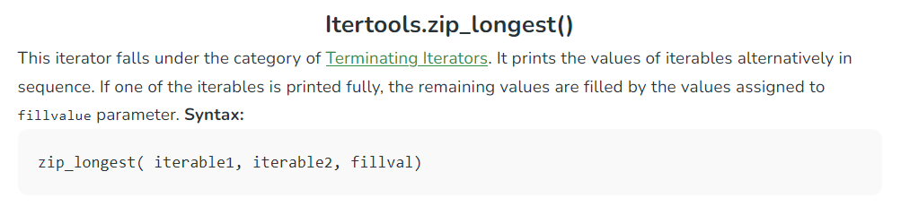
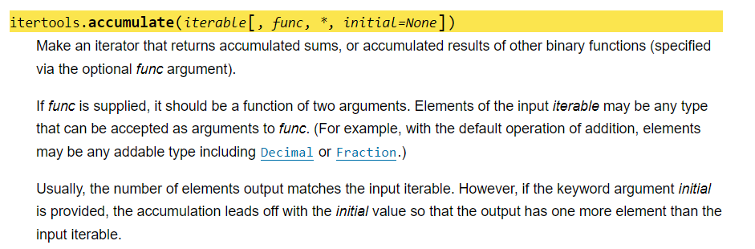

## Programování 2

# 2. cvičení, 25-2-2025


## Farní oznamy

1. Tento text a kódy ke cvičení najdete v repozitáří cvičení na https://github.com/PKvasnick/Programovani-2.
2. **Domácí úkoly**: 
   - Na první várku domácích úkolů přišlo docela dost řešení 
   - Byly to méně snadné úkoly, ale nakonec jsme povětšině dokonvergovali k rozumným řešením.
   - O nejčastějších problémech promluvíme podrobněji


---

**Obsah**:

- Kvíz
- Domácí úkoly:
  - Načítání posloupností

  - Kdy lze posloupnost zpracovat průběžně a jak to udělat?

- Resty z minula: sečítání čísel po číslicích


---

## Na zahřátí

> Pokud to funguje, nedotýkej se toho.


Dobrá, nebo špatná rada?

- nepromyšlené zásahy do kódu mohou mít nečekané důsledky
- to neznamená, že bychom se neměli snažit vylepšit ošklivý kód nebo doplnit nové funkce.

---

### Co dělá tento kód

```python
jmena = {"Jana", "Pavel", "Pepa", "Franta"}
dalsi = {"Eva", "Pepa", "Katka", "Standa"}
jmena & dalsi 
????
jmena and dalsi
jmena - dalsi
```

### Seřaďte podle data narození

```python
lide = [
    ("Jana", "Nováková", 1964),
    ("Kateřina", "Kocourová", 1962),
    ("Jozef", "Winkler", 1952),
    ("Petr", "Suchý", 1968),
    ("Jan", "Michal", 1951)
]
```

- `operator.itemgetter`
- lambda


---

## Domácí úkoly

### 1. Načtení posloupnosti z konzole a její zpracování

#### Načtení dat z řádku

Pokud máme na standardním vstupu data ve tvaru `1 2 3 5 8 ...`,  typický způsob načtení je

`a = [int(s) for s in input().split(5)]` (list comprehension), toto dává seznam (`list`).

nebo 

`a = map(int, input().split())` toto dává iterátor, pokud potřebujete, můžete ho zkovertovat na seznam, `list(a)`.

Načtená data lze rovnou rozbalit do příslušných proměnných:

`m, n = [int(s) for s in input().strip()]`

Toto je standardní metoda ne proto, že by nějak hezky vypadala, ale proto, že dělá načtení a konverzi v jediném kroku a tedy není potřebné zřizovat dočasná pole. 

Většina problémů v domácích úkolech byla v načítání dat. 

#### Načtení dat ze sloupce

Toto jste u domácích úkolů dělali 5běžně:

> Vstupní posloupnost načtete z konzoly číslo po čísel, každé číslo na novém řádku. Posloupnost je ukončená řádkou s −1, která nepatří do posloupnosti. 

##### Generická verze:

```python
def read_from_console() -> list[float]:
    a = []
    while True:
        line = input()
        if "-1" in line:
            break
        a.append(float(line))
	return a
```

Poznámky:

1. Kód `-> list[float]` oznamuje Pythonu, že výstupem funkce je seznam desetinných čísel. Podobně můžeme oznámit i typy parametrů, a analyzátor kódu ve vašem IDE pak zahlásí chybu, pokud někde použijeme nesprávný typ.
2. Logika: Máme nekonečný cyklus a vyskakujeme z něj, pokud narazíme na znak konce posloupnosti. 
3. Testujeme `"-1" in line` namísto `line == "-1"` Proč? (Už vás někdy ReCodEx trýznil hláškami `End-of-file error` u testů?)

Ze souboru:

```python
def read_from_file(filename: str) -> list[float]:
    a = []
    with open(filename, "r") as infile:
        for lines in infile:
            if "-1" in line:
                break
            a.append(float(line))
    return a 
```

##### Načíst do paměti nebo nenačíst?

U některých úkolů dokážeme čísla zpracovávat postupně a nepotřebujeme mít celou posloupnost uloženou v paměti. 

**Příklad:** : nalezení maximální hodnoty, výpočet průměru a standardní odchylky

V těchto případech má algoritmus formu propagování nějakého vnitřního stavu přes vstupná data:  Začneme počátečním stavem (např. nejmenší možnou hodnotou typu `float`, tedy `float('-inf')`) a jak přicházejí data, aktualizujeme ji (např. se u každé vstupní hodnoty ptáme: Je toto největší hodnota, jakou jsem doposud viděl? a pokud je, nastavíme vnitřní stav na tuto hodnotu).  Na konci máme výsledný stav (například maximální hodnotu posloupnosti) a umíme dokázat, jaké má vlastnosti (například že je to opravdu maximum posloupnosti).

Příklady:

- maximum
- k-tý největší prvek
- střední hodnota a standardní odchylka

Naopak, u jiných úloh potřebujeme mít posloupnost v paměti celou nebo její podstatnou část

Příklady: 

- medián
- dělící bod posloupnosti

#### Načítání pomocí generátoru

Pokud chceme hledat například maximum posloupnosti a nechceme ji celou načítat, musíme kód pro načítání a hledání promíchat. To je nešťastné, pokud chceme pro zpracování posloupnosti použít stejný kód pro načítání ze standardního vstupu nebo souboru. 

```python
m = float("-inf")
while "-1" not in (line := input()):
    number = float(line)
    if number > m:
        m = number
        
```

Poznámky:

- Inicializace: `float("-inf")` je nejmenší číslo v plovoucí desetinné čárce. Jaké je nejmenší celé číslo?
- `:=` je “walrus”, čili mroží operátor, pomocí kterého můžeme ukrást hodnotu, kterou načte `input()` do proměnné `line`. To je šikovné a řeší to malý problém s logikou načítacího cyklu: protože v cyklu načítáme, musíme kód zpřeházet, pokud chceme testovat v hlavičce `while` anebo testovat uvnitř cyklu a použít `break`

```python
def read_from_console():
    while "-1" not in (line := input()):
        yield float(line)
    return

m = float("-inf")
for number in read_from_console():
    if number > m:
        m = number
print(m)
```

Napište kód, který takto nalezne maximum při načítání posloupnosti ze souboru. 

#### Reduce

Uměli bychom uzavřít otevřený cyklus `while`, resp. `for`, který máme v tomto kódu?

Můžeme použít funkci `functools.reduce`, která dělá přibližně toto:

```python
def reduce(function, iterable, initializer=None):
    it = iter(iterable)
    if initializer is None:
        value = next(it)
    else:
        value = initializer
    for element in it:
        value = function(value, element)
    return value
```

Tedy funkce `reduce` propaguje a aktualizuje nějaký stav přes posloupnost. 

```python
from functools import reduce

def read_from_console():
    while "-1" not in (line := input()):
        yield float(line)
    return

maximum = reduce(max, read_from_console, float("-inf"))
print(maximum)
```

Takovýto kód bude rychlý, protože cyklus se vykonává uvnitř funkce, a tedy běží v C a ne v Pythonu.

####  Podobné úlohy

- rozhodnout, zda je posloupnost čísel monotonní a jak (konstantní, rostoucí, neklesající, klesající, nerostoucí) 
- v posloupnosti čísel nalézt druhou největší hodnotu a počet jejích výskytů
- v posloupnosti čísel určit délku nejdelšího souvislého rostoucího úseku
- v posloupnosti čísel určit počet různých hodnot
- v posloupnosti čísel nalézt souvislý úsek se součtem K (pro zadanou hodnotu K)
- v posloupnosti kladných čísel nalézt souvislý úsek se součtem K (pro zadanou hodnotu K)
- v posloupnosti čísel nalézt souvislý úsek s maximálním součtem.

### Úloha o pozicích prvků ve sloučené posloupnosti

Toto není těžká úloha, pokud umíte spojit dvě setříděné posloupnosti:

```python
n = int(input())
seq1 = [int(s) for s in input().split()]
m = int(input())
seq2 = [int(s) for s in input().split()]

seq = [0] * (m + n)
i = j = k = 0
while i < n and j < m:
    if seq1[i] <= seq2[j]:
        seq[k] = seq1[i]
        i += 1
    else:
        seq[k] = seq2[j]
        j += 1
    k += 1

while i < n:
    seq[k] = seq1[i]
    i += 1
    k += 1
while j < m:
    seq[k] = seq2[j]
    j += 1
    k += 1

assert (k == n + m)
print(*seq)

```

Pro řešení domácího úkolu děláme prakticky to samé, 

- ale výsledky jsou indexová pole, do kterých ukládáme index $k$ podle toho, zda do `c[k]` přiřazujeme `a[i]` nebo `b[j]`.
- pole c vůbec nevytváříme, protože ho nepotřebujeme.

U obou úloh používáme jediný průchod posloupnostmi, takže složitost bude O(m+n).

**Ztracené a hledané**

Časté řešení: setřídit pole do společného pole a pak hledat, kde se nacházejí jednotlivé položky z a a b. Takové řešení má dva problémy:

- setřídění je $O((m+n)\log(m+n))$, vyhledávání podobně.
- toto řešení nefunguje, pokud jsou v polích a, b některé hodnoty stejné. 

Příbuzné s  tímto řešením a naprosto správné je toto: přidáme značku k prvkům `a` a jinou značku k prvkům `b`, setřídíme, a podle značek vyfiltrujeme pozice prvků z `a` a `b`.

```python
m, n = [int(s) for s in input().split()]
a = [int(s) for s in input().split()]
b = [int(s) for s in input().split()]

tuples = [(ai, "A") for ai in a] + [(bi, "B") for bi in b]
tuples.sort()
a_index = [i for i, (val, flag) in enumerate(tuples) if flag == "A"]
b_index = [i for i, (val, flag) in enumerate(tuples) if flag == "B"]

print(*a_index)
print(*b_index)

```

Tady přiřazujeme index podle značky a ne podle hodnoty, takže stejné hodnoty nedělají problémy. 

---

O

## Z minula

**Součet dvou čísel**

Na vstupu načteme dvě celá čísla jako znakové řetězce. Na výstupu má váš kód vypsat jejich součet, ale máte povolenou sečítat pouze číslice 0-9, ne celá čísla. Můžete si představit, že pro sčítání máte k dispozici tabulku typu

|         | **0**  | **1**  | **...** | **8**  | **9**  |
| ------- | ------ | ------ | ------- | ------ | ------ |
| **0**   | (0, 0) |        |         |        |        |
| **1**   | (1, 0) | (2, 0) |         |        |        |
| **2**   | (2, 0) | (3, 0) |         |        |        |
| **...** |        |        |         |        |        |
| **8**   | (8, 0) | (9, 0) |         | (6, 1) |        |
| **9**   | (9, 0) | (0, 1) |         | (7, 1) | (8, 1) |

kde první číslo jsou jednotky součtu a druhé číslo je "přenos". 

**Poznámky**

* Jak to naprogramovat, aby kód byl hezký a rozumně efektivní? ("uzavřené" cykly: namísto `for` a `while`  atd.)

- Funkce `zip` a funkce `itertools.zip_longest`
- Samozřejmě budeme chtít také odečítat, násobit a dělit. Umíme vytvořit nějaký sjednocující algoritmus?

---

Zkusíme jednoduché věci:

1. Načtení čísla

předpokládáme jedno celé číslo na řádku

```python
digits = [int(c) for c in input()]
```

2. Dvojice číslic pozpátku:

```python
from itertools import zip_longest
```



```python
zip_longest(get_digits_reversed(digits1), get_digits_reversed(digits2),0)
```

4. Sečítání s přechodem:

```python
def add_and_carry(d1:int, d2:int) -> {int, int}:
    return divmod(d1+d2,10)
```

Na výstupu budeme mít dvojici (přechod, součet). Jak ale budeme takovéto dvojice sečítat v cyklu? 

```python
from itertools import accumulate
```



Funkce `accumulate` bude postupně zpracovávat dvě dvojice číslic a z nich vytvoří novou dvojici. Jak to uděláme?

5. Teď už je lehké dát všechno dohromady:

```python
from itertools import zip_longest
from itertools import accumulate


def sum_by_digits(list_a : list[int], list_b : list[int]) -> list[int]:
    '''
    Sums two integers given as lists of digits.
    :param list_a: list of digits of the first number
    :param list_b: list of digits of the second number
    :return: list of digits of the sum
    '''
    a = list_a.copy()    # avoid side effect
    b = list_b.copy()
    tuples = list(accumulate(zip_longest(a, b, fillvalue=0), func=add_and_carry, initial=(0,0)))
    tuples.reverse()
    tuples.pop()    # remove initial state
    carry = tuples[0][1]	# first carry to start of result if not 0
    result = [carry] if carry != 0 else []
    result += [u for u, v in tuples]	# extract first items of tuples
    return result


def main() -> None:
    ''''
    Demo
    ''''
    a0 = [int(c) for c in input()]
    b0 = [int(c) for c in input()]
    print("First number: ", *a0, sep = "")
    print("Second number: ",*b0, sep = "")
    digit_sum = sum_by_digits(a0, b0)
    print(*digit_sum, sep="")
    print("Kontrola:")
    a0_int = int("".join([str(d) for d in a0]))
    b0_int = int("".join([str(d) for d in b0]))
    print(a0_int + b0_int)


if __name__ == "__main__":
    main()

```

Je toto dobrý kód? Můžeme to všechno udělat v cyklu `for` nebo `while`, abychom se vyhli černé skříňce `accumulate`. Takový kód by byl naprosto vyhovující, pokud bychom neměli v úmyslu sečítat extrémně dlouhá čisla. Na druhé straně, většině drobné práce s obracením posloupnosti bychom se stejně nevyhli, protože čísla čteme zepředu, ale sečítáme je odzadu. 


## Domácí úkoly

Dnes dostanete úkoly, které volně souvisí s tříděním. U jedné hledáme, jestli je posloupnost částečně setříděná, zatímco druhá je zjednodušenou variantou důležité úlohy z dynamického programování. 

1. **Dělící bod posloupnosti** - najít v posloupnosti čísel takový index, že položky vlevo jsou menší a položky vpravo jsou větší než hodnota na tomto indexu.
2. **Minimální a maximální součet** - najít v posloupnosti $n$ čísel $k$5 čísel s minimálním a $k$ čísel s maximálním součtem.

