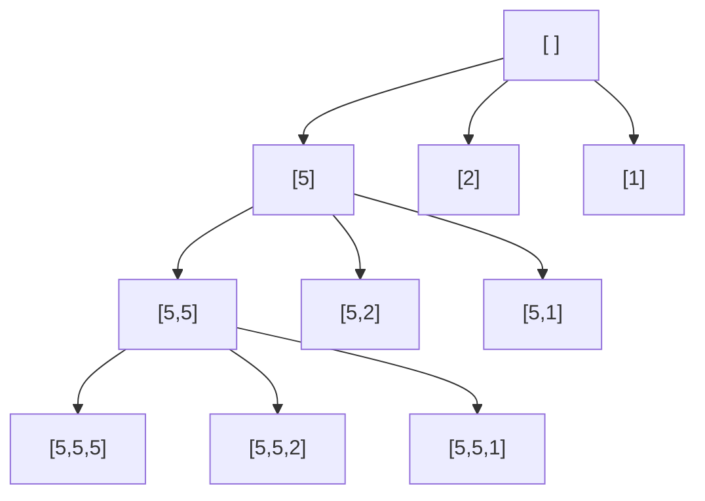

## Programování 2

# 3. cvičení, 2-3-2022

###### tags: `Programovani 2`, `čtvrtek 1`, `čtvrtek 2`

## Farní oznamy

1. Tento text a kódy ke cvičení najdete v repozitáří cvičení na https://github.com/PKvasnick/Programovani-2.
2. **Domácí úkoly**: 
   - Tento týden jste měli těžší domácí úkoly (2 těžké a 1 lehký)
   - Poradili jste si výborně
   - Budeme se úkolům dnes věnovat
   - Na další týden si dáme něco lehčího.


---

**Dnešní program**:

- Kvíz

- Domácí úkoly

- Opakování: Načítání a zpracování posloupností , matice

- BInární vyhledávání

  

## Na zahřátí

> *“First, solve the problem. Then, write the code.” – John Johnson*

Neboli **mějte po ruce  tužku a papír**. 

### Co dělá tento kód

```python
dict(zip(range(1,4), ["Pascal", "Python", "C++", "Javascript"]))
```

### Pojmenované n-tice

```python
from collections import namedtuple
Point = namedtuple("Point", "x y")
point = Point(5, 6)
point.x
Out[5]: 5
point.y
Out[6]: 6
```

Toto je jedna z možností, jak implementovat kontejner s různorodými daty, která spolu souvisí. 

## Domácí úkoly

### Spojování utříděných seznamů


---

### Platba mincemi a Youngovy tabulky

Obě úlohy jsou docela podobné, i když pro Youngovy tabulky máme zkratku rekurzivní vztah.



Obě úlohy jsou o prohledávání grafu. 

Protože úloha může mít velký počet řešení, je u obou úloh důležité pořadí, v jakém prohledáváme uzly, protože nás to zbavuje nutnosti třídíit výsledky anebo dokonce zkoumat, jestli se řešení neopakují.

Tímto typem úloh se budeme zabývat podrobněji později v tomto semestru. Dnes si ukážeme řešení pro úlohu s mincemi. 

#### Dvě řešení:

1. **Rekurzivní - backtracking**

Používáme globální seznam pro platbu - tedy set mincí, kterým chceme zaplatit danou sumu. 

V každém kroku pro všechny mince, které lze použít:

- přidáme minci k platbě,
  - pokud zůstává kladná suma k zaplacení, rekurzivně opakujeme volání funkce
  - pokud suma k zaplacení je 0, vypíšeme platbu 
- odebereme minci z platby

```python
# Rekurzivni verze - backtracking

n = int(input())
mince = [int(x) for x in input().split()]
assert(len(mince) == n)
suma = int(input())

platba = [] # Jediné úložiště


def zkus(suma: int, max_mince: int = 0) -> None:
    """Zkusi pridat některou minci k seznamu platba.
    Pokud nelze přidat, buď vytiskne anebo neudělá nic."""
    for m in mince[max_mince:]:
        platba.append(m)
        if suma - m > 0:
            zkus(suma - m, mince.index(m))
        elif suma - m == 0:
            print(*platba)
        platba.pop()


zkus(suma, 0)

```

Výhody:

- Jednoduchý kód
- Malé nároky na paměť

Nevýhody:

- Náklady na rekurzi

Vylepšení:

- Lze výrazně ušetřit při přidávání nejmenší mince


2. **Nerekurzivní - zásobník**

V každém kroku vyjmeme ze záýsobníku jednoho kandidáta na platbu

- Každou minci, kterou lze použít, přidáme k této platbě a
  - Pokud zůstává kladná suma k zaplacení, vložíme do zásobníku
  - Pokud je suma k zaplacení 0, vytiskneme

```python
# Nerekurzivni verze se zasobnikem

n = int(input())
mince = [int(s) for s in input().split()]
assert(len(mince) == n)
suma = int(input())


# Musíme obracet pořadí mincí, aby se nám vypisovali ve správném pořadí
stack = [[m] for m in reversed(mince)]
while stack:
    platba = stack.pop()
	# Zjistíme z platby, jakou sumu je potřeba zaplatit  
    # a jaké mince lze použít
    curr_sum = suma - sum(platba)
    curr_mince = 0 if len(platba) == 0 else mince.index(platba[-1])
    # Postupně přidáváme mince
    for m in reversed(mince[curr_mince:]):
        if curr_sum - m > 0:
            stack.append([*platba, m])
        elif curr_sum - m == 0:
            print(*[*platba, m])
```

Výhody:

- Jednoduchý kód
- Nemáme náklady na rekurzi

Nevýhody:

- Potenciálně velké náklady na paměť


### Opakování a pokračování: 

## Maximum a jiné vlastnosti posloupností

Tady si procvičíme úplně jednoduché věci, zčásti také proto, abychom si zopakovali některé postupy, které využijete pro domácí úkoly. 

### Načtení posloupnosti z konzole a ze souboru

Typické zadání úlohy v ReCodExu: 

> Načtěte ze standardního vstupu posloupnost desetinných čísel oddělených znakem nového řádku, ukončenou řádkou s číslem -1 (toto číslo do posloupnosti nepatří)

### Načítání pomocí generátoru

Pokud chceme hledat například maximum posloupnosti a nechceme ji celou načítat, musíme kód pro načítání a hledání promíchat. To je nešťastné, pokud chceme pro zpracování posloupnosti použít stejný kód pro načítání ze standardního vstupu nebo souboru.     

```python
def read_from_console():
    while "-1" not in (line := input()):
        yield float(line)
    return

m = float("-inf")
for number in read_from_console():
    if number > m:
        m = number
print(m)
```

Napište kód, který takto nalezne maximum při načítání posloupnosti ze souboru. 

### Reduce

Uměli bychom uzavřít otevřený cyklus `while`, resp. `for`, který máme v tomto kódu?

Můžeme použít funkci `functools.reduce`, která dělá přibližně toto:

```python
def reduce(function, iterable, initializer=None):
    it = iter(iterable)
    if initializer is None:
        value = next(it)
    else:
        value = initializer
    for element in it:
        value = function(value, element)
    return value
```

Tedy funkce `reduce` propaguje a aktualizuje nějaký stav přes posloupnost. 

```python
from functools import reduce

def read_from_console():
    while "-1" not in (line := input()):
        yield float(line)
    return

maximum = reduce(max, read_from_console(), float("-inf"))
print(maximum)
```

Takovýto kód bude rychlý, protože cyklus se vykonává uvnitř funkce, a tedy běží v C a ne v Pythonu.

Pro připomenutí, pokud načítáme rádky dat bez ukončovacího řetězce, je lepší načítat přes `sys.stdin`:

```python
from functools import reduce
from sys import stdin


def read_from_console():
    for line in stdin.readlines():
        if "-1" in line:
            break
        yield float(line)
    return


maximum = reduce(max, read_from_console(), float("-inf"))
print(maximum)
```

###  Podobné úlohy

- rozhodnout, zda je posloupnost čísel monotonní a jak (konstantní, rostoucí, neklesající, klesající, nerostoucí) 
- v posloupnosti čísel nalézt druhou největší hodnotu a počet jejích výskytů
- v posloupnosti čísel určit délku nejdelšího souvislého rostoucího úseku
- v posloupnosti čísel určit počet různých hodnot
- v posloupnosti čísel nalézt souvislý úsek se součtem K (pro zadanou hodnotu K)
- v posloupnosti kladných čísel nalézt souvislý úsek se součtem K (pro zadanou hodnotu K)
- v posloupnosti čísel nalézt souvislý úsek s maximálním součtem.

**Řešeni**

- Pro část úloh stačí implementovat funkci pro `reduce`.
- Pro další musíme vytvořite složitější vyhledávání.

### Vyhledávání v setříděném seznamu

Úloha je najít hodnotu v setříděném seznamu, nebo zjistit, jestli se tam nachází, nebo kolikrát. 

Podobně můžeme prohledávat interval na reálné ose, pokud definujeme "rozlišovacíí schopnost", tedy nejmenší interval, který ještě chceme prohledávat unvitř. 

Algoritmus: Půlení intervalu (proto *binární*). 

Náročnost: log(n)

```python
#!/usr/bin/env python3
# Binární vyhledávání v setříděném seznamu

kde = [11, 22, 33, 44, 55, 66, 77, 88]
co = int(input())

# Hledané číslo se nachazí v intervalu [l, p]
l = 0
p = len(kde) - 1

while l <= p:
    stred = (l+p) // 2
    if kde[stred] == co:   # Našli jsme
        print("Hodnota ", co, " nalezena na pozici", stred)
        break
    elif kde[stred] < co:
        l = stred + 1      # Jdeme doprava
    else:
        p = stred - 1      # Jdeme doleva
else:
    print("Hledaná hodnota nenalezena.")

```

- Co kdybychom chtěli nalézt všechny stejné hodnoty, nejen jednu?

#### Podpora v Pythonu: modul bisect

```python
import bisect

nums = [1,2,3,3,3,4,5,8]

print(bisect.bisect_left(nums, 3))
print(bisect.bisect_right(nums,3))
print(nums[bisect.bisect_left(nums, 3):bisect.bisect_right(nums,3)])
---
2
5
[3, 3, 3]
```


------
