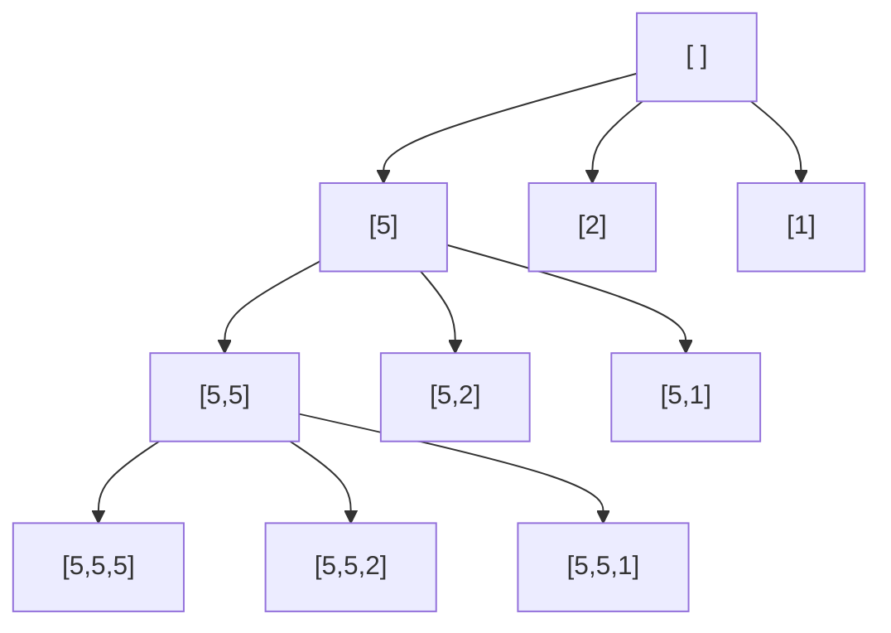

## Programování 2

# 3. cvičení, 5-3-2024

###### 

## Farní oznamy

1. Tento text a kódy ke cvičení najdete v repozitáří cvičení na https://github.com/PKvasnick/Programovani-2.
2. **Domácí úkoly**: 
   - Tento týden jste měli středně těžké domácí úkoly
   - U některých jste si poradili výborně (přesmyčky), u dalších byly problémy.
   - Budeme se úkolům dnes věnovat
   - Pokud se vám zdá, že jsou pro vás domácí úkoly těžké, napište mi. Je zbytečné, abyste dopláceli na to, že jste v Programování 1 nedostali co jste měli.


---

**Dnešní program**:

- Kvíz

- Domácí úkoly

- Opakování: Načítání a zpracování posloupností , matice

- BInární vyhledávání

  

## Na zahřátí

> *“First, solve the problem. Then, write the code.” – John Johnson*

Neboli **mějte po ruce  tužku a papír**. 

Toto se týká několika z vás. Pokud máte vážný problém, začněte od tohoto. 

Druhá důležitá ingredience je mít představu o tom, co v Pythonu lze udělat a co musíte naprogramovat "ručně": metody datových typů, kolekce, jejich vlastnosti a použití, základní algoritmy a pod. 

### Co dělá tento kód

```python
dict(zip(range(1,4), ["Pascal", "Python", "C++", "Javascript"]))
```

### Pojmenované n-tice

```python
from collections import namedtuple
Point = namedtuple("Point", "x y")
point = Point(5, 6)
point.x
Out[5]: 5
point.y
Out[6]: 6
```

Toto je jedna z možností, jak implementovat kontejner s různorodými daty, která spolu souvisí. 

## Domácí úkoly

### 1. ChatGPT a domácí úkol o anagramech

Chtěl jsem si vyzkoušet, jak ChatGPT zvládne vyřešit jeden z domácích úkolů. Následující je záznam z chatu:

> Prosím, vygeneruj kód v jazyce Python, který bude řešit následující úlohu:

---

Samozřejmě, rád vám s tím pomohu! Prosím, popište mi co nejpodrobněji, co by váš kód měl dělat, abych vám mohl připravit co nejlepší řešení.

---

> Na vstupu je číslo N, pak N řádků se slovy slovníku, pak číslo M a nakonec M řádků s dotazy (slovy). Pro každý dotaz najděte ve slovníku všechny jeho přesmyčky, tedy slova, která jsou složena ze stejných písmen, jen možná v jiném pořadí (každé slovo je tedy svou vlastní přesmyčkou). Přesmyčky ke každému dotazu vypište na samostatný řádek v abecedním (lexikografickém) pořadí, oddělené mezerami. Pokud k dotazu není nalezena žádná přesmyčka, vypište prázdný řádek.

---

Jistě, zde je kód v jazyce Python, který vyhovuje vašim požadavkům:

python

```python
from collections import Counter

# načtení vstupních hodnot 
n = int(input())
dictionary = [input().strip() for _ in range(n)]
m = int(input())
queries = [input().strip() for _ in range(m)]

# vytvoření seznamu přesmyček pro každý dotaz
anagrams = {}
for query in queries:
    query_counts = Counter(query)
    anagram_list = [word for word in dictionary if Counter(word) == query_counts]
    anagram_list.sort()
    anagrams[query] = anagram_list

# vypsání výsledků
for query in queries:
    for anagram in anagrams[query]:
        print(anagram, end=' ')
    print()
```

Kód nejprve načte vstupní hodnoty a uloží je do proměnných `n`, `dictionary`, `m` a `queries`. Poté vytvoří seznam přesmyček pro každý dotaz a uloží je do slovníku `anagrams`, kde klíče jsou dotazy a hodnoty jsou seznamy přesmyček odpovídajících dotazu. Seznam přesmyček se vytvoří tak, že se pro každé slovo ze slovníku spočítají jeho písmena a porovnají se s písmeny dotazu. Pokud se shodují, slovo je přidáno do seznamu přesmyček. Seznam je seřazen lexikograficky.

Nakonec kód projde všechny dotazy a vypíše seznam přesmyček pro každý dotaz. Pokud nebyly nalezeny žádné přesmyčky, vypíše se prázdný řádek.

---

> Toto je dost pomalý kód, protože pro každý dotaz musí projít celým seznamem slov a u každého slova porovnat písmena, z nichž pozůstává. Nešlo by to vyhledávání implementovat efektivněji?

---

Ano, máte pravdu, že tento kód může být pomalý pro velká vstupní data. Efektivnější řešení by mohlo být použít slovník, kde klíčem by byla hash hodnota převedeného slova a hodnotou by byl seznam všech slov se stejnou hash hodnotou. Potom by stačilo porovnávat hash hodnoty namísto písmen pro každé slovo v seznamu, což by mělo být mnohem rychlejší.

Zde je kód s tímto vylepšením:

python

```python
from collections import Counter

# načtení vstupních hodnot
n = int(input())
dictionary = [input().strip() for _ in range(n)]
m = int(input())
queries = [input().strip() for _ in range(m)]

# vytvoření slovníku hash hodnot a seznamů přesmyček pro každý dotaz
anagrams = {}
for word in dictionary:
    word_hash = hash(frozenset(Counter(word).items()))
    if word_hash in anagrams:
        anagrams[word_hash].append(word)
    else:
        anagrams[word_hash] = [word]

# vypsání výsledků
for query in queries:
    query_hash = hash(frozenset(Counter(query).items()))
    if query_hash in anagrams:
        anagram_list = sorted(anagrams[query_hash])
        print(' '.join(anagram_list))
    else:
        print()
```

Kód funguje téměř stejně jako původní kód, ale namísto porovnávání písmen pro každé slovo se používá hash hodnota vytvořená z počtu výskytů jednotlivých písmen v daném slově pomocí třídy `Counter`. Slovník `anagrams` obsahuje seznamy přesmyček pro každou hash hodnotu, což by mělo být rychlejší než hledání přesmyček v celém seznamu slov.

Pozor, tato implementace má ale jednu výraznou nevýhodu. Pokud nějaká dva různá slova mají stejnou hash hodnotu, budou přidána do stejného seznamu přesmyček, i když ve skutečnosti nejsou přesmyčkami. Tento problém lze řešit pomocí nějakého dalšího mechanismu na kontrolu, zda jsou slova skutečně přesmyčkami.

---

> Abychom předešli konfliktům hash hodnot, nemohli bychom namísto hashe vytvořit pro každé slovo nové slovo tak, že uspořádáme písmena slova podle abecedy? Takovéto abecedně setříděné slovo bychom pak mohli používat namísto hashe. Co si o tom myslíš?

---

Ano, použití abecedně setříděných slov místo hashovací funkce je další způsob, jak řešit konflikty hash hodnot, a mělo by to fungovat dobře. Toto řešení je sice jednodušší, ale může být náročnější na paměť, protože pro každé slovo musíme uložit jeho abecedně setříděnou verzi a porovnávat ji s abecedně setříděnými verzemi v seznamu při vyhledávání.

Zde je kód, který používá abecedně setříděné slovo namísto hashe:

python

```python
# načtení vstupních hodnot
n = int(input())
dictionary = [input().strip() for _ in range(n)]
m = int(input())
queries = [input().strip() for _ in range(m)]

# vytvoření slovníku přesmyček pro každý dotaz
anagrams = {}
for word in dictionary:
    sorted_word = ''.join(sorted(word))
    if sorted_word in anagrams:
        anagrams[sorted_word].append(word)
    else:
        anagrams[sorted_word] = [word]

# vypsání výsledků
for query in queries:
    sorted_query = ''.join(sorted(query))
    if sorted_query in anagrams:
        anagram_list = sorted(anagrams[sorted_query])
        print(' '.join(anagram_list))
    else:
        print()
```

Tento kód funguje podobně jako předchozí řešení s hashovací funkcí, ale namísto hashovací funkce používá abecedně setříděné verze slov. Pokud jsou dvě slova přesmyčky, budou mít stejnou abecedně setříděnou verzi a budou přidána do stejného seznamu přesmyček. Pokud tedy máme slova "abcd" a "dcba", abecedně setříděné verze obou slov budou "abcd", a proto budou přidána do stejného seznamu přesmyček.

Obě řešení mají své výhody a nevýhody a vhodné řešení závisí na konkrétní situaci. Pokud jsou slova vstupu relativně krátká, použití abecedně setříděných slov může být efektivnější. Na druhé straně, pokud jsou slova delší a mají velký počet různých znaků, může použití hashovací funkce být rychlejší a méně náročné na paměť.

**-- konec GPT chatu --**

Co si o tom myslíte?

Tento chat jsem vedl s GPT3. GPT4x má pro tuto úlohu úspěšnost 80%, tedy dost vysokou a znamená to, že automaticky nabízí řešení 2 nebo 3, protože řešení 1 je sice rychlejší než typická implementace, kterou jsem viděl, ale i tak neprojde testy v ReCodExu. 


### 2. Vkládání prvků (a binární vyhledávání)


Klíčové slovo pro tuto úlohu je **binární vyhledávání**, protože v setříděném seznamu lze vyhledávat *fundamentálně* rychleji než v nesetříděném: $\log n$ vs. $n$, tedy 10 vs. 1000, 20 vs. 1 000 000. Proto používáme abecedně setříděné seznamy věcí, jmenoslovy, slovníky, telefonní seznamy atd. 

#### Vyhledávání v setříděném seznamu

Úloha je najít hodnotu v setříděném seznamu, nebo zjistit, jestli se tam nachází, nebo kolikrát. 

Podobně můžeme prohledávat interval na reálné ose, pokud definujeme "rozlišovacíí schopnost", tedy nejmenší interval, který ještě chceme prohledávat unvitř. 

Algoritmus: Půlení intervalu (proto *binární*). 

Náročnost: $\log n$.

```python
#!/usr/bin/env python3
# Binární vyhledávání v setříděném seznamu

kde = [11, 22, 33, 44, 55, 66, 77, 88]
co = int(input())

# Hledané číslo se nachazí v intervalu [l, p]
l = 0
p = len(kde) - 1

while l <= p:
    stred = (l+p) // 2
    if kde[stred] == co:   # Našli jsme
        print("Hodnota ", co, " nalezena na pozici", stred)
        break
    elif kde[stred] < co:
        l = stred + 1      # Jdeme doprava
    else:
        p = stred - 1      # Jdeme doleva
else:
    print("Hledaná hodnota nenalezena.")

```

- Co kdybychom chtěli nalézt všechny stejné hodnoty, nejen jednu?
- Co kdybychom chtěli nalézt místo pro vložení nové hodnoty do seznamu?

#### Podpora v Pythonu: modul bisect

```python
import bisect

nums = [1,2,3,3,3,4,5,8]

print(bisect.bisect_left(nums, 3))
print(bisect.bisect_right(nums,3))
print(nums[bisect.bisect_left(nums, 3):bisect.bisect_right(nums,3)])
---
2
5
[3, 3, 3]
```


---

### Platba mincemi a Youngovy tabulky

Obě úlohy jsou docela podobné, i když pro Youngovy tabulky máme zkratku rekurzivní vztah.



Obě úlohy jsou o prohledávání grafu. 

Protože úloha může mít velký počet řešení, je u obou úloh důležité pořadí, v jakém prohledáváme uzly, protože nás to zbavuje nutnosti třídíit výsledky anebo dokonce zkoumat, jestli se řešení neopakují.

Tímto typem úloh se budeme zabývat podrobněji později v tomto semestru. Dnes si ukážeme řešení pro úlohu s mincemi. 

#### Dvě řešení:

1. **Rekurzivní - backtracking**

Používáme globální seznam pro platbu - tedy set mincí, kterým chceme zaplatit danou sumu. 

V každém kroku pro všechny mince, které lze použít:

- přidáme minci k platbě,
  - pokud zůstává kladná suma k zaplacení, rekurzivně opakujeme volání funkce
  - pokud suma k zaplacení je 0, vypíšeme platbu 
- odebereme minci z platby

```python
# Rekurzivni verze - backtracking

n = int(input())
mince = [int(x) for x in input().split()]
assert(len(mince) == n)
suma = int(input())

platba = [] # Jediné úložiště


def zkus(suma: int, max_mince: int = 0) -> None:
    """Zkusi pridat některou minci k seznamu platba.
    Pokud nelze přidat, buď vytiskne anebo neudělá nic."""
    for m in mince[max_mince:]:
        platba.append(m)
        if suma - m > 0:
            zkus(suma - m, mince.index(m))
        elif suma - m == 0:
            print(*platba)
        platba.pop()


zkus(suma, 0)

```

Výhody:

- Jednoduchý kód
- Malé nároky na paměť

Nevýhody:

- Náklady na rekurzi

Vylepšení:

- Lze výrazně ušetřit při přidávání nejmenší mince


2. **Nerekurzivní - zásobník**

V každém kroku vyjmeme ze záýsobníku jednoho kandidáta na platbu

- Každou minci, kterou lze použít, přidáme k této platbě a
  - Pokud zůstává kladná suma k zaplacení, vložíme do zásobníku
  - Pokud je suma k zaplacení 0, vytiskneme

```python
# Nerekurzivni verze se zasobnikem

n = int(input())
mince = [int(s) for s in input().split()]
assert(len(mince) == n)
suma = int(input())


# Musíme obracet pořadí mincí, aby se nám vypisovali ve správném pořadí
stack = [[m] for m in reversed(mince)]
while stack:
    platba = stack.pop()
	# Zjistíme z platby, jakou sumu je potřeba zaplatit  
    # a jaké mince lze použít
    curr_sum = suma - sum(platba)
    curr_mince = 0 if len(platba) == 0 else mince.index(platba[-1])
    # Postupně přidáváme mince
    for m in reversed(mince[curr_mince:]):
        if curr_sum - m > 0:
            stack.append([*platba, m])
        elif curr_sum - m == 0:
            print(*[*platba, m])
```

Výhody:

- Jednoduchý kód
- Nemáme náklady na rekurzi

Nevýhody:

- Potenciálně velké náklady na paměť


### Opakování a pokračování: 

## Maximum a jiné vlastnosti posloupností

Tady si procvičíme úplně jednoduché věci, zčásti také proto, abychom si zopakovali některé postupy, které využijete pro domácí úkoly. 

### Načtení posloupnosti z konzole a ze souboru

Typické zadání úlohy v ReCodExu: 

> Načtěte ze standardního vstupu posloupnost desetinných čísel oddělených znakem nového řádku, ukončenou řádkou s číslem -1 (toto číslo do posloupnosti nepatří)

### Načítání pomocí generátoru

Pokud chceme hledat například maximum posloupnosti a nechceme ji celou načítat, musíme kód pro načítání a hledání promíchat. To je nešťastné, pokud chceme pro zpracování posloupnosti použít stejný kód pro načítání ze standardního vstupu nebo souboru.     

```python
def read_from_console():
    while "-1" not in (line := input()):
        yield float(line)
    return

m = float("-inf")
for number in read_from_console():
    if number > m:
        m = number
print(m)
```

Napište kód, který takto nalezne maximum při načítání posloupnosti ze souboru. 

### Reduce

Uměli bychom uzavřít otevřený cyklus `while`, resp. `for`, který máme v tomto kódu?

Můžeme použít funkci `functools.reduce`, která dělá přibližně toto:

```python
def reduce(function, iterable, initializer=None):
    it = iter(iterable)
    if initializer is None:
        value = next(it)
    else:
        value = initializer
    for element in it:
        value = function(value, element)
    return value
```

Tedy funkce `reduce` propaguje a aktualizuje nějaký stav přes posloupnost. 

```python
from functools import reduce

def read_from_console():
    while "-1" not in (line := input()):
        yield float(line)
    return

maximum = reduce(max, read_from_console(), float("-inf"))
print(maximum)
```

Takovýto kód bude rychlý, protože cyklus se vykonává uvnitř funkce, a tedy běží v C a ne v Pythonu.

Pro připomenutí, pokud načítáme rádky dat bez ukončovacího řetězce, je lepší načítat přes `sys.stdin`:

```python
from functools import reduce
from sys import stdin


def read_from_console():
    for line in stdin.readlines():
        if "-1" in line:
            break
        yield float(line)
    return


maximum = reduce(max, read_from_console(), float("-inf"))
print(maximum)
```

###  Podobné úlohy

- rozhodnout, zda je posloupnost čísel monotonní a jak (konstantní, rostoucí, neklesající, klesající, nerostoucí) 
- v posloupnosti čísel nalézt druhou největší hodnotu a počet jejích výskytů
- v posloupnosti čísel určit délku nejdelšího souvislého rostoucího úseku
- v posloupnosti čísel určit počet různých hodnot
- v posloupnosti čísel nalézt souvislý úsek se součtem K (pro zadanou hodnotu K)
- v posloupnosti kladných čísel nalézt souvislý úsek se součtem K (pro zadanou hodnotu K)
- v posloupnosti čísel nalézt souvislý úsek s maximálním součtem.

**Řešeni**

- Pro část úloh stačí implementovat funkci pro `reduce`.
- Pro další musíme vytvořite složitější vyhledávání.

### Vyhledávání v setříděném seznamu

Úloha je najít hodnotu v setříděném seznamu, nebo zjistit, jestli se tam nachází, nebo kolikrát. 

Podobně můžeme prohledávat interval na reálné ose, pokud definujeme "rozlišovacíí schopnost", tedy nejmenší interval, který ještě chceme prohledávat unvitř. 

Algoritmus: Půlení intervalu (proto *binární*). 

Náročnost: log(n)

```python
#!/usr/bin/env python3
# Binární vyhledávání v setříděném seznamu

kde = [11, 22, 33, 44, 55, 66, 77, 88]
co = int(input())

# Hledané číslo se nachazí v intervalu [l, p]
l = 0
p = len(kde) - 1

while l <= p:
    stred = (l+p) // 2
    if kde[stred] == co:   # Našli jsme
        print("Hodnota ", co, " nalezena na pozici", stred)
        break
    elif kde[stred] < co:
        l = stred + 1      # Jdeme doprava
    else:
        p = stred - 1      # Jdeme doleva
else:
    print("Hledaná hodnota nenalezena.")

```

- Co kdybychom chtěli nalézt všechny stejné hodnoty, nejen jednu?

#### Podpora v Pythonu: modul bisect

```python
import bisect

nums = [1,2,3,3,3,4,5,8]

print(bisect.bisect_left(nums, 3))
print(bisect.bisect_right(nums,3))
print(nums[bisect.bisect_left(nums, 3):bisect.bisect_right(nums,3)])
---
2
5
[3, 3, 3]
```


------
