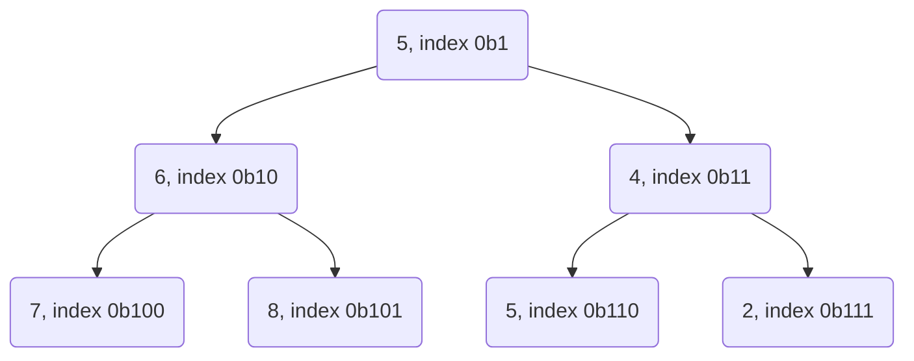

## Programování 2

# 4. cvičení, 9-3-2022

###### tags: `Programovani 2`, `čtvrtek 1`, `čtvrtek 2`

## Farní oznamy

1. Tento text a kódy ke cvičení najdete v repozitáří cvičení na https://github.com/PKvasnick/Programovani-2.
2. **Domácí úkoly**: 
   - Tento týden jste dostali 3 poměrně lehké úlohy
   - Trochu lehčeji jsem vzal i kontrolu, pokud jste získali 10 bodů, vašemu řešení jsem se nevěnoval
   - To neznamená, že tak neučiním později a nestrhnu vám body, pokud vaše řešení používá zakázanou zkratku. 
   


**Dnešní program**:

- Kvíz

- Domácí úkoly

- Opakování: Načítání a zpracování posloupností 

- Třídění

  

## Na zahřátí

> *"Code is like humor. When you have to explain it, it’s bad.” – Cory House*

Dobrý kód nepotřebuje mnoho komentářů, ale někdy potřebuje.

### Co dělá tento kód

```python
d = dict.fromkeys(range(10), [])
for k in d:
    d[k].append(k)
d
```

`dict.fromkeys`je někdy dobrá náhrada `defaultdict` nebo `Counter`, ale takto inicializovat  slovník není dobrý nápad. 

**Počítání věcí v Pythonu**

- `collections.defaultdict`
- `collections.Counter`

Běžně se bez těchto speciálních udělátek lehce obejdeme. 

### Pojmenované n-tice (ještě jednou)

Posledně jsme mluvili o `collections.namedtuple`

```python
from collections import namedtuple


Point = namedtuple("Point", "x y")
point = Point(5, 6)
point.x
Out[5]: 5
point.y
Out[6]: 6
```

Čistější možnost:

```python
from typing import NamedTuple


class Point(NamedTuple):
    x : float
    y : float


point = Point(1.2, 3.4)

print(f"{point.x=}, {point.y=}")
print(f"{point[0]=}, {point[1]=}")

point.x = 1.5
-----------
point.x=1.2, point.y=3.4
point[0]=1.2, point[1]=3.4
Traceback (most recent call last):
  File "C:\Users\kvasn\Documents\GitHub\Programovani-2\code\Ex04\namedtuple_2.py", line 14, in <module>
    point.x = 1.5
AttributeError: can't set attribute

```

Výraznější a čistší definice, i když prakticky stejná funkcionalita.

---

## Třídění

Abychom mohli věci třídit, musí tyto věci implementovat operátory porovnání:

### Selection sort

Zleva nahrazujeme hodnoty minimem zbývající části posloupnosti:

```python
def selection_sort(b):
    for i in range(len(b) -1):
        j = b.index(min(b[i:]))
        b[i], b[j] = b[j], b[i]
    return b     
```

$O(n^2)$ operací, $O(1)$ paměť. 

### Bubble sort

```python
def bubble_sort(b):
    for i in range(len(b)):
        n_swaps = 0
        for j in range(len(b)-i-1):
            if b[j] > b[j+1]:
                b[j], b[j+1] = b[j+1], b[j]
                n_swaps += 1
        if n_swaps == 0:
            break
    return b
```

$O(n^2)$ operací, $O(1)$ paměť. 

### Insertion sort

Začínáme třídit z kraje seznamu, následující číslo vždy zařadíme na správné místo do již utříděné části. 

```python
def insertion_sort(b):
    for i in range(1, len(b)):
        up = b[i]
        j = i - 1
        while j >= 0 and b[j] > up:
            b[j + 1] = b[j]
            j -= 1
        b[j + 1] = up    
    return b    
```

$O(n^2)$ operací, $O(1)$ paměť. 

### `Bucket sort`

- Nahrubo si setřídíme čísla do příhrádek

- Setřídíme obsah přihrádek

- Spojíme do výsledného seznamu

  ```python
  def bucketSort(x):
      arr = []
      slot_num = 10 # 10 means 10 slots, each
                    # slot's size is 0.1
      for i in range(slot_num):
          arr.append([])
           
      # Put array elements in different buckets
      for j in x:
          index_b = int(slot_num * j)
          arr[index_b].append(j)
       
      # Sort individual buckets
      for i in range(slot_num):
          arr[i] = insertionSort(arr[i])
           
      # concatenate the result
      k = 0
      for i in range(slot_num):
          for j in range(len(arr[i])):
              x[k] = arr[i][j]
              k += 1
      return x
  ```

  To je docela ošklivý kód, uměli bychom ho vylepšit?

------

### Halda - heap

Binární strom, implementovaný v seznamu. Namísto struktury stromu používámee vztahy přes indexy:



- Potomci uzlu na indexu k jsou 2k a 2k+1
- Předek uzlu na indexu k je k // 2
- Uzel k je levý potomek svého předka, pokud k % 2 == 0, jinak je to pravý potomek.

**Pravidlo min-haldy (min-heap)**: potomci uzlu jsou větší než hodnota v uzlu. 

```python
# heap implementation
from random import randint

def add(h:list[int], x:int) -> None:
    """Add x to the heap"""
    h.append(x)
    j = len(h)-1
    while j > 1 and h[j] < h[j//2]:
        h[j], h[j//2] = h[j//2], h[j]
        j //= 2


def pop_min(h: list[int]) -> int:
    """remove minimum element from the heap"""
    if len(h) == 1: # empty heap
        return None
    result = h[1]   # we have the value, but have to tidy up
    h[1] = h.pop()  # pop the last value and find a place for it
    j = 1
    while 2*j < len(h):
        n = 2 * j
        if n < len(h) - 1:
            if h[n + 1] < h[n]:
                n += 1
        if h[j] > h[n]:
            h[j], h[n] = h[n], h[j]
            j = n
        else:
            break
    return result


def main() -> None:
    heap = [None]  # no use for element 0
    for i in range(10):
        add(heap, randint(1, 100))
        print(heap)
    for i in range(len(heap)):
        print(pop_min(heap))
        print(heap)


if __name__ == '__main__':
    main()
```

