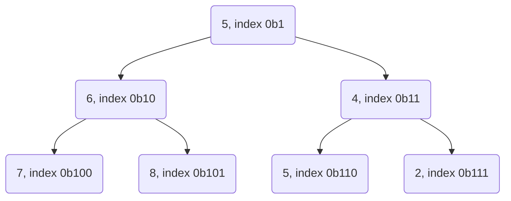

## Programování 2

# 4. cvičení, 11-3-2024


## Farní oznamy

1. Tento text a kódy ke cvičení najdete v repozitáří cvičení na https://github.com/PKvasnick/Programovani-2.
2. **Domácí úkoly**: 
   - Domácí úkoly pro ttento týden měli různou obtížnost:
     - Přesmyčky - poměrně lehké, chtělo nápad
     - Vyhledávání v utříděném seznamu - lehké, pokud víte, co máte dělat.
   - Samozřejmě, že si o nich promluvíme, ale platí upozornění z minulého týdne: pokud máte pocit, že vám programování přerůstá přes hlavu, ozvěte se. 
   

**Dnešní program**:

- Kvíz

- Domácí úkoly

- Třídění


---

## Na zahřátí

> *"Code is like humor. When you have to explain it, it’s bad.” – Cory House*

Dobrý kód nepotřebuje mnoho komentářů (ale někdy potřebuje).

```python
def sortedfind(x,data):
    #najde index nějakého prvku s danou hodnotou v seznamu
    #postupně osekávám seznam zleva a zprava
    minimum=data[0]#hodnota levého okraje oříznutého seznamu
    maximum=data[-1]#pravý okraj
    minindex=0#pozice levého okraje
    maxindex=len(data)-1#pravý okraj
    if minimum==x:#hledaný prvek je na začátku seznamu
        return(minindex)
    elif maximum==x:#je na konci
        return(maxindex)
    ...
```

Komentáře neudělají ze špatného kódu dobrý kód. (V tomto případě vzniklo něco jako plísňový sýr.)

### Co dělá tento kód

```python
d = dict.fromkeys(range(10), [])
for k in d:
    d[k].append(k)
d
```

`dict.fromkeys` vytváří z kolekce klíče slovníku a případně jim přiřadí hodnotu. Je oto někdy dobrá náhrada `defaultdict` nebo `Counter`.  Tato metoda se často používá off-label namísto množiny. 

Tato konkrétní inicializace slovníku je ale velmi špatný nápad. Ví někdo proč, a jak to udělat lépe?

**Počítání věcí v Pythonu**

- `collections.defaultdict`
- `collections.Counter`

V principu se bez těchto speciálních udělátek lehce obejdeme, ale jejich použití lépe signalizuje záměr v kódu a tedy jeho čitelnost. 


### Pojmenované n-tice (ještě jednou)

Posledně jsme mluvili o `collections.namedtuple`

```python
from collections import namedtuple

Point = namedtuple("Point", "x y")
point = Point(5, 6)
point.x
Out[5]: 5
point.y
Out[6]: 6
```

Čistější možnost:

```python
from typing import NamedTuple


class Point(NamedTuple):
    x : float
    y : float


point = Point(1.2, 3.4)

print(f"{point.x=}, {point.y=}")
print(f"{point[0]=}, {point[1]=}")

point.x = 1.5
-----------
point.x=1.2, point.y=3.4
point[0]=1.2, point[1]=3.4
Traceback (most recent call last):
  File "C:\Users\kvasn\Documents\GitHub\Programovani-2\code\Ex04\namedtuple_2.py", line 14, in <module>
    point.x = 1.5
AttributeError: can't set attribute

```

Výraznější a čistší definice, i když prakticky stejná funkcionalita.

---


## Domácí úkoly

### 1. ChatGPT a domácí úkol o anagramech

Chtěl jsem si vyzkoušet, jak ChatGPT zvládne vyřešit jeden z domácích úkolů. Následující je záznam z chatu:

> Prosím, vygeneruj kód v jazyce Python, který bude řešit následující úlohu:

---

Samozřejmě, rád vám s tím pomohu! Prosím, popište mi co nejpodrobněji, co by váš kód měl dělat, abych vám mohl připravit co nejlepší řešení.

---

> Na vstupu je číslo N, pak N řádků se slovy slovníku, pak číslo M a nakonec M řádků s dotazy (slovy). Pro každý dotaz najděte ve slovníku všechny jeho přesmyčky, tedy slova, která jsou složena ze stejných písmen, jen možná v jiném pořadí (každé slovo je tedy svou vlastní přesmyčkou). Přesmyčky ke každému dotazu vypište na samostatný řádek v abecedním (lexikografickém) pořadí, oddělené mezerami. Pokud k dotazu není nalezena žádná přesmyčka, vypište prázdný řádek.

---

Jistě, zde je kód v jazyce Python, který vyhovuje vašim požadavkům:

python

```python
from collections import Counter

# načtení vstupních hodnot 
n = int(input())
dictionary = [input().strip() for _ in range(n)]
m = int(input())
queries = [input().strip() for _ in range(m)]

# vytvoření seznamu přesmyček pro každý dotaz
anagrams = {}
for query in queries:
    query_counts = Counter(query)
    anagram_list = [word for word in dictionary if Counter(word) == query_counts]
    anagram_list.sort()
    anagrams[query] = anagram_list

# vypsání výsledků
for query in queries:
    for anagram in anagrams[query]:
        print(anagram, end=' ')
    print()
```

Kód nejprve načte vstupní hodnoty a uloží je do proměnných `n`, `dictionary`, `m` a `queries`. Poté vytvoří seznam přesmyček pro každý dotaz a uloží je do slovníku `anagrams`, kde klíče jsou dotazy a hodnoty jsou seznamy přesmyček odpovídajících dotazu. Seznam přesmyček se vytvoří tak, že se pro každé slovo ze slovníku spočítají jeho písmena a porovnají se s písmeny dotazu. Pokud se shodují, slovo je přidáno do seznamu přesmyček. Seznam je seřazen lexikograficky.

Nakonec kód projde všechny dotazy a vypíše seznam přesmyček pro každý dotaz. Pokud nebyly nalezeny žádné přesmyčky, vypíše se prázdný řádek.

---

> Toto je dost pomalý kód, protože pro každý dotaz musí projít celým seznamem slov a u každého slova porovnat písmena, z nichž pozůstává. Nešlo by to vyhledávání implementovat efektivněji?

---

Ano, máte pravdu, že tento kód může být pomalý pro velká vstupní data. Efektivnější řešení by mohlo být použít slovník, kde klíčem by byla hash hodnota převedeného slova a hodnotou by byl seznam všech slov se stejnou hash hodnotou. Potom by stačilo porovnávat hash hodnoty namísto písmen pro každé slovo v seznamu, což by mělo být mnohem rychlejší.

Zde je kód s tímto vylepšením:

python

```python
from collections import Counter

# načtení vstupních hodnot
n = int(input())
dictionary = [input().strip() for _ in range(n)]
m = int(input())
queries = [input().strip() for _ in range(m)]

# vytvoření slovníku hash hodnot a seznamů přesmyček pro každý dotaz
anagrams = {}
for word in dictionary:
    word_hash = hash(frozenset(Counter(word).items()))
    if word_hash in anagrams:
        anagrams[word_hash].append(word)
    else:
        anagrams[word_hash] = [word]

# vypsání výsledků
for query in queries:
    query_hash = hash(frozenset(Counter(query).items()))
    if query_hash in anagrams:
        anagram_list = sorted(anagrams[query_hash])
        print(' '.join(anagram_list))
    else:
        print()
```

Kód funguje téměř stejně jako původní kód, ale namísto porovnávání písmen pro každé slovo se používá hash hodnota vytvořená z počtu výskytů jednotlivých písmen v daném slově pomocí třídy `Counter`. Slovník `anagrams` obsahuje seznamy přesmyček pro každou hash hodnotu, což by mělo být rychlejší než hledání přesmyček v celém seznamu slov.

Pozor, tato implementace má ale jednu výraznou nevýhodu. Pokud nějaká dva různá slova mají stejnou hash hodnotu, budou přidána do stejného seznamu přesmyček, i když ve skutečnosti nejsou přesmyčkami. Tento problém lze řešit pomocí nějakého dalšího mechanismu na kontrolu, zda jsou slova skutečně přesmyčkami.

---

> Abychom předešli konfliktům hash hodnot, nemohli bychom namísto hashe vytvořit pro každé slovo nové slovo tak, že uspořádáme písmena slova podle abecedy? Takovéto abecedně setříděné slovo bychom pak mohli používat namísto hashe. Co si o tom myslíš?

---

Ano, použití abecedně setříděných slov místo hashovací funkce je další způsob, jak řešit konflikty hash hodnot, a mělo by to fungovat dobře. Toto řešení je sice jednodušší, ale může být náročnější na paměť, protože pro každé slovo musíme uložit jeho abecedně setříděnou verzi a porovnávat ji s abecedně setříděnými verzemi v seznamu při vyhledávání.

Zde je kód, který používá abecedně setříděné slovo namísto hashe:

python

```python
# načtení vstupních hodnot
n = int(input())
dictionary = [input().strip() for _ in range(n)]
m = int(input())
queries = [input().strip() for _ in range(m)]

# vytvoření slovníku přesmyček pro každý dotaz
anagrams = {}
for word in dictionary:
    sorted_word = ''.join(sorted(word))
    if sorted_word in anagrams:
        anagrams[sorted_word].append(word)
    else:
        anagrams[sorted_word] = [word]

# vypsání výsledků
for query in queries:
    sorted_query = ''.join(sorted(query))
    if sorted_query in anagrams:
        anagram_list = sorted(anagrams[sorted_query])
        print(' '.join(anagram_list))
    else:
        print()
```

Tento kód funguje podobně jako předchozí řešení s hashovací funkcí, ale namísto hashovací funkce používá abecedně setříděné verze slov. Pokud jsou dvě slova přesmyčky, budou mít stejnou abecedně setříděnou verzi a budou přidána do stejného seznamu přesmyček. Pokud tedy máme slova "abcd" a "dcba", abecedně setříděné verze obou slov budou "abcd", a proto budou přidána do stejného seznamu přesmyček.

Obě řešení mají své výhody a nevýhody a vhodné řešení závisí na konkrétní situaci. Pokud jsou slova vstupu relativně krátká, použití abecedně setříděných slov může být efektivnější. Na druhé straně, pokud jsou slova delší a mají velký počet různých znaků, může použití hashovací funkce být rychlejší a méně náročné na paměť.

**-- konec GPT chatu --**


**Co si o tom myslíte?**

   

---

### O velkých a malých písmenech

```python
uzivatele = [
    "johndoe@gmail.com",
    "JANICKA@seznam.cz",
    "PEPA@GMAIL.COM",
]

def is_new_email(address):
    for user in users:
        if ...:
            return False
    return True
```

Chceme doplnit `...` tak, aby kód fungoval - tedy např. aby fungovali následující testy:

```python
assert is_new_email("john@gmail.com")
assert is_new_email("example@gmail.com")

assert not is_new_email("JOHNdoe@gmail.com")
assert not is_new_email("JOHNDOE@GMAIL.COM")
assert not is_new_email("Janicka@Seznam.cz")
assert not is_new_email("pepa@gmail.com")
```

#### `str.lower / str.upper` není dobré řešení

Zřejmé řešení:

```python
def is_new_email(address):
    for user in users:
        if user.lower() == address.lower():
            return False
    return True
```

Nemáme problém pro 26 písmen anglické abecedy:

```python
>>> import string
>>> string.ascii_uppercase
'ABCDEFGHIJKLMNOPQRSTUVWXYZ'
>>> string.ascii_lowercase
'abcdefghijklmnopqrstuvwxyz'
```

**Ale**: Německé ostré s, **ß**:

```python
>>> "ß".lower()
'ß'
>>> "ß".upper()
'SS'
>>> "SS".lower()
???
```

Existuje ještě několik dalších problematických znaků:

```python
for i in range(65535):
    c = chr(i)
    if c.lower() == c and c.upper().lower() != c: print(i, c)

"""
Dostaneme znaky jako:
181 µ
223 ß
305 ı
329 ʼn
383 ſ
496 ǰ
837 ͅ
# a další.
"""
```

Samozřejmě můžeme omezit množinu znaků povolených v e-mailových adresách, např. na malá a velká písmena ze `string.ascii_lowercase`, ale ne vždy jde řešit problémy omezením možností. 

Ze stejných důvodů nejde použít ani `str.upper()`:

```python
for i in range(65535):
    c = chr(i)
    if c.upper() == c and c.lower().upper() != c: print(i, c)

"""
Dostaneme znaky jako:
304 İ
1012 ϴ
7838 ẞ
8486 Ω
8490 K
8491 Å
"""
```

#### `str.casefold()`

dělá pro běžná písmena to, co `str.lower()`,  ale chová se regulárně i pro problematická písmena:

```python
>>> sentence = "THE QUICK brown FoX jumps OVER the LaZy dog."
>>> sentence.lower()
'the quick brown fox jumps over the lazy dog.'
>>> sentence.casefold()
'the quick brown fox jumps over the lazy dog.'
---
>>> word = "straße"
>>> word.lower()
'straße'
>>> word.casefold()
'strasse'

```

Takže `str.casefold()` je správný nástroj pro porovnání řetězců necitlivé k velikosti písmen:

```python
def addresses_match(new, old):
    return new.casefold() == old.casefold()

address_in_database = "Imaginary Straße, 27"
new_address = "IMAGINARY STRASSE, 27"

print(addresses_match(new_address, address_in_database))  # True
```

#### Slovník nerozlišující velikost písmen

Chtěli bychom něco takovéhoto:

```python
class CaseInsensitiveDict(dict):
    ...

d = CaseInsensitiveDict()
print(d)  # {}

d["Rodrigo"] = "Rodrigo"
print(d["RODRIGO"])  # Rodrigo
del d["rOdRiGo"]
print(d)  # {}

d["straße"] = "street"
d["STRASSE"] = "STREET"
print(d)  # {'strasse': "STREET"}
```

Slovníky používají pro přístup ke klíčům, pro nastavování hodnot pro nový klíč, a pro odstraňování klíčů ze slovníku [dunder metody](https://mathspp.com/blog/pydonts/dunder-methods) .

- `__setitem__(key, value)` se volá, když chceme nastavit hodnotu pro klíč, například příkazem  `d[key] = value`;
- `__getitem__(key)` se volá, když chceme ze slovníku získat hodnotu pro daný klíč, např. příkazem  `print(d[key])`;
- `__delitem__(key)` se volá, když chceme ze slovníku odstranit ze slovníku klíč a odpovídajícíc hodnotu, např. příkazem  `del d[key]`.

Takže potřebujeme přepsat tyto metody tak, aby se před použitím klíčů tyto normalizovali pomocí `str.casefold`. Abychom si ulehčili práci, odvodíme naši třídu  `CaseInsensitiveDict` od základního slovníku `dict`. Tak nám zůstane starost, aby se pro normalizaci klíčů použila funkce `str.casefold`, ale jinak chování  slovníku převezmeme z mateřské třídy `dict`.

```python
class CaseInsensitiveDict(dict):
    """Case-insensitive dictionary implementation."""

    def __getitem__(self, key):
        return dict.__getitem__(self, key.casefold())

    def __setitem__(self, key, value):
        dict.__setitem__(self, key.casefold(), value)

    def __delitem__(self, key):
        dict.__delitem__(self, key.casefold())
```

Zavedli jsme malé úpravy slovníku, ale složitou funkcionalitu přebíráme od `dict`. Naše implementace pracuje takto:

```python
d = CaseInsensitiveDict()
print(d)  # {}

d["Rodrigo"] = "Rodrigo"
print(d["RODRIGO"])  # Rodrigo
del d["rOdRiGo"]
print(d)  # {}

d["straße"] = "street"
d["STRASSE"] = "STREET"
print(d)  # {'strasse': "STREET"}
```

#### Množina, nerozlišující velikost písmen

Aby množina nerozlišovala velikost písmen v prvcích, musíme použít  `str.casefold` při všech manipulacích s prvky množiny, např.

- při pridání nového prvku,  `set.add`;
- při odstraňování prvků z množiny, `set.remove`/`set.discard` (jak se liší?);
- při kontrole, zda se prvek nachází v množině, `value in set`.

Pro ilustraci si vytvoříme třídu `CaseInsensitiveSet` , do kterého můžeme přidávat prvky, odebírat je a zjišťovat, zda se prvek nachází v množině bez ohledu na velikost písmen. 

Chceme, aby třída dělala přibližně toto:

```python
class CaseInsensitiveSet(set):
    # ...

s = CaseInsensitiveSet()

s.add("Rodrigo")
s.add("mathspp")
s.add("RODRIGO")

print(s)  # CaseInsensitiveSet({'rodrigo', 'mathspp'})
print("RODRIGO" in s)  # True

s.discard("MaThSpP")  # Try to remove "mathspp"
print(s)  # CaseInsensitiveSet({'rodrigo'})

s.discard("mathspp")  # Try to remove "mathspp"
print(s)  # CaseInsensitiveSet({'rodrigo'})

s.add("mathspp")
s.remove("rodrigo")  # Remove "rodrigo" and error if not present
print(s)  # CaseInsensitiveSet({'mathspp'})
```

Použijeme stejný postup jako u slovníku. Pro zjištění, zda se hodnota nachází v množině, používáme *_dunder_* funkci `__contains__`:

```python
class CaseInsensitiveSet(set):
    def add(self, value):
        set.add(self, value.casefold())

    def discard(self, value):
        set.discard(self, value.casefold())

    def remove(self, value):
        set.remove(self, value.casefold())

    def __contains__(self, value):
        return set.__contains__(self, value.casefold())
```

Takováto implementace není úplná - potřebovali bychom upravit ještě několik dalších dunder metod, např. `set.__update__()`.

---

## Třídění

Abychom mohli věci třídit, musí tyto věci implementovat operátory porovnání:

Nejprve si prosvištíme pár jednoduchých metod:

### Selection sort

Zleva nahrazujeme hodnoty minimem zbývající části posloupnosti:

```python
def selection_sort(b):
    for i in range(len(b) -1):
        j = b.index(min(b[i:]))
        b[i], b[j] = b[j], b[i]
    return b     
```

$O(n^2)$ operací, $O(1)$ paměť. 

### Bubble sort

```python
def bubble_sort(b):
    for i in range(len(b)):
        n_swaps = 0
        for j in range(len(b)-i-1):
            if b[j] > b[j+1]:
                b[j], b[j+1] = b[j+1], b[j]
                n_swaps += 1
        if n_swaps == 0:
            break
    return b
```

$O(n^2)$ operací, $O(1)$ paměť. 

### Insertion sort

Začínáme třídit z kraje seznamu, následující číslo vždy zařadíme na správné místo do již utříděné části. 

```python
def insertion_sort(b):
    for i in range(1, len(b)):
        up = b[i]
        j = i - 1
        while j >= 0 and b[j] > up:
            b[j + 1] = b[j]
            j -= 1
        b[j + 1] = up    
    return b    
```

$O(n^2)$ operací, $O(1)$ paměť. 

a teď něco, co je opravdu efektivní:

### Bucket sort

- Nahrubo si setřídíme čísla do příhrádek

- Setřídíme obsah přihrádek

- Spojíme do výsledného seznamu

  ```python
  def bucketSort(x):
      arr = []
      slot_num = 10 # 10 means 10 slots, each
                    # slot's size is 0.1
      for i in range(slot_num):
          arr.append([])
           
      # Put array elements in different buckets
      for j in x:
          index_b = int(slot_num * j)
          arr[index_b].append(j)
       
      # Sort individual buckets
      for i in range(slot_num):
          arr[i] = insertionSort(arr[i])
           
      # concatenate the result
      k = 0
      for i in range(slot_num):
          for j in range(len(arr[i])):
              x[k] = arr[i][j]
              k += 1
      return x
  ```

  To je docela ošklivý kód, uměli bychom ho vylepšit?
  
  Když ale obsah přihrádek nemusíme třídit, dostáváme třidění s lineární složitostí.
  
  Také můžeme uvnitř přihrádek použít stejný princip a dělit rekurzivně podle dalších (jemnějších) kritérií. (radix sort).

**collections.deque** - pole optimalizované pro přídávání a odebírání prvků na začátku a na konci.

!

`pop`, `popleft`, `append`, `appendleft`.

---

#### Částečné třídění, quickselect a quicksort

Ještě se na chvíli vrátíme k částečnému třídění pomocí pivotování. Algoritmus můžeme symbolicky brát jako bucket sort, přičemž používáme tři buckety. 

Např. symbolická implementace QuickSortu může vypadat nějak takto:

```py
from random import randint

def quicksort(data):
    if len(data) <= 1:
        return data
    if len(data) == 2:
        return [min(data), max(data)]

    pivot = data[randint(0, len(data)-1)]
    left = [i for i in data if i < pivot]
    pivots = [i for i in data if i == pivot]
    right = [i for i in data if i > pivot]
    return quicksort(left) + pivots + quicksort(right)


data = [randint(1,100) for _ in range(20)]
print(data)
sdata = quicksort(data)
print(sdata)
```

Pro QuickSelect pokračujeme pouze s částí, kde se nachází požadovaný index. 

To ale není realistický algoritmus, protože potřebuje mnoho paměti a skládá seznamyy atd. Umíme rozdělit data do tří skupin na místě?

Jak podle vás funguje tento kód? Všimněte si, jak vám v čtení pomáhají komentáře. Jaká je složitost tohoto kódu?

```python
def partition(data, left, right, pivotIndex, n):
    pivotValue = data[pivotIndex]
    data[pivotIndex], data[right] = data[right], data[pivotIndex]  # Move pivot to end
    storeIndex = left
    # Move all elements smaller than the pivot to the left of the pivot
    for i in range(left, right):
        if data[i] < pivotValue:
            data[storeIndex], data[i] = data[i], data[storeIndex]
            storeIndex += 1
    # Move all elements equal to the pivot right after
    # the smaller elements
    storeIndexEq = storeIndex
    for i in range(storeIndex, right):
        if data[i] == pivotValue:
            data[storeIndexEq], data[i] = data[i], data[storeIndexEq]
            storeIndexEq += 1
    data[right], data[storeIndexEq] = data[storeIndexEq], data[right]  # Move pivot to its final place
    # Return location of pivot considering the desired location n
    if n < storeIndex:
        return storeIndex  # n is in the group of smaller elements
    if n <= storeIndexEq:
        return n  # n is in the group equal to pivot
    return storeIndexEq  # n is in the group of larger elements

data = [3, 1, 4, 1, 5, 9, 2, 6, 5, 3, 5]
print(data)
pivotIndex = 2  # 3rd element is 4
n = 6        # 6th smallest element is 6
result = partition(data, 0, len(data)-1, pivotIndex, n)
print("Partitioned index:", result)
print("Data after partitioning:", data)

```


------

### Halda - heap

Binární strom, implementovaný v seznamu. Namísto struktury stromu používámee vztahy přes indexy:



- Potomci uzlu na indexu k jsou 2k a 2k+1
- Předek uzlu na indexu k je k // 2
- Uzel k je levý potomek svého předka, pokud k % 2 == 0, jinak je to pravý potomek.

**Pravidlo min-haldy (min-heap)**: potomci uzlu jsou větší než hodnota v uzlu. 

```python
# heap implementation
from random import randint

def add(h:list[int], x:int) -> None:
    """Add x to the heap"""
    h.append(x)
    j = len(h)-1
    while j > 1 and h[j] < h[j//2]:
        h[j], h[j//2] = h[j//2], h[j]
        j //= 2


def pop_min(h: list[int]) -> int:
    """remove minimum element from the heap"""
    if len(h) == 1: # empty heap
        return None
    result = h[1]   # we have the value, but have to tidy up
    h[1] = h.pop()  # pop the last value and find a place for it
    j = 1
    while 2*j < len(h):
        n = 2 * j
        if n < len(h) - 1:
            if h[n + 1] < h[n]:
                n += 1
        if h[j] > h[n]:
            h[j], h[n] = h[n], h[j]
            j = n
        else:
            break
    return result


def main() -> None:
    heap = [None]  # no use for element 0
    for i in range(10):
        add(heap, randint(1, 100))
        print(heap)
    for i in range(len(heap)):
        print(pop_min(heap))
        print(heap)


if __name__ == '__main__':
    main()
```

---

## Domácí úkoly

1. **Maximální počet hostů v restauraci:** do restaurace v nepravidelných okamžicích přicházejí hosté a po k hodinách odcházejí. Máte zjistit, kdy je v restauraci maximální počet hostů a počítají se pouze průběžná řešení.
2. **Stejnočastá slova** - máte v textu vyhledat slova, u kterých je počet jejich písmen stejný jako počet výskytů v textu. ,Cvičení na zpracování stringů.2
