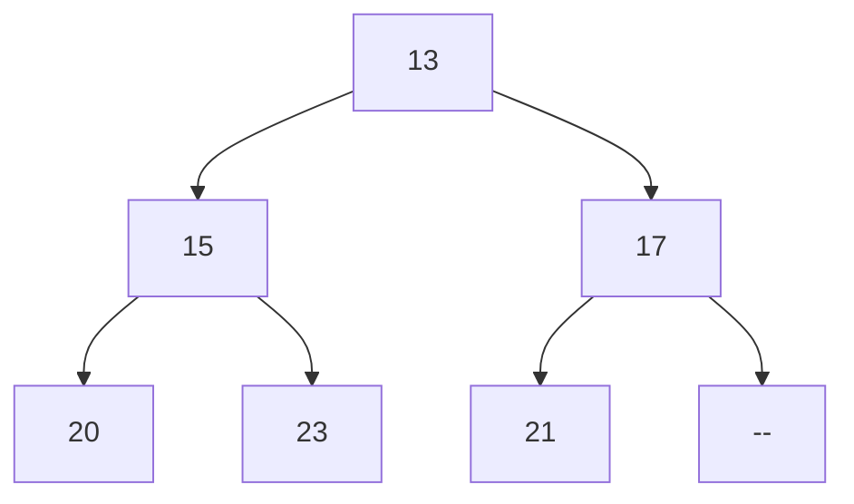

## Programování 2

# 6. cvičení, 26-3-2024

###### 

## Farní oznamy

1. Tento text a kódy ke cvičení najdete v repozitáří cvičení na https://github.com/PKvasnick/Programovani-2.
2. **Domácí úkoly**: 
   - 3 poměrně lehké úkoly
   - Problémy s inverzí slovníku, hlavně kvůli ReCodExu: řešení testuji sám, pokud máte pocit, že máte správné řešení ale zapomněl jsem na vás, napište.


**Dnešní program**:

- Kvíz a jazykové okénko
- Rekurze a memoizace
- Třídění (pořád): Halda neboli heap
- Lineární spojovaný seznam
- Varianty LSS: zásobník, fronta, cyklický zásobník, dvojitě spojovný seznam

---


## Na zahřátí

> Make it work, then make it better.

Představte si, že svůj kód tesáte do kamene. Každé písmenko musíte pracně vyrazit do kamene, takže každé zbytečné písmenko je hromada zbytečné práce navíc. Co pak ale vytesáte, prožije staletí. 

Každý sochař si ale předem připraví náčrt toho, co chce sochat, a potřebné nástroje. Až pak začne tesat. 

### Co dělá tento kód

```python
def check(s:str) -> tuple[bool, bool, bool]:
    return s.isnumeric(), s.isdigit(), s.isdecimal()

check("V")
check("5")
check("-5")
```

Těmto metodám je lepší se vyhýbat, protože často dávají neintuitivní výsledky.

---

### Rekurze

O tomto budete mluvit často, dokonce už na tomto cvičení, a tak si také dáme něco rekurzivního a budeme v následujících cvičeních (a domácích úkolech) přidávat.

**Levenshteinova vzdálenost**

Mějme dva znakové řetězce **a** a **b**. Počet záměn, přidání a vynechání jednotlivých znaků z **b**, abychom dostali **a** se nazývá *Levenshteinova vzdálenost* řeťězců **a** a **b**. Např. lev("čtvrtek", "pátek") je 4 (přidat čt, zaměnit "pá" za "vr"). Definice funkce je rekurzivní, takže implementace rekurzivní verze je triviální:


```python
def lev(s:str, t:str) -> int:
    """Calculate Levenshtein (edit) distance between strings s and t."""
    if (not s) or (not t):
        return len(s) + len(t)
    if s[0] == t[0]:
        return lev(s[1:], t[1:])
    return 1 + min(
        lev(s[1:], t),
        lev(s, t[1:]),
        lev(s[1:], t[1:])
    )
```

Problém s touto implementací je zjevný: každé volání může potenciálně vyvolat tři další. Pro delší řetězce to znamená, že takovýto výpočet je nepoužitelný. Začneme tím, že si to vyzkoušíme, a pak vyzkoušíme dva způsoby nápravy. 

Budeme především potřebovat dva dostatečně dlouhé řetězce, např. 

```python
s = "Démon kýs' škaredý, chvost vlečúc po zemi"
t = "Ko mne sa priplazil, do ucha šepce mi:"

k = 10

print(lev(s[:k],t[:k]))
```

Pro k>12 už výpočet trvá neúnosně dlouho. Pojďme se podívat na počet volání funkce. Pro tento účel použijeme *dekorátor* - tedy funkci, které pošleme naši funkci jako argument a ona vrátí modifikovanou funkci:

```python
# Dekorátor, počítající počet volání funkce
# Toto není úplně dokonalá implementace, protože nepřenáší signaturu funkce f.
def counted(f):
    def inner(s, t):
        inner.calls += 1 # inkrementujeme atribut
        return f(s, t)
    inner.calls = 0 # zřizujeme atribut funkce inner
    return(inner)


@counted
def lev(s:str, t:str) -> int:
    """Finds Levenshtein (edit) distance between two strings"""
    if (not s) or (not t):
        return len(s) + len(t)
    if s[0] == t[0]:
        return lev(s[1:], t[1:])
    return 1 + min(
        lev(s[1:], t),
        lev(s, t[1:]),
        lev(s[1:], t[1:])
    )


s = "Démon kýs' škaredý, chvost vlečúc po zemi"
t = "Ko mne sa priplazil, do ucha šepce mi:"

k = 10

print(lev(s[:k],t[:k]), lev.calls)
```

Vidíme, že počet volání funkce lev roste velice rychle. 

Jeden způsob řešení je memoizace, o které jste mluvili na přednášce: zapamatujeme si hodnoty funkce, které jsme už počítali, a u těchto hodnot namísto volání funkce použijeme uloženou hodnotu. V Pythonu nemusíme psát vlastní memoizační funkci, stačí použít dekorátor:


```python
from functools import cache

# Dekorátor, počítající počet volání funkce
# Toto není úplně dokonalá implementace, protože nepřenáší signaturu funkce f.
def counted(f):
    def inner(s, t):
        inner.calls += 1 # inkrementujeme atribut
        return f(s, t)
    inner.calls = 0 # zřizujeme atribut funkce inner
    return(inner)


@counted
@cache
def lev(s:str, t:str) -> int:
    """Finds Levenshtein (edit) distance between two strings"""
    if (not s) or (not t):
        return len(s) + len(t)
    if s[0] == t[0]:
        return lev(s[1:], t[1:])
    return 1 + min(
        lev(s[1:], t),
        lev(s, t[1:]),
        lev(s[1:], t[1:])
    )


s = "Démon kýs' škaredý, chvost vlečúc po zemi"
t = "Ko mne sa priplazil, do ucha šepce mi:"

k = 10

print(lev(s[:k],t[:k]), lev.calls)
```

Počet volání je podstatně menší a teď už dokážeme spočítat lev(s, t) pro podstatně delší s, t.

Problém u memoizace je, že nám keš může nekontrolovatelně růst. V praxi se ukazuje, že zpravidla můžeme výrazně omezit velikost keše beze stráty efektivnosti:


```python
from functools import lru_cache

# Dekorátor, počítající počet volání funkce
# Toto není úplně dokonalá implementace, protože nepřenáší signaturu funkce f.
def counted(f):
    def inner(s, t):
        inner.calls += 1 # inkrementujeme atribut
        return f(s, t)
    inner.calls = 0 # zřizujeme atribut funkce inner
    return(inner)


@counted
@lru_cache(maxsize=1000)
def lev(s:str, t:str) -> int:
    """Finds Levenshtein (edit) distance between two strings"""
    if (not s) or (not t):
        return len(s) + len(t)
    if s[0] == t[0]:
        return lev(s[1:], t[1:])
    return 1 + min(
        lev(s[1:], t),
        lev(s, t[1:]),
        lev(s[1:], t[1:])
    )


s = "Démon kýs' škaredý, chvost vlečúc po zemi"
t = "Ko mne sa priplazil, do ucha šepce mi:"

k = 10

print(lev(s[:k],t[:k]), lev.calls)
```

---

## Halda a heap sort

Halda, **min-heap** nebo **max-heap** je *kompletní* binární strom, u kterého je hodnota ve vrcholu menší než hodnota ve vrcholech potomků. (podobně můžeme sestrojit i max-heap; od jednoho ke druhému lehce přejdeme tak, že obrátíme znaménka hodnot ve vrcholech.



**Implementace**

Haldu můžeme lehko implementovat jako seznam, s následujícími pravidly:

- Vrchol stromu má index 0

- Pro hodnotu na indexu **k** jsou potomci na indexech **2k+1** a **2k+2**
- Pro hodnotu na indexu **k** je rodič na indexu **(k-1) // 2**

Pokud máme možnost, můžeme prvek s indexem 0 nechat prázdný, a začínat s indexem 1. Pka máme hezčí číslování:

- Vrchol stromu má index 1

- Pro hodnotu na indexu **k** jsou potomci na indexech **2k** a **2k+1**
- Pro hodnotu na indexu **k** je rodič na indexu **k // 2**

Hloubka stromu je $\log_2{k}$, tedy strom je velice mělký.

#### Operace na min-haldě

**get_min** vrátí minimální prvek haldy. Složitost O(1)

**pop_min** odstraní z haldy minimální prvek, vrátí ho a přeorganizuje zbytek binárního stromu tak, aby zase byl haldou (**heapify**). Složitost $O(log_2{n}$ (O(1) pro získání minimálního prvku, O(log n)) pro heapify).

**add** vloží do haldy novou hodnotu. Hodnotu přidáváme na konec a voláme **heapify**. Složitost O(log n) .

**heapify** je operace, která obnoví haldu po náhradě hodnoty v kořenu stromu. Hodnotu propagujeme směrem k listům stromu tak, že jí vyměňujeme za menší hodnotu z jejich potomků, až dokud nenajdeme uzel, kde jsou hodnoty u obou potomků větší anebo nedojdeme na kraj stromu (tedy k uzlu, který nemá potomky).

```python
# simplistic heap implementation
from random import randint


def add(h:list[int], x:int) -> None:
    """Add x to the heap"""
    h.append(x)
    j = len(h)-1
    while j > 1 and h[j] < h[j//2]:
        h[j], h[j//2] = h[j//2], h[j]
        j //= 2


def pop_min(h: list[int]) -> int:
    """remove minimum element from the heap"""
    if len(h) == 1: # empty heap
        return None
    result = h[1]   # we have the value, but have to tidy up
    h[1] = h.pop()  # pop the last value and find a place for it
    j = 1
    while 2*j < len(h):
        n = 2 * j
        if n < len(h) - 1:
            if h[n + 1] < h[n]:
                n += 1
        if h[j] > h[n]:
            h[j], h[n] = h[n], h[j]
            j = n
        else:
            break
    return result


def main() -> None:
    heap = [None]  # no use for element 0
    for i in range(10):
        add(heap, randint(1, 100))
        print(heap)
    for i in range(len(heap)):
        print(pop_min(heap))
        print(heap)


if __name__ == '__main__':
    main()
```


#### Heapsort: setřídění seznamu na místě

Používáme *max-heap* a číslování od 0, tedy potomci uzlu k jsou 2k+1 a 2k+2, a předek uzlu k je (k-1) // 2. Max-heap proto, že chceme standardní způsob třídění. 

1. Přidáme do heapu první prvek.
2. Přidáme následující prvek a podle potřeby ho propagujeme doleva.
3. Takto postupujeme, až je celý seznam přeorganizovaný na haldu.
4. Pak začneme haldu rozebírat: Odstraníme kořen, co je spolehlivě maximum, vyměníme ho za poslední prvek haldy, a odstraníme ho z haldy. 
5. Haldu přeorganizujeme: nový prvek v 0 propagujeme nahoru na správné místo: zaměňujeme ho s potomkem, který má největší hodnotu. Nakonec máme opět na indexu 0 maximální prvek hlady.
6. Opakujeme od 4. kroku, až vyčerpáme celou haldu.

Udělali jsme O(n log n) operací a máme setříděný seznam. 

```python
# simplistic heap implementation
from random import randint


def print_heap(h: list[int], size: int) -> None:
    """Infix printout"""
    def to_string(h: list[int], index: int, size: int, level: int) -> list[str]:
        rows = []
        if (child := 2*index + 1) < size:
            rows.extend(to_string(h, child, size, level + 1))
        rows.append(f"{' '*(level * 4)} -- {h[index]}")
        if (child := 2*index + 2) < size:
            rows.extend(to_string(h, child, size, level + 1))
        return rows

    print("\n".join(to_string(h, 0, size, 0)))


def heapify(h:list[int]) -> None:
    """Turn a list into a max-heap in-place"""
    for element in range(len(h)):
        p = element
        while (prev := (p-1) // 2) >= 0:
            if h[p] > h[prev]:
                h[p], h[prev] = h[prev], h[p]
                p = prev
            else:
                break
        print_heap(h, element+1)
        print(h[element+1:])


def heap_sort(h: list[int]) -> None:
    """Turne a heap into a sorted list"""
    for heap_size in reversed(range(1, len(h))):
        h[0], h[heap_size] = h[heap_size], h[0]
        p = 0
        while True:
            p_child = 2 * p + 1
            if p_child >= heap_size:
                break
            p_child2 = 2 * p + 2
            if p_child2 < heap_size and h[p_child2] > h[p_child]:
                p_child = p_child2
            if h[p] >= h[p_child]:
                break
            h[p], h[p_child] = h[p_child], h[p]
            p = p_child
        print_heap(h, heap_size)
        print(h[heap_size:])


def main() -> None:
    heap = [randint(1,100) for _ in range(10)]
    print(heap)
    heapify(heap)
    print(heap)
    heap_sort(heap)
    print(heap)


if __name__ == '__main__':
    main()
```

Výstup ilustruje budování haldy (heapify) a rozebírání hlady na setříděný seznam:

1. Heapify: seznam -> halda

```python
[36, 83, 76, 71, 80, 9, 100, 5, 57, 80]
 -- 36
[83, 76, 71, 80, 9, 100, 5, 57, 80]
     -- 36
 -- 83
[76, 71, 80, 9, 100, 5, 57, 80]
     -- 36
 -- 83
     -- 76
[71, 80, 9, 100, 5, 57, 80]
         -- 36
     -- 71
 -- 83
     -- 76
[80, 9, 100, 5, 57, 80]
         -- 36
     -- 80
         -- 71
 -- 83
     -- 76
[9, 100, 5, 57, 80]
         -- 36
     -- 80
         -- 71
 -- 83
         -- 9
     -- 76
[100, 5, 57, 80]
         -- 36
     -- 80
         -- 71
 -- 100
         -- 9
     -- 83
         -- 76
[5, 57, 80]
             -- 5
         -- 36
     -- 80
         -- 71
 -- 100
         -- 9
     -- 83
         -- 76
[57, 80]
             -- 5
         -- 57
             -- 36
     -- 80
         -- 71
 -- 100
         -- 9
     -- 83
         -- 76
[80]
             -- 5
         -- 57
             -- 36
     -- 80
             -- 71
         -- 80
 -- 100
         -- 9
     -- 83
         -- 76
[]

```

2. halda -> setříděný seznam

```python
[100, 80, 83, 57, 80, 9, 76, 5, 36, 71]
             -- 5
         -- 57
             -- 36
     -- 80
         -- 80
 -- 83
         -- 9
     -- 76
         -- 71
[100]
             -- 5
         -- 57
     -- 80
         -- 36
 -- 80
         -- 9
     -- 76
         -- 71
[83, 100]
         -- 5
     -- 57
         -- 36
 -- 80
         -- 9
     -- 76
         -- 71
[80, 83, 100]
         -- 5
     -- 57
         -- 36
 -- 76
         -- 9
     -- 71
[80, 80, 83, 100]
         -- 5
     -- 57
         -- 36
 -- 71
     -- 9
[76, 80, 80, 83, 100]
         -- 5
     -- 36
 -- 57
     -- 9
[71, 76, 80, 80, 83, 100]
     -- 5
 -- 36
     -- 9
[57, 71, 76, 80, 80, 83, 100]
     -- 5
 -- 9
[36, 57, 71, 76, 80, 80, 83, 100]
 -- 5
[9, 36, 57, 71, 76, 80, 80, 83, 100]
[5, 9, 36, 57, 71, 76, 80, 80, 83, 100]

```


### Modul `heapq`

V Pythonu máme k dispozici modul *heapq*, který obslouží haldu za nás. 

```python
# Python3 program to demonstrate working of heapq
  
from heapq import heapify, heappush, heappop
  
# Creating empty heap
heap = []
heapify(heap)
  
# Adding items to the heap using heappush function
heappush(heap, 10)
heappush(heap, 30)
heappush(heap, 20)
heappush(heap, 400)
  
# printing the value of minimum element
print("Head value of heap : "+str(heap[0]))
  
# printing the elements of the heap
print("The heap elements : ")
for i in heap:
    print(i, end = ' ')
print("\n")
  
element = heappop(heap)
  
# printing the elements of the heap
print("The heap elements : ")
for i in heap:
    print(i, end = ' ')


```

Aplikace: spojování setříděných seznamů (setříděný seznam je validní reprezentace hlady, tedy heapify na setříděném seznamu nic nestojí)

---


## Lineární spojovaný seznam

"Převratný vynález": **spojení dat a strukturní informace**:


Takovéto jednotky pak umíme spojovat do větších struktur. LSS je nejjednodušší z nich.


**Aplikace**: 

- Fronty a zásobníky


### Spojované seznamy v Pythonu

`list` v Pythonu je [dynamické pole](http://www.laurentluce.com/posts/python-list-implementation/)

- přidávání prvků: `insert` a `append`
- odebírání prvků: `pop` a `remove`

`collections.deque` je implementace fronty se dvěma konci.

- `append` / `appendleft`
- `pop` / `popleft`

### Implementujeme spojovaný seznam

Spojovaný seznam s hlavou (kód v repozitáří, `code/Ex6/simply_linked_list1.py`)

```python
# Simple linked list

class Node:
    def __init__(self, value):
        """Polozku inicializujeme hodnotou value"""
        self.value = value
        self.next = None

    def __repr__(self):
        """Reprezentace objektu na Pythonovske konzoli"""
        return str(self.value)


class LinkedList:
    def __init__(self, values = None):
        """Spojovany seznam volitelne inicializujeme seznamem hodnot"""
        if values is None:
            self.head = None
            return
        self.head = Node(values.pop(0)) # pop vrati a odstrani hodnotu z values
        node = self.head
        for value in values:
            node.next = Node(value)
            node = node.next

    def __repr__(self):
        """Reprezentace na Pythonovske konzoli:
        Hodnoty spojene sipkami a na konci None"""
        values = []
        node = self.head
        while node is not None:
            values.append(str(node.value))
            node = node.next
        values.append("None")
        return " -> ".join(values)

    def __iter__(self):
        """Iterator prochazejici _hodnotami_ seznamu,
        napr. pro pouziti v cyklu for"""
        node = self.head
        while node is not None:
            yield node.value
            node = node.next

    def add_first(self, node):
        """Prida polozku na zacatek seznamu,
        tedy na head."""
        node.next = self.head
        self.head = node

    def add_last(self, node):
        """Prida polozku na konec seznamu."""
        p = self.head
        prev = None
        while p is not None:
            prev, p = p, p.next
        prev.next = node


```

### Vkládání a odstraňování prvků

- `add_first`, `add_last`
- `add_before`, `add_after`
- `remove`

### Třídění LSS

Utříděný seznam: `add` vloží prvek na správné místo

Jak utřídit již existující seznam?

**Bucket sort** vyžaduje složitou datovou strukturu


Heapsort potřebuje skákat z k na 2k (umíme, ale neradi děláme) a zpátky (neumíme, nebo jenom ztěžka)

Máme třídící algoritmus, který by vystačil s průchody v jednom směru? Umíte ho implementovat v LSS?


## Varianty LSS

- **Dvojitě spojovaný seznam** - pro `deque`

  

  

```python
class Node:
    def __init__(self, data):
        self.data = data
        self.next = None
        self.previous = None
```

- **Cyklický seznam**


Cyklickým seznamem můžeme procházet počínaje libovolným prvkem:

```python
class CircularLinkedList:
    def __init__(self):
        self.head = None

    def traverse(self, starting_point=None):
        if starting_point is None:
            starting_point = self.head
        node = starting_point
        while node is not None and (node.next != starting_point):
            yield node
            node = node.next
        yield node

    def print_list(self, starting_point=None):
        nodes = []
        for node in self.traverse(starting_point):
            nodes.append(str(node))
        print(" -> ".join(nodes))
```

Jak to funguje:

```python
>>> circular_llist = CircularLinkedList()
>>> circular_llist.print_list()
None

>>> a = Node("a")
>>> b = Node("b")
>>> c = Node("c")
>>> d = Node("d")
>>> a.next = b
>>> b.next = c
>>> c.next = d
>>> d.next = a
>>> circular_llist.head = a
>>> circular_llist.print_list()
a -> b -> c -> d

>>> circular_llist.print_list(b)
b -> c -> d -> a

>>> circular_llist.print_list(d)
d -> a -> b -> c
```
