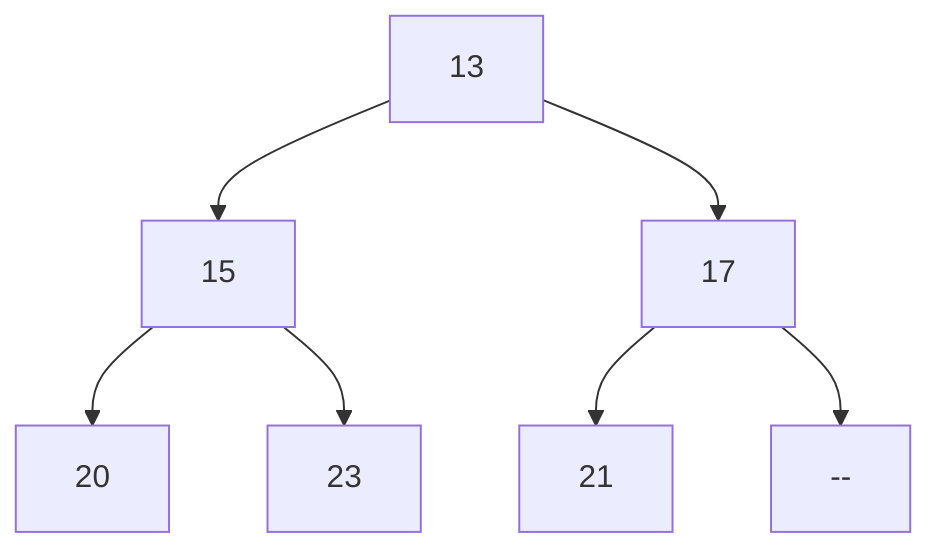
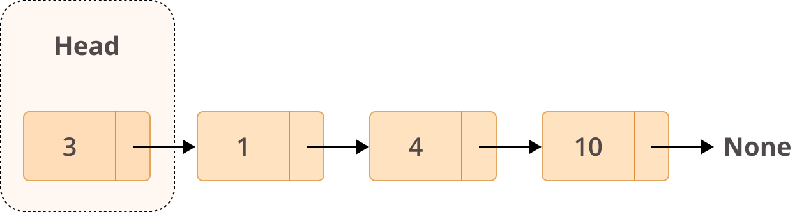
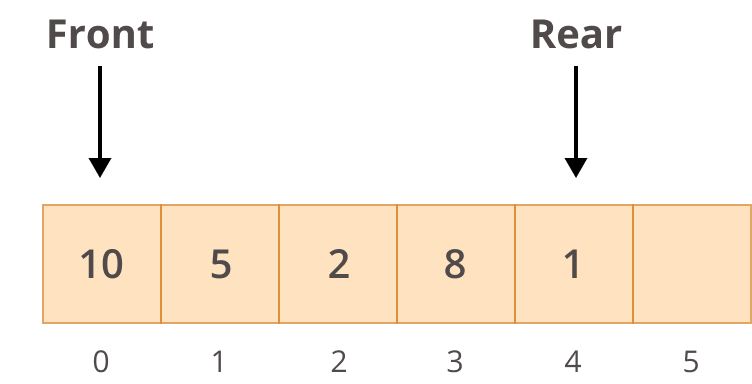

## Programování 2

# 6. cvičení, 24-3-2026


## Farní oznamy

1. Tento text a kódy ke cvičení najdete v repozitáří cvičení na https://github.com/PKvasnick/Programovani-2.

3. **Domácí úkoly**: 
   - Parkoviště a restaurace: 
   
     - Většina funkčních řešení u Parkoviště, ale chtělo by to víc popsaného (třeba i virtuálního) papíru, než začnete psát kód. 
     - Počet hostů v restauraci je vlastně jednoduchá úloha, ale některým z vás dala zabrat. 
   
   
   Zjevně máme o čem mluvit: samozřejmě o haldě, ale také o návrhu kódu.


**Dnešní program**:

- Kvíz a jazykové okénko

- Rekurze a memoizace

- Třídění (pořád): Halda neboli heap

- Lineární spojovaný seznam

  

---

## Na zahřátí

## 

Čistý a srozumitelný kód je prostředek, ne cíl. Jasný kód signalizuje jasné myšlení a zvládnutí řemesla. 

Kód, který je špatně srozumitelný a křehký, se vylepšuje špatně, takže důležitější je rovnou psát co nejčistěji. 

Vylepšete svůj kód, když přijdete na lepší nápad, jak to nebo ono udělat. Třeba dejte lepší jměna proměnným. Pro vylepšení kódu poskytují moderní IDE řadu nástrojů, většinou je najdete pod položkou "Refactor". 

Pokud chcete něco vylepšit ve svém kódu, velmi pomůžou třeba i jednoduché testy, abyste rychle zjistili, jestli se něco nerozbilo:

**doctest**

```python
from random import randint
from doctest import testmod


def insertion_sort(b: list[int]) -> list[int]:
    """
    Sorts a list of integers using insertion sort.

    >>> insertion_sort([3, 1, 4, 1, 5, 9, 2, 6, 5, 3, 5])
    [1, 1, 2, 3, 3, 4, 5, 5, 5, 6, 9]
    """
    for i in range(1, len(b)):
        key = b[i]
        j = i - 1
        while j >= 0 and b[j] > key:
            b[j + 1] = b[j]
            j -= 1
        b[j + 1] = key
    return b


def median(b: list[int]) -> int:
    """
    Returns the integer part of the median of a list of integers.
    >>> median([3, 1, 4, 1, 5, 9, 2, 6, 5, 3, 5])
    4
    """
    b = insertion_sort(b)
    mid = len(b) // 2
    return (b[mid] + b[~mid]) // 2


def median_of_medians(b: list[int]) -> int:
    """
    Returns the approximate median of a list of integers using the median 
    of medians algorithm.
    >>> median_of_medians([3, 1, 4, 1, 5, 9, 2, 6, 5, 3, 5])
    4
    """
    if len(b) <= 5:
        return median(b)
    medians = [median(b[i : i + 5]) for i in range(0, len(b), 5)]
    return median_of_medians(medians)


def main():
    b = [randint(1, 100) for _ in range(100)]
    print(median_of_medians(b))
    print(median(b))


if __name__ == "__main__":
    testmod()
    main()

```

- doctesty jdou do docstringů funkcí a tříd

- mají formu kousků interaktivní práce s funkcí / třídou v Pythonské konzoli. 

  - `>>>` vstup 
  - výstup

  Výhoda je, že takto můžete interaktivně vyvíjet vlastní doctesty v Pythonské konzoli a pak je jednoduše překopírovat do docstringů.

* můžete také zadávat testy, vyvolávající výjimky.
* Testy v daném modulu spustíte voláním `doctest.testmod()`. Pokud je vše v pořádku, nic se nevypíše. 
* Podívejte se prosím do dokumentace.
* AI asistenti vám začnou doctesty iniciativně generovat, jakmile někde napíšete `import doctest`.

**Křehký kód?**

Je to kód, který se pořád věnuje svým složitostem: 

- přechází z číslování od 0 k číslováním od 1 a zpátky, 
- různě mění datové typy objektů,
- ukládá stejné věci s různou hodnotou do odlišných datových struktur, a naopak,
- opakovaně něco sliožitě vypočítává,
- je plný vícenásobně vnořených `if`ů, vlaječek. a cyklů `while`, řídících se složitou logikou.

Takový kód je křehký v tom smyslu, že musíte porozumět jemnostem a neustále je mít na paměti, jinak se celá konstrukce zhroutí. 

- Složitosti kódu se snažíme schovat do funkcí a vhodných datových struktur tak, abychom na ně nemuseli pořád dávat pozor.

- **Přes nebezpečná místa procházíme rychle a zbytečně se tam nezdržujeme,** radí horozlezci.

- Vysvětlete sami sobě v komentáři, co přesně jemného děláte.

  

```python
vahy = [int() for _ in range(n_aut + 1)]
for i in range(1, n_aut + 1):
    vahy[i] = int(input())
```

- Abychom pořád nemuseli myslet na přičítání nebo odečítání 1, sttačí přidat na začátek pole 0. Nikoho to nebude bolet. Všimněte si, co jsme dosáhli: změnu číslování jsme soustředili na jedno místo v kódu namísto neustálého posouvání indexů.
- `[float()] * n` je lepší inicializace než `[None] * n` , protože nemění typ pole. 

---

### Rekurze

O tomto jste mluvili a ještě budete mluvit často, dokonce už na tomto cvičení, a tak si také dáme něco rekurzivního a budeme v následujících cvičeních (a domácích úkolech) přidávat.

Mnozí z vás použili rekurzi už v domácím úkolu o třídění slov (protože to bylo neprozíravě zmíněno v zadání).  Rekurzi jsme také viděli v kódu pro medián mediánů.

Rekurzivní kód má tu výhodu, že bývá jednoduchý a intuitivní. To je fajn, pokud funguje, tedy dokud se neutopíte v milionech rekurzivních volání. Pokud se to stane, můžeme se pokusit rekurzivní kód zachránit buď tak, že mu pomůžeme memoizací, anebo ho přepíšeme do nerekurzivní formy. 

**Levenshteinova vzdálenost**

Mějme dva znakové řetězce **a** a **b**. Počet záměn, přidání a vynechání jednotlivých znaků z **b**, abychom dostali **a** se nazývá *Levenshteinova vzdálenost* řeťězců **a** a **b**. 

Např. `lev("čtvrtek", "pátek")` je 4 (přidat čt, zaměnit "pá" za "vr"). Definice funkce je rekurzivní:


Rekurzivní definice se implementuje přímočaře:

```python
def lev(s:str, t:str) -> int:
    """Calculate Levenshtein (edit) distance between strings s and t."""
    if (not s) or (not t):
        return len(s) + len(t)
    if s[0] == t[0]:
        return lev(s[1:], t[1:])
    return 1 + min(
        lev(s[1:], t),		# přidání
        lev(s, t[1:]),		# vynechání
        lev(s[1:], t[1:])	# záměna
    )
```

Problém s touto implementací je zjevný: každé volání může potenciálně vyvolat tři další. Pro delší řetězce to znamená, že takovýto výpočet je *nepoužitelný* (proč?). Začneme tím, že si to vyzkoušíme, a pak vyzkoušíme dva způsoby nápravy. 

Budeme především potřebovat dva dostatečně dlouhé řetězce, např. 

```python
s = "Démon kýs' škaredý, chvost vlečúc po zemi"
t = "Ko mne sa priplazil, do ucha šepce mi:"

k = 10

print(lev(s[:k],t[:k]))
```

Pro k > 12 už výpočet trvá neúnosně dlouho. Pojďme se podívat na počet volání funkce. Pro tento účel použijeme *dekorátor* - tedy funkci, které pošleme naši funkci jako argument a ona vrátí modifikovanou funkci:

```python
from doctest import testmod

# Dekorátor, počítající počet volání funkce. Počet volání se ukládá jako atribut funkce inner.
# Toto není úplně dokonalá implementace, protože nepřenáší signaturu funkce f.
def counted(f):
    def inner(s, t):
        inner.calls += 1  # inkrementujeme atribut
        return f(s, t)

    inner.calls = 0  # zřizujeme atribut funkce inner (ještě nebyla volána!)
    return inner


@counted  # namísto lev(...) pokaždé volej counted(lev)(...)
def lev(s: str, t: str) -> int:
    """Finds Levenshtein (edit) distance between two strings"""
    if (not s) or (not t):
        return len(s) + len(t)
    if s[0] == t[0]:
        return lev(s[1:], t[1:])
    return 1 + min(lev(s[1:], t), lev(s, t[1:]), lev(s[1:], t[1:]))


def main():

    s = "Démon kýs škaredý, chvost vlečúc po zemi"
    t = "ko mne sa priplazil, do ucha šepce mi:"

    k = 12
    print(lev(s[:k], t[:k]), lev.calls) # i při volání atributu se namísto lev volá inner


if __name__ == "__main__":
    testmod()
    main()

```

Vidíme, že počet volání funkce lev roste velice rychle. 

Dekorátor `counted` můžeme vylepšit pomocí dekorátoru `wraps` z modulu `functools`, aby byl použitelný pro funkce s různýimi signaturami a aby funkce `inner` podědila víc vlastností původní funkce, např. docstring. 

```python
# Dekorátor, počítající počet volání funkce
from functools import wraps

def counted(f):
    @wraps(f)
    def inner(*args, **kwargs):
        inner.calls += 1 # inkrementujeme atribut
        return f(*args, **kwargs)
    inner.calls = 0 # zřizujeme atribut funkce inner
    return(inner)
```

Toto je jenom diagnostika. Jak ale z problému ven?

Jeden způsob řešení je *memoizace*, o které jste už určitě mluvili: zapamatujeme si hodnoty funkce, které jsme už počítali, a u těchto hodnot namísto volání funkce použijeme uloženou hodnotu. V Pythonu nemusíme psát vlastní memoizační funkci, stačí použít dekorátor:

```python
from functools import wraps, cache

# Dekorátor, počítající počet volání funkce
def counted(f):
    @wraps(f)
    def inner(*args, **kwargs):
        inner.calls += 1 # inkrementujeme atribut
        return f(*args, **kwargs)
    inner.calls = 0 # zřizujeme atribut funkce inner
    return(inner)


@counted
@cache
def lev(s:str, t:str) -> int:
    """Finds Levenshtein (edit) distance between two strings"""
    if (not s) or (not t):
        return len(s) + len(t)
    if s[0] == t[0]:
        return lev(s[1:], t[1:])
    return 1 + min(
        lev(s[1:], t),
        lev(s, t[1:]),
        lev(s[1:], t[1:])
    )


s = "Démon kýs' škaredý, chvost vlečúc po zemi"
t = "Ko mne sa priplazil, do ucha šepce mi:"

k = min(len(s), len(t))

print(lev(s[:k],t[:k]), lev.calls)
```

Počet volání je podstatně menší a teď už dokážeme spočítat lev(s, t) pro podstatně delší s, t. Když se ale zamyslíte, pořád je těch volání opravdu hodně. 

Problém u memoizace je, že nám keš může nekontrolovatelně růst. V praxi se ukazuje, že zpravidla můžeme výrazně omezit velikost keše beze ztráty efektivnosti:

```python
from functools import lru_cache

# Dekorátor, počítající počet volání funkce
# Toto není úplně dokonalá implementace, protože nepřenáší signaturu funkce f.
def counted(f):
    def inner(s, t):
        inner.calls += 1 # inkrementujeme atribut
        return f(s, t)
    inner.calls = 0 # zřizujeme atribut funkce inner
    return(inner)


@counted
@lru_cache(maxsize=1000)
def lev(s:str, t:str) -> int:
    """Finds Levenshtein (edit) distance between two strings"""
    if (not s) or (not t):
        return len(s) + len(t)
    if s[0] == t[0]:
        return lev(s[1:], t[1:])
    return 1 + min(
        lev(s[1:], t),
        lev(s, t[1:]),
        lev(s[1:], t[1:])
    )


s = "Démon kýs' škaredý, chvost vlečúc po zemi"
t = "Ko mne sa priplazil, do ucha šepce mi:"

k = 10

print(lev(s[:k],t[:k]), lev.calls)
```

Nikoho ale nezajímá porovnávaní dvou veršů. Chceme porovnávat kód, knihy a aminokyselinové nebo nukleotidové sekvence. A na to náš algoritmus zatím nemá. Ještě v tomto semestru se budeme věnovat dynamickému programování a uvidíte, že existuje i nerekurzivní řešení problému. Faktem ale zůstává, že neexistuje lepší řešení než O(n²) a tedy porovnání opravdu dlouhých sekvencí musíme vyřešit chytřeji.

---


## Halda a heap sort

Halda, **min-heap** nebo **max-heap** je *kompletní* binární strom, u kterého je hodnota ve vrcholu menší než hodnota ve vrcholech potomků. (podobně můžeme sestrojit i max-heap; od jednoho ke druhému lehce přejdeme tak, že obrátíme znaménka hodnot ve vrcholech.



**Implementace** 

Halda je abstraktní datová struktura. Při volbě implementace rozhodujeme, kde bude takováto struktura *bydlet*. Voleb je víc, například spojovaná dynamická struktura, hierarchie slovníků, matice atd. 

Haldu můžeme lehko implementovat jako seznam, s následujícími pravidly:

- Vrchol stromu má index 0

- Pro hodnotu na indexu **k** jsou potomci na indexech **2k+1** a **2k+2**
- Pro hodnotu na indexu **k** je rodič na indexu **(k-1) // 2**

Pokud máme možnost, můžeme prvek s indexem 0 nechat prázdný, a začínat s indexem 1. Pak máme hezčí číslování:

- Vrchol stromu má index 1

- Pro hodnotu na indexu **k** jsou potomci na indexech **2k** a **2k+1**
- Pro hodnotu na indexu **k** je rodič na indexu **k // 2**

Hloubka stromu je $\log_2{N}$, tedy strom je *velice mělký*.

#### Operace na min-haldě

**get_min** vrátí minimální prvek haldy, tedy kořen stromu. Složitost O(1)

**pop_min** odstraní z haldy minimální prvek, vrátí ho a přeorganizuje zbytek binárního stromu tak, aby zase byl haldou (**heapify**). Složitost $O(log_2{n}$: O(1) pro získání minimálního prvku, O(log n)) pro heapify.

**add** vloží do haldy novou hodnotu. Hodnotu přidáváme na konec a voláme **heapify**. Složitost O(log n) .

**heapify** je operace, která obnoví haldu po náhradě hodnoty v kořenu stromu. Hodnotu propagujeme směrem k listům stromu tak, že jí vyměňujeme za menší hodnotu z jejich potomků, až dokud nenajdeme uzel, kde jsou hodnoty u obou potomků větší anebo nedojdeme na kraj stromu (tedy k uzlu, který nemá  dva potomky).

```python
# simplistic heap implementation (1-based indexing)
from doctest import testmod
from random import randint


def add(h: list[int], x: int) -> None:
    """Add x to the heap
    :param h: heap to add to
    :param x: value to add
    >>> h = [0]
    >>> add(h, 5)
    >>> h
    [0, 5]
    >>> add(h, 3)
    >>> h
    [0, 3, 5]
    >>> add(h, 4)
    >>> h
    [0, 3, 4, 5]
    """
    h.append(x)
    j = len(h) - 1
    while j > 1 and h[j] < h[j // 2]:
        h[j], h[j // 2] = h[j // 2], h[j]
        j //= 2


def pop_min(h: list[int]) -> int:
    """remove minimum element from the heap
    :param h: heap to pop from
    :return: minimum value
    >>> h = [0, 3, 4, 5]
    >>> pop_min(h)
    3
    >>> h
    [0, 4, 5]
    >>> pop_min(h)
    4
    >>> h
    [0, 5]
    >>> pop_min(h)
    5
    >>> h
    [0]
    >>> pop_min(h)
    """
    if len(h) == 1:  # empty heap
        return None
    result = h[1]  # we have the value, but have to tidy up
    if len(h) == 2:  # last element, no need to heapify
        h.pop()
        return result
    h[1] = h.pop()  # pop the last value and find a place for it
    j = 1
    while 2 * j < len(h):
        n = 2 * j
        if n < len(h) - 1:
            if h[n + 1] < h[n]:
                n += 1
        if h[j] > h[n]:
            h[j], h[n] = h[n], h[j]
            j = n
        else:
            break
    return result


def main() -> None:
    heap = [0]  # no use for element 0
    for i in range(10):
        add(heap, randint(1, 100))
        print(heap)
    for i in range(len(heap) - 1):
        print(pop_min(heap))
        print(heap)


if __name__ == "__main__":
    testmod()
    main()
```


#### Heapsort: setřídění seznamu na místě

Používáme *max-heap* a pro změnu číslování od 0, tedy potomci uzlu k jsou 2k+1 a 2k+2, a předek uzlu k je (k-1) // 2. Max-heap proto, že chceme standardní - vzestupný - způsob třídění. 

1. Přidáme do heapu první prvek.
2. Přidáme následující prvek a podle (potřeby ho propagujeme doleva.
3. Takto postupujeme, až je celý seznam přeorganizovaný na haldu.
4. Pak začneme haldu rozebírat: Odstraníme kořen, co je spolehlivě maximum, vyměníme ho za poslední prvek haldy, a odstraníme ho z haldy. 
5. Haldu přeorganizujeme: nový prvek v 0 propagujeme nahoru na správné místo: zaměňujeme ho s potomkem, který má největší hodnotu. Nakonec máme opět na indexu 0 maximální prvek hlady.
6. Opakujeme od 4. kroku, až vyčerpáme celou haldu.

Udělali jsme O(n log n) operací a máme setříděný seznam. Následující kód ukazuje postup procesu včetně zobrazení haldy jako binárního stromu.

```python
# simplistic heap implementation, indexing from 0, max-heap for sorting
# no doctests, they are confused by informative printouts
from random import randint


def print_heap(h: list[int], size: int) -> None:
    """Prints the heap tree"""

    def to_string(h: list[int], index: int, size: int, level: int) -> list[str]:
        rows = []
        if (child := 2 * index + 1) < size:
            rows.extend(to_string(h, child, size, level + 1))
        rows.append(f"{' ' * (level * 4)} -- {h[index]}")
        if (child := 2 * index + 2) < size:
            rows.extend(to_string(h, child, size, level + 1))
        return rows

    print("\n".join(to_string(h, 0, size, 0)))


def heapify(h: list[int]) -> None:
    """Turn a list into a max-heap in-place"""
    for element in range(len(h)):
        p = element
        while (prev := (p - 1) // 2) >= 0:
            if h[p] > h[prev]:
                h[p], h[prev] = h[prev], h[p]
                p = prev
            else:
                break
        print_heap(h, element + 1)
        print(h[: element + 1], " ", h[element + 1 :])


def heap_sort(h: list[int]) -> None:
    """Turne a heap into a sorted list"""
    for heap_size in reversed(range(1, len(h))):
        h[0], h[heap_size] = h[heap_size], h[0]
        p = 0
        while True:
            p_child = 2 * p + 1
            if p_child >= heap_size:
                break
            p_child2 = 2 * p + 2
            if p_child2 < heap_size and h[p_child2] > h[p_child]:
                p_child = p_child2
            if h[p] >= h[p_child]:
                break
            h[p], h[p_child] = h[p_child], h[p]
            p = p_child
        print_heap(h, heap_size)
        print(h[:heap_size], " ", h[heap_size:])


def main() -> None:
    heap = [randint(1, 100) for _ in range(10)]
    print(heap)
    heapify(heap)
    print(heap)
    heap_sort(heap)
    print(heap)


if __name__ == "__main__":
    main()

```


Výstup ilustruje budování haldy (heapify) a rozebírání hlady na setříděný seznam. Všimněte si, jak je halda uložená v poli neuspořádaná a musíte se pořádně podívat, abyste uviděli, že to je halda. 

1. Heapify: seznam -> max- halda

```python
[25, 75, 15, 61, 13, 46, 85, 39, 29, 1]
 -- 25
[25]   [75, 15, 61, 13, 46, 85, 39, 29, 1]
     -- 25
 -- 75
[75, 25]   [15, 61, 13, 46, 85, 39, 29, 1]
     -- 25
 -- 75
     -- 15
[75, 25, 15]   [61, 13, 46, 85, 39, 29, 1]
         -- 25
     -- 61
 -- 75
     -- 15
[75, 61, 15, 25]   [13, 46, 85, 39, 29, 1]
         -- 25
     -- 61
         -- 13
 -- 75
     -- 15
[75, 61, 15, 25, 13]   [46, 85, 39, 29, 1]
         -- 25
     -- 61
         -- 13
 -- 75
         -- 15
     -- 46
[75, 61, 46, 25, 13, 15]   [85, 39, 29, 1]
         -- 25
     -- 61
         -- 13
 -- 85
         -- 15
     -- 75
         -- 46
[85, 61, 75, 25, 13, 15, 46]   [39, 29, 1]
             -- 25
         -- 39
     -- 61
         -- 13
 -- 85
         -- 15
     -- 75
         -- 46
[85, 61, 75, 39, 13, 15, 46, 25]   [29, 1]
             -- 25
         -- 39
             -- 29
     -- 61
         -- 13
 -- 85
         -- 15
     -- 75
         -- 46
[85, 61, 75, 39, 13, 15, 46, 25, 29]   [1]
             -- 25
         -- 39
             -- 29
     -- 61
             -- 1
         -- 13
 -- 85
         -- 15
     -- 75
         -- 46
[85, 61, 75, 39, 13, 15, 46, 25, 29, 1]   []

```

2. max-halda -> setříděný seznam

```python
[85, 61, 75, 39, 13, 15, 46, 25, 29, 1]
             -- 25
         -- 39
             -- 29
     -- 61
         -- 13
 -- 75
         -- 15
     -- 46
         -- 1
[75, 61, 46, 39, 13, 15, 1, 25, 29]   [85]
             -- 25
         -- 29
     -- 39
         -- 13
 -- 61
         -- 15
     -- 46
         -- 1
[61, 39, 46, 29, 13, 15, 1, 25]   [75, 85]
         -- 29
     -- 39
         -- 13
 -- 46
         -- 15
     -- 25
         -- 1
[46, 39, 25, 29, 13, 15, 1]   [61, 75, 85]
         -- 1
     -- 29
         -- 13
 -- 39
         -- 15
     -- 25
[39, 29, 25, 1, 13, 15]   [46, 61, 75, 85]
         -- 1
     -- 15
         -- 13
 -- 29
     -- 25
[29, 15, 25, 1, 13]   [39, 46, 61, 75, 85]
         -- 1
     -- 15
 -- 25
     -- 13
[25, 15, 13, 1]   [29, 39, 46, 61, 75, 85]
     -- 1
 -- 15
     -- 13
[15, 1, 13]   [25, 29, 39, 46, 61, 75, 85]
     -- 1
 -- 13
[13, 1]   [15, 25, 29, 39, 46, 61, 75, 85]
 -- 1
[1]   [13, 15, 25, 29, 39, 46, 61, 75, 85]
[1, 13, 15, 25, 29, 39, 46, 61, 75, 85]
```


### Modul `heapq`

V Pythonu máme k dispozici modul *heapq*, který obslouží haldu za nás. 

```python
# Python3 program to demonstrate working of heapq
  
from heapq import heapify, heappush, heappop
  
# Creating empty heap
heap = []
heapify(heap)
  
# Adding items to the heap using heappush function
heappush(heap, 10)
heappush(heap, 30)
heappush(heap, 20)
heappush(heap, 400)
  
# printing the value of minimum element
print("Head value of heap : "+str(heap[0]))
  
# printing the elements of the heap
print("The heap elements : ")
for i in heap:
    print(i, end = ' ')
print("\n")
  
element = heappop(heap)
  
# printing the elements of the heap
print("The heap elements : ")
for i in heap:
    print(i, end = ' ')


```

Aplikace haldy:

- prioritní fronty (přidělování zdrojů - operační systémy, sítě atd.)
- spojování setříděných seznamů
- grafové algoritmy - Dijkstra a p.
- pořadové statistiky - k-tá největší / nejmenší hodnota, medián

---


## Lineární spojovaný seznam

"Převratný vynález": **spojení dat a strukturní informace**:


Takovéto jednotky pak umíme spojovat do větších struktur. LSS je nejjednodušší z nich.



**Aplikace**: 

- Fronty a zásobníky




### Spojované seznamy v Pythonu

`list` v Pythonu je [dynamické pole](http://www.laurentluce.com/posts/python-list-implementation/)

- přidávání prvků: `insert` a `append`
- odebírání prvků: `pop` a `remove`

`collections.deque` je implementace fronty se dvěma konci.

- `append` / `appendleft`
- `pop` / `popleft`

### Implementujeme spojovaný seznam

Spojovaný seznam s hlavou, implementovaný jako dynamická struktura  (kód v repozitáří, `code/Ex6/simply_linked_list1.py`)

```python
# Simple linked list

class Node:
    def __init__(self, value):
        """Polozku inicializujeme hodnotou value"""
        self.value = value
        self.next = None

    def __repr__(self):
        """Reprezentace objektu na Pythonovske konzoli"""
        return str(self.value)


class LinkedList:
    def __init__(self, values = None):
        """Spojovany seznam volitelne inicializujeme seznamem hodnot"""
        if values is None:
            self.head = None
            return
        self.head = Node(values.pop(0)) # pop vrati a odstrani hodnotu z values
        node = self.head
        for value in values:
            node.next = Node(value)
            node = node.next

    def __repr__(self):
        """Reprezentace na Pythonovske konzoli:
        Hodnoty spojene sipkami a na konci None"""
        values = []
        node = self.head
        while node is not None:
            values.append(str(node.value))
            node = node.next
        values.append("None")
        return " -> ".join(values)

    def __iter__(self):
        """Iterator prochazejici _hodnotami_ seznamu,
        napr. pro pouziti v cyklu for"""
        node = self.head
        while node is not None:
            yield node.value
            node = node.next

    def add_first(self, node):
        """Prida polozku na zacatek seznamu,
        tedy na head."""
        node.next = self.head
        self.head = node

    def add_last(self, node):
        """Prida polozku na konec seznamu."""
        p = self.head
        prev = None
        while p is not None:
            prev, p = p, p.next
        prev.next = node


```

### Vkládání a odstraňování prvků

- `add_first`, `add_last`
- `add_before`, `add_after`
- `remove`

### Třídění LSS

Utříděný seznam: `add` vloží prvek na správné místo

Jak utřídit již existující seznam?

**Bucket sort** vyžaduje složitou datovou strukturu

**Heapsort** potřebuje skákat z k na 2k (umíme, ale neradi děláme) a zpátky (neumíme)

- Máme třídící algoritmus, který by vystačil s průchody v jednom směru? 
- Umíte ho implementovat v LSS?


## Varianty LSS

- **Dvojitě spojovaný seznam** - pro `deque`

  

  

```python
class Node:
    def __init__(self, data):
        self.data = data
        self.next = None
        self.previous = None
```

- **Cyklický seznam**


Cyklickým seznamem můžeme procházet počínaje libovolným prvkem:

```python
class CircularLinkedList:
    def __init__(self):
        self.head = None

    def traverse(self, starting_point=None):
        if starting_point is None:
            starting_point = self.head
        node = starting_point
        while node is not None and (node.next != starting_point):
            yield node
            node = node.next
        yield node

    def print_list(self, starting_point=None):
        nodes = []
        for node in self.traverse(starting_point):
            nodes.append(str(node))
        print(" -> ".join(nodes))
```

Jak to funguje:

```4python
>>> circular_llist = CircularLinkedList()
>>> circular_llist.print_list()
None

>>> a = Node("a")
>>> b = Node("b")
>>> c = Node("c")
>>> d = Node("d")
>>> a.next = b
>>> b.next = c
>>> c.next = d
>>> d.next = a
>>> circular_llist.head = a
>>> circular_llist.print_list()
a -> b -> c -> d

>>> circular_llist.print_list(b)
b -> c -> d -> a

>>> circular_llist.print_list(d)
d -> a -> b -> c
```

---


## Domácí úkoly

1. **Prioritní fronta** - máte implementovat prioritní frontu na lineárně spojovaném seznamu. Musíte zvolit vhodný algoritmus pro zatřídění příchozích dat.
2. **Fronta lidí různých věků** - pro procvičení operací se spojovaným seznamem.
