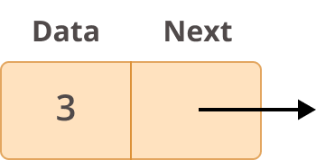
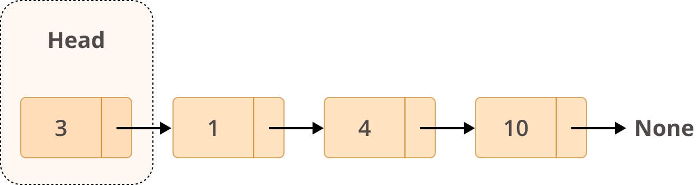
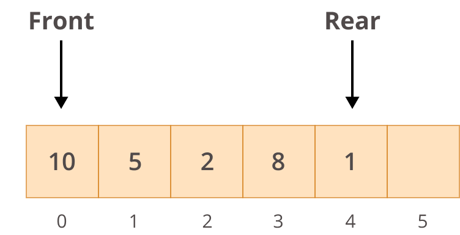
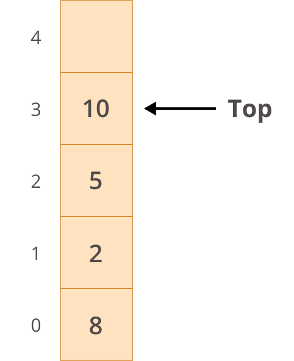

## Programování 2

# 7. cvičení, 2-4-2024

###### 

## Farní oznamy

1. Tento text a kódy ke cvičení najdete v repozitáří cvičení na https://github.com/PKvasnick/Programovani-2.

2. **Domácí úkoly**: 

   **Prodloužil jsem termín odevzdání: 10b do neděle** a pak ale už nic (týká se nových řešení - pokud jste začali řešit před termínem, body dostanete). Bohužel jsem přes svátky nestihl všechno zkontrolovat. 

   - Nejasnost u prioritní fronty:: psal jsem, že nemusíte používat spojovaný seznam, ale mnoho z vás spojovaný seznam použilo (což je samozřejmě jenom chvalitebné).
   - Garáž: to je především úloha na datové struktury.
   - Neklesající posloupnosti jsou úloha na rekurzi (i když ne nevyhnutně)

​	**Tento týden to uděláme stejně**, tedy dnes dostanete domácí úkoly do přespříští neděle.

3. **Zápočtový program** a **zápočtový test**: dostali jsme se do dalšího měsíce výuky a je čas promluvit si o tom, co vás čeká.

   - **Zápočtový program**: Měl by to být větší ucelený kus kódu, řádově stovky řádků na rozdil od desítek pro domácí úkoly.  Víc níže.

   - **Zápočtový test** Jeden příklad kategorie domácího úkolu vyřešit v reálném čase u počítače v učebně. 

---

**Dnešní program**:

- Zápočtový program
- Kvíz 
- Mini-tutoriál: výjimky
- Lineární spojované seznamy a jejich variace

---

## Zápočtový program

**Zápočtový program je  závěrečná výstupní práce každého studenta, vyvrcholení roční  výuky programování. **

Zatímco průběžné domácí úkoly mají typicky rozsah  několika málo desítek řádků kódu a zadaný úkol je pro všechny studenty  stejný, zápočtové programy mají obvykle rozsah několika set řádků kódu a studenti zpracovávají různá témata. 

- Zadání v polovině letního semestru
- Dokončení: šikovní ke konci semestru, typicky přes prázdniny
- Odevzdání první verze: konec srpna, finální verze: konec září
- Textová dokumentace
  - Zadání
  - Uživatelská část - návod na použití
  - Technická - popis z programátorského hlediska
- **Téma**: Jakékoliv.  
  - poslat specifikaci - musíme se dohodnout na rozsahu, aby zadání nebylo příliš sliožité ani příliš jednoduché
    - Jednoduché hry: Sudoku, Piškvorky (PyGame)
    - Matematické knihovny nebo výukové materiály: numerická diferenciace, maticové operace atd.
    - Fyzikální a statistické simulace - difúze částic v složitém prostředí, perkolace, pohyb osob v budově s výtahem,  pohyb zákazníků v nákupním středisku, zákazníci obědvající v restauraci, pohyb lidí na Matějské pouti, epidemiologické modely apod.
    - Statistika, zpracování a prezentace dat 
  - nějaká témata máme, podívejte se třeba na web Martina Mareše: [http://mj.ucw.cz/vyuka/zap/](http://mj.ucw.cz/vyuka/zap/)
  - termín pro zadání závěrečného programu: **do konce dubna**, pak dostanete témata přidělena.

#### **Co se očekává, že uděláte**

**Do konce dubna:**

1. Rozmyslete si anebo vyhledejte vhodné téma, a napište mi e-mail.  Také napište, pokud nemáte představu, co byste si vybrali. 
2. Dohodneme se na zadání (10-15 řádek textu) a odsouhlasíme si ho.

**(Nejpozději) do konce srpna:**

1. Pak si začnete studovat, co potřebujete k implementaci a psát kód.
2. Napíšete si kód a otestujete
3. Pokud se zaseknete, napíšete mi. 
4. Vytvoříte technický popis a uživatelský návod (nemusí být rozsáhlé).
5. Zřídíte si pro svúj kód GitHub repozitář, uploadujete ho a pošlete mi link.

**(Nejpozději) do konce září:**

Doiterujeme ke konečné verzi (80% zadání běžně nepotřebuje iteraci) a dostanete zápočet.

​		

## Na zahřátí

> *“Experience is the name everyone gives to their mistakes.” – Oscar Wilde*

Vlastní naražený nos poučí lépe než rady učených mistrů. Tak jako kuchař musí zkazit kopu receptů, než se vyučí, i programátor musí udělat kopu chyb. Naučí vás to některé věci automaticky nedělat.

### Co dělá tento kód

```python
[x for x in dir("") if "_" not in x]
```

Návod:

`dir(objekt)` vypíše atributy objektu.

---

### Mini tutoriál: Výjimky

Výjimky řada z vás běžně používá v kódu, ale dáme si opakování:

Obsluha výjimek v Pythonu využívá strukturu `try + except`,  případně s dodatečnými větvemí `else` a `finally`:


`Exception` je základní typ výjimky, specifické výjimky jsou jeho podtřídami. Pokud zachytáváme `Exception`, znamená to, že zachytávame všechny výjimky. V takovém případě nemusíme `Exception` v klauzule `except` vůbec uvádět:


Úplně nejlepší je ale toto vůbec **NIKDY** nepoužívat. Zachytávejte ty chybové stavy, které umíte ošetřit. Některé výjimky prostě musíte nechat "přepadnout" do části kódu, která si s ní bude umět poradit. 

Co udělat se zachycenou výjimkou? Co potřebujete:


Musíte samozřejmě zachytit správnou výjimku.


Můžete také zachytit víc výjimek:


tady ale vzniká problém: Jak poznat, kterou výjimku jsme zachytili?

Jedna z možností je:


Praktičtější řešení je použít více klauzulí `except`, každou pro jeden typ výjimky. 

`Exception`je třída, má své atributy a můžeme se na ně doptat.


Můžeme si také vytvořit vlastní výjimku:


Klauzule `finally` vám umožňuje provést úklid po operaci nezávisle od toho, zda se operace povedla nebo ne.

Jiný způsob, jak uklidit po operaci se souborem, jsme si ukazovali v minulém semestru - je to použití kontextového manažera:


Toto zaručeně po sobě uklidí, a to i v případě, že se něco pokazí - například pokud se nenajde soubor. 

Modul `contextlib` také umožňuje zpracovat výjimky pomocí kontextového manažera namísto `try-except-finally`:

```python
import os

try:
    os.remove("mujsoubor.txt")
except FileNotFoundError:
    pass

```

Tady jenom chceme, aby se kód nezastavil, když se nenajde soubor, který chceme odstranit.

```python
from contextlib import suppress

with suppress(FileNotFoundError):
    os.remove("mujsoubor.txt")
```

Pro případy, kdy chceme něco udělat, pokud se objeví výjimka, musíme použít `try-except`.

Pokud chceme, aby program v případě chyby skončil, můžeme v klauzuli `except` použít `sys.exit()` anebo můžete výjimku znova vyvolat:


**`try-except` namísto `if-else`**

Pokud potřebujeme zachytit zřídka se vyskytující stav, můžeme namísto `if-else` použít `try-except`. Podmíněný příkaz přidává prodlení ke zpracování obou větví, zatímco `try-except` přidává prodlení prakticky jenom ke větvi `except`.

Není dobré takovýto způsob nadužívat, ale je to Pythonský způsob vyjadřování a neváhejte ho ve vhodné situaci použít. 

---


## Lineární spojovaný seznam

"Převratný vynález": **spojení dat a strukturní informace**:



Takovéto jednotky pak umíme spojovat do větších struktur. LSS je nejjednodušší z nich.



**Aplikace**: 

- Fronty a zásobníky






### Spojované seznamy v Pythonu

`list` v Pythonu je [dynamické pole](http://www.laurentluce.com/posts/python-list-implementation/)

- přidávání prvků: `insert` a `append`
- odebírání prvků: `pop` a `remove`

`collections.deque` je implementace fronty se dvěma konci.

- `append` / `appendleft`
- `pop` / `popleft`

**Omezené programování**

Dosud jsme se učili hledat optimální prostředky pro implementaci různých věcí - binární vyhledávání a modul *bisect*, haldu a modul *heapq*, množiny a slovníky a pod.

Teď máme jinou situaci: Dobrovolně se zříkáme něketerých prostředků (např. přístup k položkám přes index) a zkoumáme, co všechno dokážeme udělat. 

### Implementujeme spojovaný seznam

Spojovaný seznam s hlavou (kód v repozitáří, `code/Ex6/simply_linked_list1.py`)

```python
# Simple linked list

class Node:
    def __init__(self, value):
        """Polozku inicializujeme hodnotou value"""
        self.value = value
        self.next = None

    def __repr__(self):
        """Reprezentace objektu na Pythonovske konzoli"""
        return str(self.value)


class LinkedList:
    def __init__(self, values = None):
        """Spojovany seznam volitelne inicializujeme seznamem hodnot"""
        if values is None:
            self.head = None
            return
        self.head = Node(values.pop(0)) # pop vrati a odstrani hodnotu z values
        node = self.head
        for value in values:
            node.next = Node(value)
            node = node.next

    def __repr__(self):
        """Reprezentace na Pythonovske konzoli:
        Hodnoty spojene sipkami a na konci None"""
        values = []
        node = self.head
        while node is not None:
            values.append(str(node.value))
            node = node.next
        values.append("None")
        return " -> ".join(values)

    def __iter__(self):
        """Iterator prochazejici _hodnotami_ seznamu,
        napr. pro pouziti v cyklu for"""
        node = self.head
        while node is not None:
            yield node.value
            node = node.next

    def add_first(self, node):
        """Prida polozku na zacatek seznamu,
        tedy na head."""
        node.next = self.head
        self.head = node

    def add_last(self, node):
        """Prida polozku na konec seznamu."""
        p = self.head
        prev = None
        while p is not None:
            prev, p = p, p.next
        prev.next = node


```

### Vkládání a odstraňování prvků

- `add_first`, `add_last`
- `add_before`, `add_after`
- `remove`

```python
# Simple linked list 2

class Node:
    def __init__(self, value):
        """Polozku inicializujeme hodnotou value"""
        self.value = value
        self.next = None

    def __repr__(self):
        """Reprezentace objektu na Pythonovske konzoli"""
        return str(self.value)


class LinkedList:
    def __init__(self, values = None):
        """Spojovany seznam volitelne inicializujeme seznamem hodnot"""
        if values is None:
            self.head = None
            return
        self.head = Node(values.pop(0)) # pop vrati a odstrani hodnotu z values
        node = self.head
        for value in values:
            node.next = Node(value)
            node = node.next

    def __repr__(self):
        """Reprezentace na Pythonovske konzoli:
        Hodnoty spojene sipkami a na konci None"""
        values = []
        node = self.head
        while node is not None:
            values.append(str(node.value))
            node = node.next
        values.append("None")
        return " -> ".join(values)

    def __iter__(self):
        """Iterator prochazejici polozkami seznamu,
        napr. pro pouziti v cyklu for"""
        node = self.head
        while node is not None:
            yield node
            node = node.next

    def values(self):
        vals = []
        for node in self:
            vals.append(node.value)
        return vals

    def get_last_node(self):
        for node in self:
            pass
        return node

    def __len__(self):
        count = 0
        for node in self:
            count += 1
        return count

    def add_first(self, val):
        """Prida polozku na zacatek seznamu,
        tedy na head."""
        node = Node(val)
        node.next = self.head
        self.head = node

    def add_last(self, val):
        """Prida polozku na konec seznamu."""
        for p in self:
            pass
        node = Node(val)
        p.next = node

    def get_node(self, target_val):
        for p in self:
            if p.value == target_val:
                return p
        else:
            return None

    def add_after(self, target_val, new_val):
        p = self.get_node(target_val)
        if p is None:
            raise ValueError(f"{target_val} se nenachazi v seznamu.")
        node = Node(new_val)
        node.next = p.next
        p.next = node

    def add_before(self, target_val, new_val):
        if self.head.value == target_val:
            node = Node(new_val)
            node.next = self.head
            self.head = node
            return
        prev = self.head
        p = prev.next
        while (p is not None) and (p.value != target_val):
            prev = p
            p = p.next
        if p is None:
            raise ValueError(f"{target_val} se nenachazi v seznamu.")
        node = Node(new_val)
        node.next = p
        prev.next = node

    def remove(self, target_val):
        p = self.head
        if p.value == target_val:
            self.head = p.next
            del p
            return
        prev = p
        p = p.next
        while (p is not None) and (p.value != target_val):
            prev = p
            p = p.next
        if p is None:
            raise ValueError(f"{target_val} se nenachazi v seznamu.")
        prev.next = p.next
        del p

```


### Třídění LSS

Utříděný seznam: `add` vloží prvek na správné místo

Jak utřídit již existující seznam?

**Bucket sort** vyžaduje složitou datovou strukturu


Heapsort potřebuje skákat z k na 2k (umíme, ale neradi děláme) a zpátky (neumíme, nebo jenom ztěžka)

Máme třídící algoritmus, který by vystačil s průchody v jednom směru? Umíte ho implementovat v LSS?

Bubble sort, insert sort: volíme tak, abychom se vyhnuli složitým logickým situacím ohledně existence nebo neexistence uzlů.

---


## Varianty LSS

- **Dvouhlavý seznam**: kromě *head* také udržujeme pointr na poslední prvek, *tail*.  

- **Dvojitě spojovaný seznam** - pro `deque`

  

  

```python
class Node:
    def __init__(self, data):
        self.data = data
        self.next = None
        self.previous = None
```

Místy nepříjemné programování kvůli složitější logice v degenerovaných a okrajových případech. 

- **Cyklický seznam**


Cyklickým seznamem můžeme procházet počínaje libovolným prvkem:

```python
# Kruhový seznam - pointer u poslední položky ukazuje na začátek seznamu.
from _collections_abc import Generator


class Node:
    def __init__(self, value):
        """Polozku inicializujeme hodnotou value"""
        self.value = value
        self.next = None

    def __repr__(self):
        """Reprezentace objektu na Pythonovske konzoli"""
        return str(self.value)


class CircularLinkedList:
    def __init__(self, values = None):
        self.head = None
        if values is not None:
            self.head = Node(values.pop(0))
            node = self.head
            for val in values:
                node.next = Node(val)
                node = node.next
            node.next = self.head

    def traverse(self, starting_point: Node = None) -> Generator[Node, None, None]:
        if starting_point is None:
            starting_point = self.head
        node = starting_point
        while node is not None and (node.next != starting_point):
            yield node
            node = node.next
        yield node

    def print_list(self, starting_point: Node = None) -> None:
        nodes = []
        for node in self.traverse(starting_point):
            nodes.append(str(node))
        print(" -> ".join(nodes))

```

Jak to funguje:

```python
>>> circular_llist = CircularLinkedList()
>>> circular_llist.print_list()
None

>>> a = Node("a")
>>> b = Node("b")
>>> c = Node("c")
>>> d = Node("d")
>>> a.next = b
>>> b.next = c
>>> c.next = d
>>> d.next = a
>>> circular_llist.head = a
>>> circular_llist.print_list()
a -> b -> c -> d

>>> circular_llist.print_list(b)
b -> c -> d -> a

>>> circular_llist.print_list(d)
d -> a -> b -> c
```

---

### 
