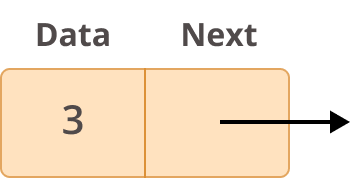
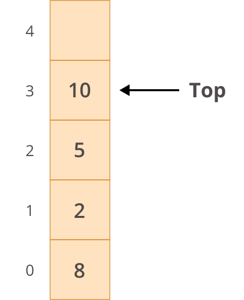

## Programování 2

# 7. cvičení, 31-3-2026


## Farní oznamy

1. Tento text a kódy ke cvičení najdete v repozitáří cvičení na https://github.com/PKvasnick/Programovani-2.

2. **Domácí úkoly**: 

   **Prodloužil jsem termín odevzdání domácích úkolů o týden**.   

   - Úmyslně jsem vás s LSS hodil do vody, abyste měli představu o čem budeme mluvit na dnešním cvičení.
   
   - Dostanete jediný další domácí úkol se standardními termíny.

3. **Zápočtový program** a **zápočtový test**: dostali jsme se do dalšího měsíce výuky a je čas promluvit si o tom, co vás čeká.

   - **Zápočtový program**: Měl by to být větší ucelený kus kódu, řádově stovky řádků na rozdil od desítek pro domácí úkoly.  Víc níže.

   - **Zápočtový test** Jeden příklad kategorie domácího úkolu vyřešit v reálném čase u počítače v učebně.  Pravidla se ale můžou mírně změnit (k lepšímu)

---

**Dnešní program**:

- Zápočtový program
- Kvíz 
- Lineární spojované seznamy a jejich variace

---

## Zápočtový program

**Zápočtový program je  závěrečná výstupní práce každého studenta, vyvrcholení roční výuky programování. **

Zatímco průběžné domácí úkoly mají typicky rozsah  několika málo desítek řádků kódu a zadaný úkol je pro všechny studenty  stejný, zápočtové programy mají obvykle rozsah několika set řádků kódu a studenti zpracovávají různá témata. 

- Zadání v polovině letního semestru
- Dokončení: šikovní ke konci semestru, typicky přes prázdniny
- Odevzdání první verze: konec srpna, finální verze: konec září
- Textová dokumentace
  - Zadání
  - Uživatelská část - návod na použití
  - Technická - popis z programátorského hlediska
- **Téma**: Jakékoliv.  
  - poslat specifikaci - musíme se dohodnout na rozsahu, aby zadání nebylo příliš sliožité ani příliš jednoduché
    - Jednoduché hry: Sudoku, Piškvorky (PyGame)
    - Matematické knihovny nebo výukové materiály: numerická diferenciace, maticové operace, symbolické manipulace (SymPy), geometrie, diferenciální rovnice, aplikace SAT solverů (piškvorky a pod.), zajímavé algoritmy (dancing links) atd.
    - Strojové učení - neurální sítě, rozhodovací stromy, Gaussovské směsi, ligistická regrese a pod. 
    - Fyzikální a statistické simulace - difúze částic v složitém prostředí, perkolace, Monte Carlo - Metropolis-Hastings a pod., kSinetika, ,pohyb osob v budově s výtahem,  pohyb zákazníků v nákupním středisku, pohyb lidí na Matějské pouti, epidemiologické modely apod.
    - Statistika, zpracování a prezentace dat, Bayesovské metody (STAN) a pod.
  - Nějaká témata máme, podívejte se třeba na web Martina Mareše: [http://mj.ucw.cz/vyuka/zap/](http://mj.ucw.cz/vyuka/zap/)
  - termín pro zadání závěrečného programu: **do konce dubna**, pak dostanete témata přidělena.

#### **Co se očekává, že uděláte**

**Do konce dubna:**

1. Rozmyslete si anebo vyhledejte vhodné téma, a napište mi e-mail se svou představou.  Také napište, pokud nemáte představu, co byste si vybrali. 
2. Dohodneme se na zadání (10-15 řádek textu) a odsouhlasíme si ho.

**(Nejpozději) do konce srpna:**

1. Po odsouhlasení tématu se můžete pustit do díla. Nastudujete si, co potřebujete k implementaci a začnete psát kód.
2. Otestujete, jak kód funguje. Pokud se zaseknete, napíšete mi. 
3. Vytvoříte technický popis a uživatelský návod (nemusí být rozsáhlé, pouze výstižné,  1 A4 je spíš rozsáhlejší dokumentace).
4. Zřídíte si pro svúj kód GitHub repozitář, uploadujete ho, dpolníte náležitosti (README.md, setup.py, requirements.txt) a pošlete mi link.

**(Nejpozději) do konce září:**

1. Pokud od vás neuslyším do poloviny září, začnu zjišťovat, co se děje.

2. Doiterujeme ke konečné verzi (obvykle kolem 80% zadání nepotřebuje iteraci) a dostanete zápočet.

​		

## Na zahřátí

> *“Experience is the name everyone gives to their mistakes.” – Oscar Wilde*

Vlastní naražený nos poučí lépe než rady učených mistrů. Tak jako kuchař musí zkazit kopu receptů, než se vyučí, i programátor musí udělat kopu chyb. **Nebojte se dělat chyby.**. Naučí vás to některé věci automaticky nedělat.

### Co dělá tento kód

```python
[x for x in dir("") if "_" not in x]
```

Návod:

`dir(objekt)` vypíše atributy objektu.

---

### None

`None` je v Pythonu unikátní *objekt*, představující chybějící hodnotu. Máme jedno jediné `None`, prostupující všechna prázdná místa v Pythonském vesmíru.

>  `None` se ničemu nerovná, jenom chybí. 

Takže: i když v Pythonu lze napsat `if uzel.dalsi == None:` , podstatě věci lépe odpovídá `if uzel.dalsi is None:`.

---

---

A jdeme rovnou na věc.

## Lineární spojovaný seznam

"Převratný vynález": **spojení dat a strukturní informace**:



Takovéto jednotky pak umíme spojovat do větších struktur. LSS je nejjednodušší z nich.


**Aplikace**: 

- Fronty a zásobníky





### Spojované seznamy v Pythonu

`list` v Pythonu je [dynamické pole](http://www.laurentluce.com/posts/python-list-implementation/)

- přidávání prvků: `insert` a `append`
- odebírání prvků: `pop` a `remove`

Všechno máme, ale to neznamená, že je dobré to používat. Tyto operace v seznamu jsou **drahé** (O(n))).

Co seznam umí výborně, je náhodný přístup k položkám přes index, ten má konstantní složitost O(1).

`collections.deque` je implementace fronty se dvěma konci.

- `append` / `appendleft`
- `pop` / `popleft`

jsou levné, protože `deque` je implementovaná jako dvojitě-spojovaný seznam.  

Na druhé straně,  náhodný přístup přes index má lineární složitost.

**Omezené programování**

Dosud jsme se učili hledat optimální prostředky pro implementaci různých věcí - binární vyhledávání a modul *bisect*, haldu a modul *heapq*, množiny a slovníky a pod.

Teď máme jinou situaci: Dobrovolně se zříkáme něketerých prostředků (např. přístup k položkám přes index) a zkoumáme, co všechno dokážeme udělat. 

### Implementujeme spojovaný seznam

Tento kód najdete v repozitáři, `code/Ex07/LSS:py`:

```python
# Operations on a headless simply linked list

class Node:
    def __init__(self, data=None):
        self.data = data
        self.next = None

    def __str__(self):
        return str(self.data)


class LinkedList:
    def __init__(self):
        self.head = None

    def print_list(self):
        current_node = self.head
        while current_node:
            print(current_node.data, end=" -> ")
            current_node = current_node.next
        print("None")

```

### Průchod LSS

Trošku syntaktického cukru:

```python
    def __iter__(self):
        """Iterator traversing the list's nodes, can be used in a for cycle."""
        node = self.head
        while node is not None:
            yield node
            node = node.next

    def get_last(self):
        for node in self:
            pass
        return node

    def __len__(self):
        count = 0
        for node in self:
            count += 1
        return count

```

Takto bychom asi mohli přepsat také metodu `print_list`, ale chceme dělat zajímavější věci než jen přecházet seznamem.

> [!TIP]
>
> **Jak programovat v LSS?**
>
> - Pamatujte, že ke všem objektům musíte mít ručičku, abyste je neztratili. 
> - Kreslete si diagramy a promyslete si, jak přepojit drátky.
> - Snažte se schovat komplexitu dovnitř metod.
> - Používejte debugger

Proto si i tady na cvičení budeme kreslit obrázky.

### Vkládání a odstraňování prvků

Tyto operace známe z `deque`, tak je nazveme podobně.

- `append`, `append_left`
- `pop`, `pop_left`
- `remove`, `pop_node`

`pop_value` je analogem funkce `pop(index)`, ale protože v LSS nepodporujeme přístup přes index, funkce vyhledá první uzel s hodnotou `key`, odstraní ho ze seznamu a vrátí ho. 

```python
    def append(self, data):
        new_node = Node(data)
        if self.head is None:
            self.head = new_node
            return
        last_node = self.head
        while last_node.next:
            last_node = last_node.next
        last_node.next = new_node

    def append_left(self, data):
        new_node = Node(data)
        new_node.next = self.head
        self.head = new_node

    def pop(self):
        if self.head is None:
            return None
        new_end = None
        popped_node = self.head
        while popped_node.next is not None:
            new_end = popped_node
            popped_node = popped_node.next
        if new_end is None:
            self.head = None
        else:
            new_end.next = None
        return popped_node

    def pop_left(self):
        if self.head is None:
            return None
        popped_node = self.head
        self.head = self.head.next
        return popped_node.data

    def remove(self, key):
        current_node = self.head
        if current_node and current_node.data == key:
            self.head = current_node.next
            current_node = None
            return
        prev_node = None
        while current_node and current_node.data != key:
            prev_node = current_node
            current_node = current_node.next
        if current_node is None:
            return
        prev_node.next = current_node.next
        current_node = None
        
    def pop_node(self, key):
        current_node = self.head
        if current_node and current_node.data == key:
            self.head = current_node.next
            return current_node
        prev_node = None
        while current_node and current_node.data != key:
            prev_node = current_node
            current_node = current_node.next
        if current_node is None:
            return None
        prev_node.next = current_node.next
        return current_node

    def __del__(self):
        current_node = self.head
        while current_node:
            next_node = current_node.next
            del current_node
            current_node = next_node

```

Doplinili jsme také *dunder* metodu `__del__`, která nám umožňuje vymazat celý LSS příkazem `del llist`.

A teď povolme uzdu fantazii.

> [!NOTE]
>
> **Pravidla**: 
>
> - Vyhýbáme se prohazování dat mezi uzly namísto prohazování uzlů. Můžete si představit, že uzly mají časovou známku a nemůžeme manipulovat s jejich obsahem.
> - Ze stejného důvodu nevytváříme kopie uzlů s tím, že původní uzly vymažeme. 
> - Nepoužíváme seznamy a jiné "pokročilejší" kontejnery, pokud to rozhraní vyloženě nevyžaduje .
>
> Tato pravidla můžou samozřejmě být pro některé situace nadbytečná, ale kvůli smyslu pro fair play je budeme dodržovat. 

### Třídění LSS

Bubble sort: opakované sekvenční průchody LSS.  Základem je, abychom uměli prohodoit pořadí dvou uzlů seznamu. 

```python
	def swap_with_next(self, node: Node):
        if node == self.head and self.head.next is not None:
            self.head = self.head.next
            node.next = self.head.next
            self.head.next = node
            return

        prev_node = self.head
        while prev_node.next and prev_node.next != node:
            prev_node = prev_node.next
        if prev_node.next is None:  # node is not found
            return
        # prev -> node -> next_node to prev -> next_node -> node
        next_node = node.next
        prev_node.next = next_node
        node.next = next_node.next
        next_node.next = node

    def sort(self):
        if self.head is None or self.head.next is None:
            return
        current_node = self.head
        n_swaps = -1
        while n_swaps != 0:
            n_swaps = 0
            current_node = self.head
            while current_node and current_node.next:
                next_node = current_node.next
                if current_node.data > next_node.data:
                    self.swap_with_next(current_node)
                    n_swaps += 1
                else:
                    current_node = current_node.next


```

#### Inverze a částečné třídění LSS

Ještě implementujeme metody `invert`a `partition`. První obrátí pořadí uzlů v seznamu (u LSS to je zásadní změna), a druhá přesune uzly, splňující logickou podmínku, dopředu, ale jinak pořadí  uzlů nemění.  Ne, nejdeme implementovat quicksort. Děláme to pro ilustraci hezkých postupů.

```python
    def invert(self):
        prev_node = None
        current_node = self.head
        while current_node:
            next_node = current_node.next
            current_node.next = prev_node
            prev_node = current_node
            current_node = next_node
        self.head = prev_node

    
    def partition(self, unary_predicate):
        # Partition the list based on a unary predicate, i.e.,
        # a function up(x) -> bool. The nodes that satisfy the predicate
        # are moved to the front of the list, preserving their relative order.
        less_head = less_tail = None
        greater_head = greater_tail = None
        current_node = self.head
        while current_node:
            next_node = current_node.next
            if unary_predicate(current_node.data):
                if less_head is None:
                    less_head = less_tail = current_node
                else:
                    less_tail.next = current_node
                    less_tail = current_node
                less_tail.next = None
            else:
                if greater_head is None:
                    greater_head = greater_tail = current_node
                else:
                    greater_tail.next = current_node
                    greater_tail = current_node
                greater_tail.next = None
            current_node = next_node
        if less_head is None:
            self.head = greater_head
        else:
            self.head = less_head
            less_tail.next = greater_head

```

### Jak to funguje

```python
def main():
    llist = LinkedList()
    llist.append(3)
    llist.append(2)
    llist.append(1)
    llist.print_list()
    llist.append_left(4)
    llist.append_left(5)
    llist.print_list()
    llist.swap_with_next(llist.head.next)
    llist.print_list()
    llist.remove(llist.head.next.data)
    llist.print_list()
    llist.sort()
    llist.print_list()
    llist.partition(lambda x: x % 2 == 0)
    llist.print_list()


if __name__ == "__main__":
    main()

---
3 -> 2 -> 1 -> None
5 -> 4 -> 3 -> 2 -> 1 -> None
5 -> 3 -> 4 -> 2 -> 1 -> None
5 -> 4 -> 2 -> 1 -> None
1 -> 2 -> 4 -> 5 -> None
5 -> 4 -> 2 -> 1 -> None
4 -> 2 -> 5 -> 1 -> None
```


---


## Varianty LSS

- **Dvouhlavý seznam**: kromě *head* také udržujeme pointr na poslední prvek, *tail*.  

- **Dvojitě spojovaný seznam** - pro `deque`

  

  

```python
class Node:
    def __init__(self, data):
        self.data = data
        self.next = None
        self.previous = None
```

Místy nepříjemné programování kvůli složitější logice v degenerovaných a okrajových případech. 

- **Cyklický seznam**


Cyklickým seznamem můžeme procházet počínaje libovolným prvkem:

```python
# Kruhový seznam - pointer u poslední položky ukazuje na začátek seznamu.
from _collections_abc import Generator


class Node:
    def __init__(self, value):
        """Polozku inicializujeme hodnotou value"""
        self.value = value
        self.next = None

    def __repr__(self):
        """Reprezentace objektu na Pythonovske konzoli"""
        return str(self.value)


class CircularLinkedList:
    def __init__(self, values = None):
        self.head = None
        if values is not None:
            self.head = Node(values.pop(0))
            node = self.head
            for val in values:
                node.next = Node(val)
                node = node.next
            node.next = self.head

    def traverse(self, starting_point: Node = None) -> Generator[Node, None, None]:
        if starting_point is None:
            starting_point = self.head
        node = starting_point
        while node is not None and (node.next != starting_point):
            yield node
            node = node.next
        yield node

    def print_list(self, starting_point: Node = None) -> None:
        nodes = []
        for node in self.traverse(starting_point):
            nodes.append(str(node))
        print(" -> ".join(nodes))

```

Jak to funguje:

```python
>>> circular_llist = CircularLinkedList()
>>> circular_llist.print_list()
None

>>> a = Node("a")
>>> b = Node("b")
>>> c = Node("c")
>>> d = Node("d")
>>> a.next = b
>>> b.next = c
>>> c.next = d
>>> d.next = a
>>> circular_llist.head = a
>>> circular_llist.print_list()
a -> b -> c -> d

>>> circular_llist.print_list(b)
b -> c -> d -> a

>>> circular_llist.print_list(d)
d -> a -> b -> c
```

---


## Domácí úkol

Protože se řada z vás potřebuje zabývat předešlými úkoly, dostanete jediný další domácí úkol:

**Fronta zvířat**, kde si dále procvičíte práci s LSS. Tato úloha je o něco jednodušší než úkol o frontě lidí různých věků.
