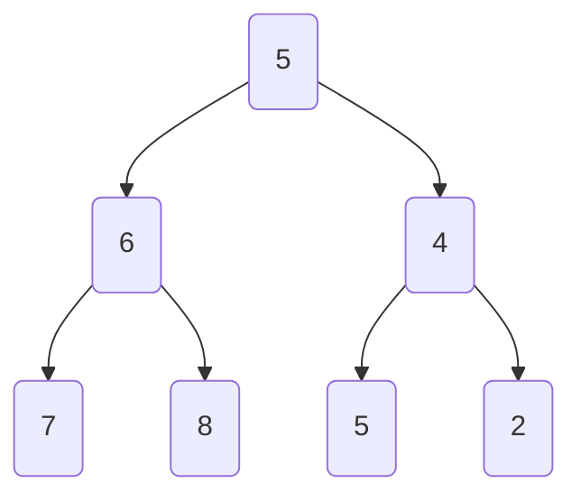
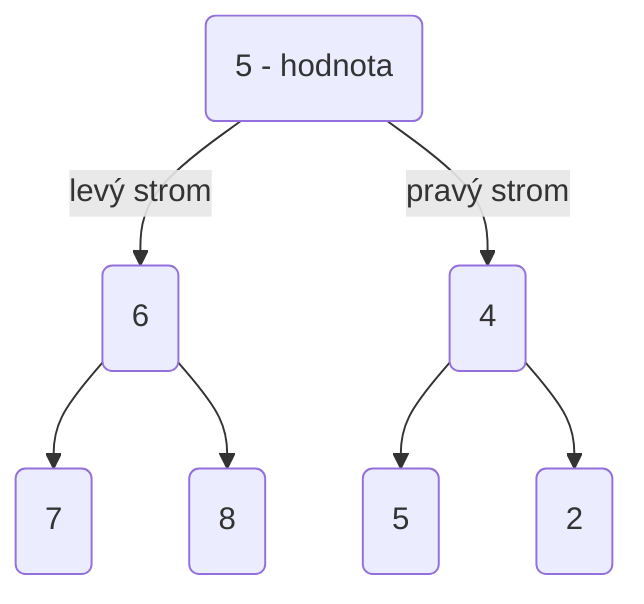
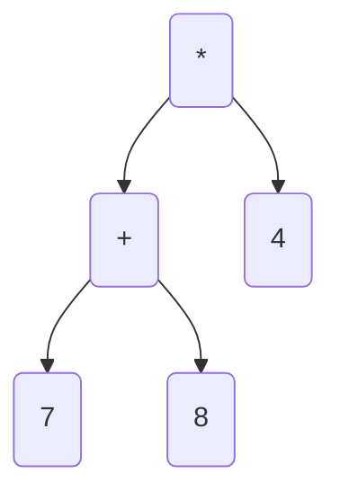
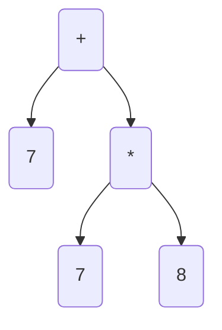
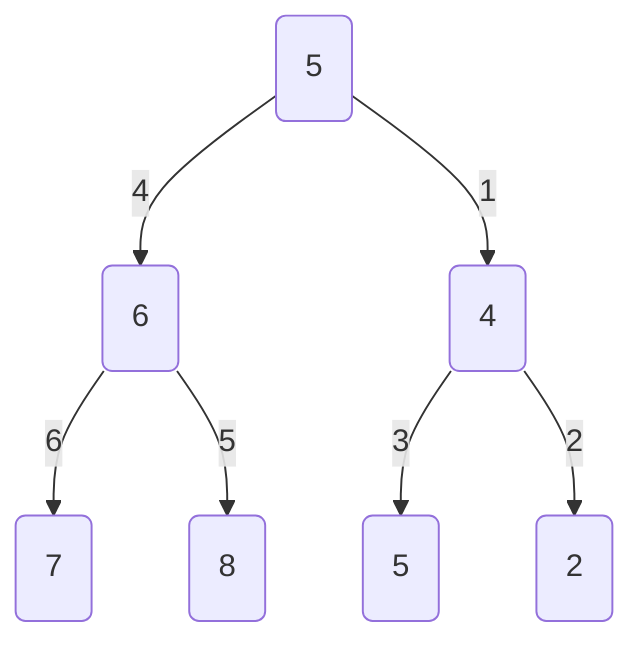
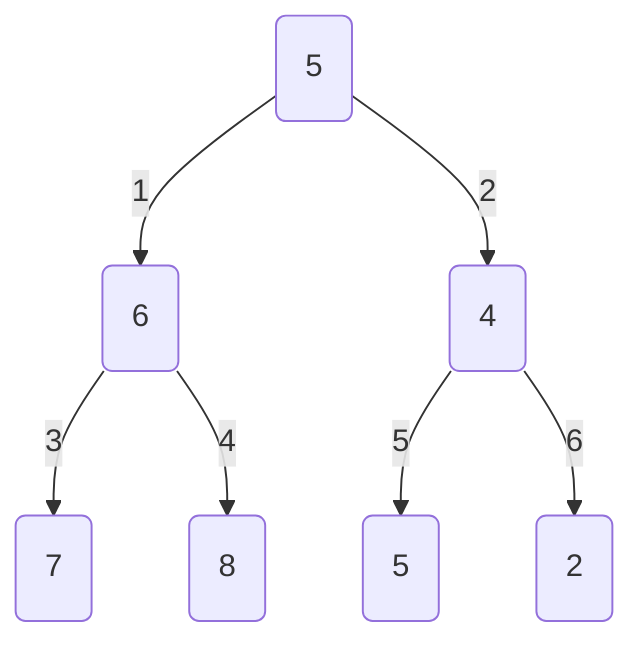
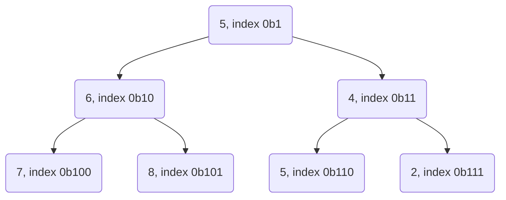

## Programování 2

# 8. cvičení, 14-4-2022

###### tags: `Programovani 2`, `čtvrtek 1`, `čtvrtek 2`

## Farní oznamy

1. Tento text a kódy ke cvičení najdete v repozitáří cvičení na https://github.com/PKvasnick/Programovani-2.
2. **Minulý týden** jsme cvičení neměli. Dostanete dodatečný materiál k prostudování po malých kouscích v příštích týdnech. 
3. **Domácí úkoly**: Dva minulý týden, víc brzo, protože máme víc věcí, na které se dají vymýšlet smysluplné úkoly. 

---

**Dnešní program**:

- Kvíz 
- Mini-tutoriál: konstanty (opravdu mini)
- Binární stromy
- Rekurze

---

## Na zahřátí

```python
import this

The Zen of Python, by Tim Peters

Beautiful is better than ugly.
Explicit is better than implicit.
Simple is better than complex.
Complex is better than complicated.
Flat is better than nested.
Sparse is better than dense.
Readability counts.
Special cases aren't special enough to break the rules.
Although practicality beats purity.
Errors should never pass silently.
Unless explicitly silenced.
In the face of ambiguity, refuse the temptation to guess.
There should be one-- and preferably only one --obvious way to do it.
Although that way may not be obvious at first unless you're Dutch.
Now is better than never.
Although never is often better than *right* now.
If the implementation is hard to explain, it's a bad idea.
If the implementation is easy to explain, it may be a good idea.
Namespaces are one honking great idea -- let's do more of those!

```

Navštivte https://testdriven.io/blog/clean-code-python/ pro množství rad o tom, jak psát v Pythonu dobrý kód.

### Co dělá tento kód

```python
(lambda : 50)()
```

---

## Mini-tutoriál: konstanty

**Konstanty** pot\ŕebujeme, když máme v kódu fixní číselné hodnoty nebo řetězce. 

Je dobrou praxí definovat konstantní čísla, řetězce nebo jiné objekty na jediném místě, 

- abychom je mohli v případě potřeby lehce změnit 
- aby byl kód srozumitelnější.

V Pythonu máme některé konstanty v modulu `math`, například `math.pi`, `math.e` a pod. Pro metody strojového učení nebo fyzikální simulace často potřebujeme rozsáhlé seznamy konstant. 

### 1. Tradiční způsob

Podle  příručky Pythonského stylu konstanty označujeme identifikátory z velkých písmen a umísťujeme je na začátek modulu:

```python
N_AVOGADRO = 6.022e23
K_GRAVITY = 6.673e-11
H_PLANCK = 6.626e-34
    
def atoms_from_moles(moles: float) -> float:
    return moles * N_AVOGADRO
...
```

- Velká písmena zabezpečují lehkou identifikaci objektu jako konstanty a tedy i jako určitou ochrana před náhodným přepsáním. 
- Hodnotu konstanty je ale možné přepsat a toto riziko je větší díky tomu, že konstanty umísřujeme do globálního prostoru jmen. Například můžeme omylem předefinovat konstantu konstantou stejného jména, ale v jiných jednotkách, z jiného modulu. 
- Umístění na začátku modulu sice umožňuje lehce identifikovat konstantní hodnoty v kódu, ale může se nám tam nahromadit spousta čisel různého významu. Někdy je lepší definovat konstanty tam, kde je používáme. 

### 2. Třídy konstant

Pokud spravujeme různé soubory konstant, můžeme použít jiný přístup - definovat konstanty jako atributy tříd, které nelze měnit. 

**Metoda 1:** Dataclass

Dataclass (modul `dataclasses`) představují efektivní způsob tvorby tříd, jejichž primárním účelem je uchovávat data. Pro účely této části si jenom řekneme, že dataclass můžeme vytvořit jako zmrzlý - frozen - tedy jako konstantní třídu, jejíž atributy nelze měnit.

```python
# Const class:
# Container for numbers protected against change
# Variant 1: frozen dataclass

from dataclasses import dataclass


@dataclass(frozen=True)
class ConstClass:
    PI: float = 3.1416
    E: float = 2.7183


ConstClass.EULER_GAMMA = 0.57722 # Can add attributes to class
ConstClass.E = 2.71828 # Can modify class attributes

const = ConstClass()   # Instances are frozen:
                       # no adding or modifying
print(const.PI, const.E)


const.PI = 42 # dataclasses.FrozenInstanceError:  
              # cannot assign to field 'PI'


3.1416 2.71828
Traceback (most recent call last):
...
dataclasses.FrozenInstanceError: cannot assign to field 'PI'

```

- Konstanty jsou atributy třídy `Const`  a není nutné, aby měly identifikátory z velkých písmen. To může být graficky méně rušivé. 
- Analyzátor kódu i interpret brání změně atributů instancí zmrzlé třídy, i když samotnou třídu modifikovat lze. 

**Metoda 2** `__setattr__`

Můžeme také použít běžnou třídu, ale upravit metodu, kterou se do třídy přidávají atributy - tedy metodu `__setattr__`:

```python
class Const:
    def __setattr__(self, name, value):
        if hasattr(self, name):
            raise TypeError('cannot mutate constant')
        super().__setattr__(name, value)

chem = Const()    # potřebujeme instanci
chem.avogadro = 6.022e23

physics = Const()
physics.G = 6.673e-11
physics.h = 6.626e-34

chem.avogadro = 7 # TypeError: cannot mutate constant


Traceback (most recent call last):
...
TypeError: cannot mutate constant
```


## Stromy


Obecný strom: jeden kořen, mnoho větví, neomezené větvení.

### Binární stromy

Každý uzel má nejvíc dvě větve:


**Proč jsou právě binární stromy důležité?** 

Počítání uzlů:

- Kořen je úroveň 0, pak na úrovni  K máme maximálně $2^{K}$ uzlů
- plný graf s hloubkou D bude mít $2^{D}-1$ uzlů. Hloubka je počet úrovní grafu.
- Graf s N vrcholy má nejméně $log_2(N+1)$ úrovní.
- Binární strom s L listy má nejméně $log_2(L)+1$ úrovní.

Pro binární stromy nám bude stačit implementovat uzel, nepotřebujeme samostatnou třídu binárního stromu. 

(Kód v `code/Ex8/binary_tree1.py`)

```python
class Node:
    def __init__(self, value, left=None, right=None):
        self.value = value
        self.left = left
        self.right = right
 
```

- Je to dizajnová volba: u lineárních seznamů vlastnil objekt seznamu ukazatel na první uzel seznamu, ale také jako kontejner na metody seznamu. Ty však můžeme implementovat také jako metody uzlu.
- Takováto volba je výhodná pro rekurzi. 

Jak s takovýmto objektem vytvářet binární stromy a pracovat s nimi?

Vytváření stromů je lehké díky tomu, že v konstruktoru můžeme zadat dceřinné uzly:

```python
    tree = Node(
        5,
        Node(
            6,
            Node(7),
            Node(8)
        ),
        Node(
            4,
            Node(5),
            Node(2)
        )
    )
```



Takže umíme vytvořit strom, ale také potřebujeme vypsat hodnoty ze stromu nebo dokonce strom zobrazit.

### Rekurze

Mnoho věcí umíme lehce definovat, pokud si uvědomíme rekurzivní podstatu binárního stromu:

U každého uzlu máme hodnotu, levý strom a pravý strom:



Takže například lehce vypíšeme hodnoty ze seznamu:

```python
    def count(self):
        count = 1                       # kořen
        if self.left is not None:
            count += self.left.count()  # levý strom
        if self.right is not None:
            count += self.right.count()  # pravý strom
        return count
    
7
```

Tady jsme jenom počítali hodnoty, takže výsledek nezávisel od toho, jak jsme stromem procházeli. 

**Úkol**: Vypište hodnoty v listech stromu.

```python
    def write_leaves(self):
        if self.left is None and self.right is None:
            return [self.value]
        leaves = []
        if self.left is not None:
            leaves.extend(self.left.write_leaves())
        if self.right is not None:
            leaves.extend(self.right.write_leaves())
        return leaves
    
[7, 8, 5, 2]
```

**Úkol**: Vypište obsah stromu do slovníku ("JSON" - Javascript object notation - slovník zkonvertovaný na řetězec).

```python
    def to_dict(self):
        repr_dict = {
            "value" : self.value,
            "left" : self.left.to_dict() if self.left is not None else None,
            "right" : self.right.to_dict() if self.right is not None else None
        }
        return repr_dict

    def __repr__(self):
        return str(self.to_dict())
    
{'value': 5, 'left': {'value': 6, 'left': {'value': 7, 'left': None, 'right': None}, 'right': {'value': 8, 'left': None, 'right': None}}, 'right': {'value': 4, 'left': {'value': 5, 'left': None, 'right': None}, 'right': {'value': 2, 'left': None, 'right': None}}}

```

Stejně můžeme chtít vypsat hodnoty ve všech uzlech stromu. V takovém případě ale musíme definovat, jak budeme stromem procházet:

```python
    def to_list_preorder(self):
        flat_list = []
        flat_list.append(self.value)
        if self.left is not None:
            flat_list.extend(self.left.to_list_preorder())
        if self.right is not None:
            flat_list.extend(self.right.to_list_preorder())
        return flat_list

    def to_list_inorder(self):
        flat_list = []
        if self.left is not None:
            flat_list.extend(self.left.to_list_inorder())
        flat_list.append(self.value)
        if self.right is not None:
            flat_list.extend(self.right.to_list_inorder())
        return flat_list

    def to_list_postorder(self):
        flat_list = []
        if self.left is not None:
            flat_list.extend(self.left.to_list_postorder())
        if self.right is not None:
            flat_list.extend(self.right.to_list_postorder())
        flat_list.append(self.value)
        return flat_list

[5, 6, 7, 8, 4, 5, 2]
[6, 7, 8, 5, 4, 5, 2]
[6, 7, 8, 4, 5, 2, 5]
```

Pre-order dává rozumné pořadí, a in-order ani post-order nedávají výpis po úrovních , což je důležitá věc, kterou bychom chtěli mít. 

| Pořadí     | Použití                                                      |
| ---------- | ------------------------------------------------------------ |
| Pre-order  | Výpis od kořene k listům, kopírování, výrazy s prefixovou notací |
| In-order   | Ve vyhledávacích stromech dává inorder hodnoty v uzlech v neklesajícím pořadí. |
| Post-order | Vymazání stromu                                              |

Aritmetické výrazy: 



Výraz ve tvaru binárního stromu je jednoznačný a nepotřebuje závorky. Podle toho, jak výraz ze stromu přečteme, dostáváme různé typy notace: 

- in-order --> infixová notace (běžná notace, potřebuje závorky) (7+8) x 4
- Pre-order --> prefixová notace (Polská logika, nepotřebuje závorky) * 4 +7 8
- Post-order --> postfixová notace (RPL, nepotřebuje závorky) 7 8 + 4 *

Pro binární operátory je binární graf jednoznačným zápisem výrazu a nepotŕebuje závorky. Pro výraz 7 + 8 * 4 máme úplně jiný strom než pro (7 + 8) * 4:



Uměli bychom strom nějak zobrazit? Můžeme třeba zkusit posouvat jednotlivé úrovně stromu a použít in-order průchod stromem: 

```python
    def to_string(self, level = 0):
        strings = []
        if self.left is not None:
            strings.append(self.left.to_string(level + 1))
        strings.append(' ' * 4 * level + '-> ' + str(self.value))
        if self.right is not None:
            strings.append(self.right.to_string(level + 1))
        return "\n".join(strings)

    def __str__(self):
        return self.to_string()
    
        -> 7
    -> 6
        -> 8
-> 5
        -> 5
    -> 4
        -> 2
```

Výsledek sice neoslní, ale jakž-takž vyhoví. 

`to_string` musí být oddělená od `__str__`, protože potřebujeme jinou signaturu. 

**Rekurze** je sice elegantní způsob, jak implementovat metody procházení binárními stromy, ale víme, že bychom brzo narazili na meze hloubky rekurze. Proto je zajímavé zkusit implementovat nerekurzivní verze těchto metod. 

1. Použít zásobník: FIFO pro prohledávání do hloubky (depth-first):
   - Jako zásobník by nám stačil obyčejný seznam (list), tady používáme collections.deque
   - cestou tiskneme stav zásobníku, abychom viděli, co se děje

```python
from collections import deque
...

	def to_list_depth_first(self):
        stack = deque()
        df_list = []
        stack.append(self)
        print(stack)
        while len(stack)>0:
            node = stack.pop()
            df_list.append(node.value)
            if node.left:
                stack.append(node.left)
            if node.right:
                stack.append(node.right)
            print(stack)
        return df_list

deque([5])
deque([6, 4])
deque([6, 5, 2])
deque([6, 5])
deque([6])
deque([7, 8])
deque([7])
deque([])
[5, 4, 2, 5, 6, 8, 7]
```



 Pořadí dáme dopořádku přehozením levé a pravé větve. 

2. Použít frontu LIFO pro prohledávání do šířky (breadth-first)

```python
    def to_list_breadth_first(self):
        queue = deque()
        bf_list = []
        queue.append(self)
        print(queue)
        while len(queue)>0:
            node = queue.popleft()
            bf_list.append(node.value)
            if node.left:
                queue.append(node.left)
            if node.right:
                queue.append(node.right)
            print(queue)
        return bf_list
    
deque([5])
deque([6, 4])
deque([4, 7, 8])
deque([7, 8, 5, 2])
deque([8, 5, 2])
deque([5, 2])
deque([2])
deque([])
[5, 6, 4, 7, 8, 5, 2]
```



Tato poslední metoda je zvlášť důležitá, protože umožňuje jednoduché mapování binárního stromu do pole.



- Potomci uzlu na indexu k jsou 2k a 2k+1
- Předek uzlu na indexu k je k // 2
- Uzel k je levý potomek svého předka, pokud k % 2 == 0, jinak je to pravý potomek.

**Úkol** Zkuste popřemýšlet, jak byste ze seznamu hodnot, který poskytuje metoda `to_list_breadth_first` zrekonstruovali původní strom. 

**Úkol** Napište metodu `Node.copy(self)`, která vrátí kopii stávajícího stromu.

**Úkol** Napište metodu `Node.delete(self)`, která vymaže strom s kořenem v `Node`.

---

## Rekurze

O rekurzi jsem se dost bavili v minulém semestru, takže pojďme radši něco naprogramovat.

Hanojské věže


Máme 3 kolíčky a sadu kroužků různých velikostí.

Kroužky jsou na začátku na jediném količku uspořádané podle velikosti, největší vespod. 

Úloha je přesunout kroužky na jiný kolíček tak, že v každém okamžiku budou kolečka na vśech kolících uspořádaná podle velikosti - tedy nesmíme vétší kolečko uložit na menší.

Kde tady nalézt rekurzi? Použijeme princip podobný matematické indukci: 

- Úlohu umíme vyřešit pro 1 kroužek.

- Pokud bychom znali řešení pro n-1 kroužků, uměli bychom úlohu vyŕešit pro n kroužků?

```python
def move(n: int, start: str, end: str, via: str) -> None:
    if n == 1:
        print(f"Moved {start} to {end}")
    else:
        move(n-1, start, via, end)
        move(1, start, end, via)
        move(n-1, via, end, start)
    return


if __name__ == '__main__':
    move(5, "A", "B", "C")
```

