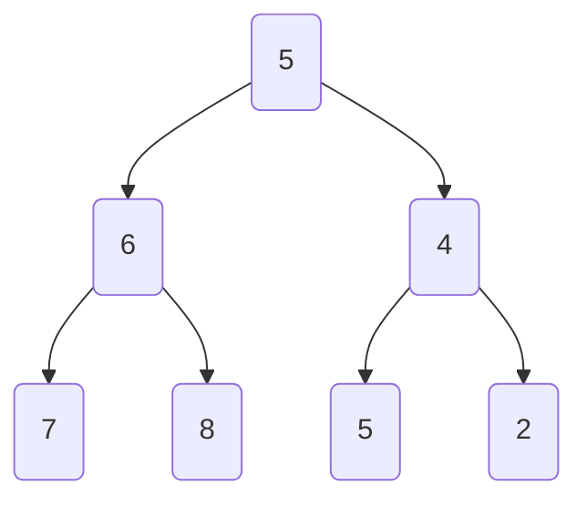
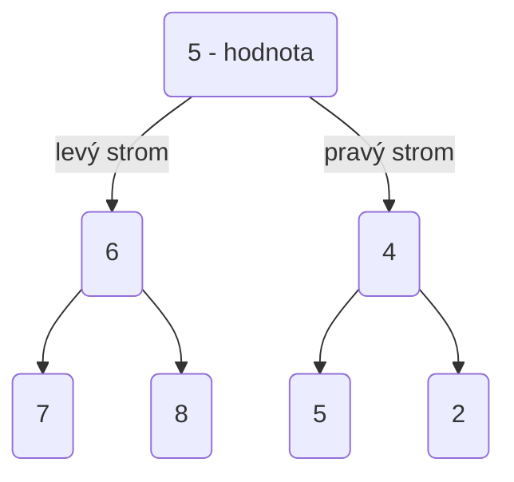
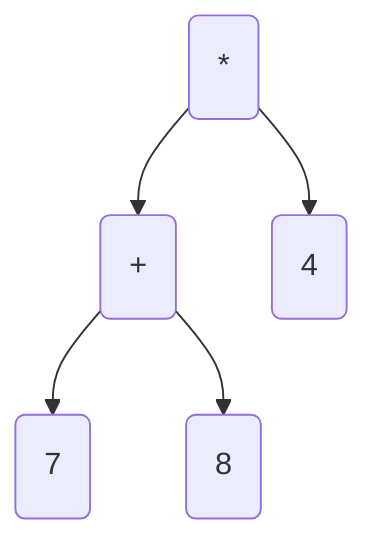
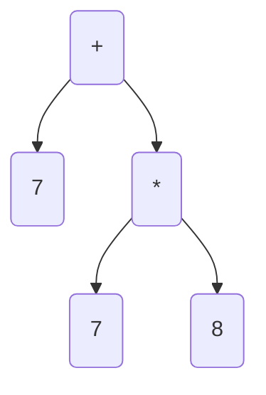
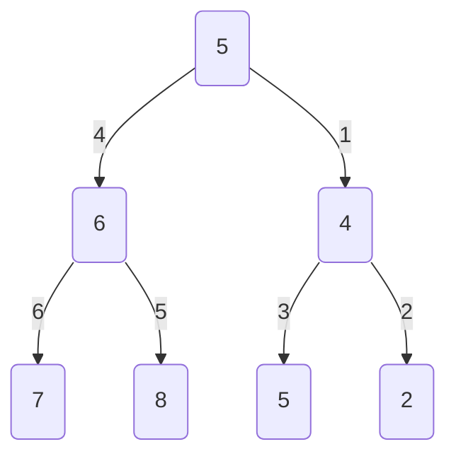
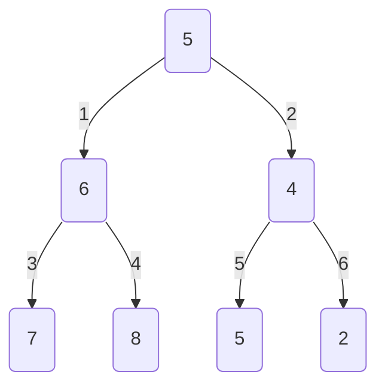
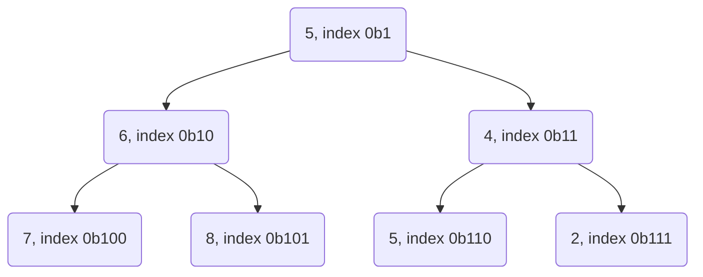

## Programování 2

# 9. cvičení, 21-4-2022

###### tags: `Programovani 2`, `čtvrtek 1`, `čtvrtek 2`

## Farní oznamy

1. Tento text a kódy ke cvičení najdete v repozitáří cvičení na https://github.com/PKvasnick/Programovani-2.
2. **Domácí úkoly** Prohlédl jsem většinu úkolů. Další přijdou tento týden. 
3. **Zápočtový program**: první vlaštovky se ozvaly, ale zatím to je málo. Je opravdu důležité, abyste měli téma ke konci dubna. Myslete na to, že specifikace budeme muset upřesňovat, takže to nejspíš nevyřídíte za jedno odpoledne. 

---

**Dnešní program**:

- Kvíz 
- Mini-tutoriál: konstanty (opravdu mini)
- Binární stromy
- Rekurze

---

## Na zahřátí


V komentářích si můžete zapamatovat důležité podrobnosti o kódu.

- Nevýhoda komentářů je, že se neaktualizují, když změníte kód - musí se aktualizovat ručně. Matoucí komentář dělá přesný opak toho, co by měl.
- Ani zakomentovaný kód se sám nezkontroluje, jestli je funkční po změnách v ostatním kódu. Proto v kódu nikdy nenechávejte zakomentované bloky. 
- Používejte docstringy u funkcí a tříd.

```python
def my_fun(x: float) - float:
    """Funkce spočte druhou mocninu vstupího parametru"""
    return x * x

>> help(fun)
Help on function fun in module __main__:
my_fun(x: float) -> float
    Funkce spočte druhou mocninu vstupího parametru
```

### Co dělá tento kód

```python
x = True
y = False
x == not y
???
```

Pokud chceme narušit pořadí operací, potřebujeme závorky.

---

## Tři variace na téma "Je x celé číslo?"

```python
# Dotaz na typ objektu
isinstance(3.00, int) ---> False
isinstance(3, int)    ---> True

# Číslo z řetězce
int("3")    ---> 3
int("3.14") ---> ValueError

# Dotaz na hodnotu desetinného čísla
(3.00).is_integer()  ---> True
(3.14).is_integer()  ---> False
```


## Binární stromy

Každý uzel má nejvíc dvě větve:


(Kód v `code/Ex8/binary_tree1.py`)

```python
class Node:
    def __init__(self, value, left=None, right=None):
        self.value = value
        self.left = left
        self.right = right
 
```

Jak s takovýmto objektem vytvářet binární stromy a pracovat s nimi?

Vytváření stromů je lehké díky tomu, že v konstruktoru můžeme zadat dceřinné uzly:

```python
    tree = Node(
        5,
        Node(
            6,
            Node(7),
            Node(8)
        ),
        Node(
            4,
            Node(5),
            Node(2)
        )
    )
```



Takže umíme vytvořit strom, ale také potřebujeme vypsat hodnoty ze stromu nebo dokonce strom zobrazit.

### Rekurze

Mnoho věcí umíme lehce definovat, pokud si uvědomíme rekurzivní podstatu binárního stromu:

U každého uzlu máme hodnotu, levý strom a pravý strom:



Takže například lehce vypíšeme hodnoty ze seznamu:

```python
    def count(self):
        count = 1                       # kořen
        if self.left is not None:
            count += self.left.count()  # levý strom
        if self.right is not None:
            count += self.right.count()  # pravý strom
        return count
    
7
```

Tady jsme jenom počítali hodnoty, takže výsledek nezávisel od toho, jak jsme stromem procházeli. 

Stejně můžeme chtít vypsat hodnoty ve všech uzlech stromu. V takovém případě ale musíme definovat, jak budeme stromem procházet:

```python
    def to_list_preorder(self):
        flat_list = []
        flat_list.append(self.value)
        if self.left is not None:
            flat_list.extend(self.left.to_list_preorder())
        if self.right is not None:
            flat_list.extend(self.right.to_list_preorder())
        return flat_list

    def to_list_inorder(self):
        flat_list = []
        if self.left is not None:
            flat_list.extend(self.left.to_list_inorder())
        flat_list.append(self.value)
        if self.right is not None:
            flat_list.extend(self.right.to_list_inorder())
        return flat_list

    def to_list_postorder(self):
        flat_list = []
        if self.left is not None:
            flat_list.extend(self.left.to_list_postorder())
        if self.right is not None:
            flat_list.extend(self.right.to_list_postorder())
        flat_list.append(self.value)
        return flat_list

[5, 6, 7, 8, 4, 5, 2]
[6, 7, 8, 5, 4, 5, 2]
[6, 7, 8, 4, 5, 2, 5]
```

| Pořadí     | Použití                                                      |
| ---------- | ------------------------------------------------------------ |
| Pre-order  | Výpis od kořene k listům, kopírování, výrazy s prefixovou notací |
| In-order   | Ve vyhledávacích stromech dává inorder hodnoty v uzlech v neklesajícím pořadí. |
| Post-order | Vymazání stromu                                              |

Aritmetické výrazy: 



Výraz ve tvaru binárního stromu je jednoznačný a nepotřebuje závorky. Podle toho, jak výraz ze stromu přečteme, dostáváme různé typy notace: 

- in-order --> infixová notace (běžná notace, potřebuje závorky) (7+8) x 4
- Pre-order --> prefixová notace (Polská logika, nepotřebuje závorky) * 4 +7 8
- Post-order --> postfixová notace (RPL, nepotřebuje závorky) 7 8 + 4 *

Pro binární operátory je binární graf jednoznačným zápisem výrazu a nepotŕebuje závorky. Pro výraz 7 + 8 * 4 máme úplně jiný strom než pro (7 + 8) * 4:



**Úkol** Jak vypočíst hodnotu takovéhoto stromu?


Uměli bychom strom nějak zobrazit? Můžeme třeba zkusit posouvat jednotlivé úrovně stromu a použít in-order průchod stromem: 

```python
    def to_string(self, level = 0):
        strings = []
        if self.left is not None:
            strings.append(self.left.to_string(level + 1))
        strings.append(' ' * 4 * level + '-> ' + str(self.value))
        if self.right is not None:
            strings.append(self.right.to_string(level + 1))
        return "\n".join(strings)

    def __str__(self):
        return self.to_string()
    
        -> 7
    -> 6
        -> 8
-> 5
        -> 5
    -> 4
        -> 2
```

Výsledek sice neoslní, ale jakž-takž vyhoví. 

`to_string` musí být oddělená od `__str__`, protože potřebujeme jinou signaturu. 

### Nerekurzivní průchod stromem

**Rekurze** je sice elegantní způsob, jak implementovat metody procházení binárními stromy, ale víme, že bychom brzo narazili na meze hloubky rekurze. Proto je zajímavé zkusit implementovat nerekurzivní verze těchto metod. 

1. Použít zásobník: FIFO pro prohledávání do hloubky (depth-first):
   - Jako zásobník by nám stačil obyčejný seznam (list), tady používáme collections.deque
   - cestou tiskneme stav zásobníku, abychom viděli, co se děje

```python
from collections import deque
...

	def to_list_depth_first(self):
        stack = deque()
        df_list = []
        stack.append(self)
        print(stack)
        while len(stack)>0:
            node = stack.pop()
            df_list.append(node.value)
            if node.left:
                stack.append(node.left)
            if node.right:
                stack.append(node.right)
            print(stack)
        return df_list

deque([5])
deque([6, 4])
deque([6, 5, 2])
deque([6, 5])
deque([6])
deque([7, 8])
deque([7])
deque([])
[5, 4, 2, 5, 6, 8, 7]
```



 Pořadí dáme do pořádku přehozením levé a pravé větve. 

2. Použít frontu LIFO pro prohledávání do šířky (breadth-first)

```python
    def to_list_breadth_first(self):
        queue = deque()
        bf_list = []
        queue.append(self)
        print(queue)
        while len(queue)>0:
            node = queue.popleft()
            bf_list.append(node.value)
            if node.left:
                queue.append(node.left)
            if node.right:
                queue.append(node.right)
            print(queue)
        return bf_list
    
deque([5])
deque([6, 4])
deque([4, 7, 8])
deque([7, 8, 5, 2])
deque([8, 5, 2])
deque([5, 2])
deque([2])
deque([])
[5, 6, 4, 7, 8, 5, 2]
```



Tato poslední metoda je zvlášť důležitá, protože umožňuje jednoduché mapování binárního stromu do pole.



- Potomci uzlu na indexu k jsou 2k a 2k+1
- Předek uzlu na indexu k je k // 2
- Uzel k je levý potomek svého předka, pokud k % 2 == 0, jinak je to pravý potomek.

**Úkol** Zkuste popřemýšlet, jak byste ze seznamu hodnot, který poskytuje metoda `to_list_breadth_first` zrekonstruovali původní strom. 

(Kód v `code/Ex9/list_tree.py`)

```python
...
def construct_from_list(values: list[int]) -> Node:
    values = [0] + values
    queue = deque()
    index = 1
    tree = Node(values[index])
    index += 1
    queue.append(tree)
    while index < len(values):
        print(queue)
        node = queue.popleft()
        node.left = Node(values[index])
        print(index)
        index += 1
        queue.append(node.left)
        if index < len(values):
            node.right = Node(values[index])
            print(index)
            index += 1
            queue.append(node.right)
        else:
            node.right = None
    return tree


def main() -> None:
    tree = Node(
        5,
        Node(
            6,
            Node(7),
            Node(8)
        ),
        Node(
            4,
            Node(5),
            Node(2)
        )
    )

    print(tree.to_string())
    values = tree.to_list_breadth_first()
    tree2 = construct_from_list(values)
    print(tree2.to_string())


if __name__ == '__main__':
    main()
```

**Úkol** Napište metodu `Node.copy(self)`, která vrátí kopii stávajícího stromu.

**Úkol** Napište metodu `Node.delete(self)`, která vymaže strom s kořenem v `Node`.

---

## Rekurze

O rekurzi jsem se dost bavili v minulém semestru, takže pojďme radši něco naprogramovat.

### Hanojské věže


Máme 3 kolíčky a sadu kroužků různých velikostí.

Kroužky jsou na začátku na jediném količku uspořádané podle velikosti, největší vespod. 

Úloha je přesunout kroužky na jiný kolíček tak, že v každém okamžiku budou kolečka na vśech kolících uspořádaná podle velikosti - tedy nesmíme vétší kolečko uložit na menší.

Kde tady nalézt rekurzi? Použijeme princip podobný matematické indukci: 

- Úlohu umíme vyřešit pro 1 kroužek.

- Pokud bychom znali řešení pro n-1 kroužků, uměli bychom úlohu vyŕešit pro n kroužků?


(Kód v `code/Ex8/hanoi.py`)

```python
def move(n: int, start: str, end: str, via: str) -> None:
    if n == 1:
        print(f"Moved {start} to {end}")
    else:
        move(n-1, start, via, end)
        move(1, start, end, via)
        move(n-1, via, end, start)
    return


if __name__ == '__main__':
    move(5, "A", "B", "C")
```

### Všechny možné rozklady přirozeného čísla

1 -> (1)

2 -> (2), (1,1)

3 -> (3), (2, 1), (1, 1, 1)

4 -> (4), (3, 1), (2, 2), (2, 1, 1), (1, 1, 1, 1)

Podobný styl rekurze: indukce

- Máme řesení pro několik malých čísel 1, 2, ...
- Z řešení pro n umíme zkonstruovat rešení pro n+1.

