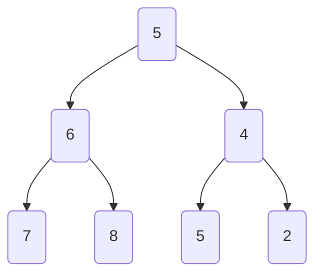
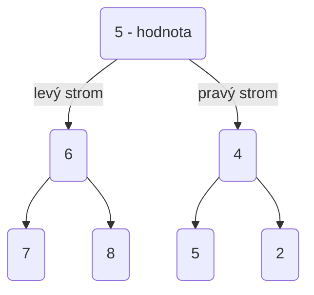
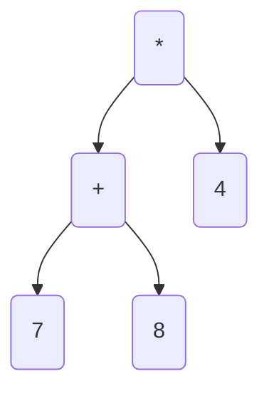
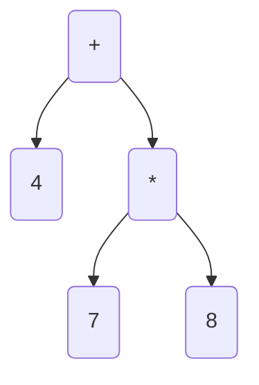
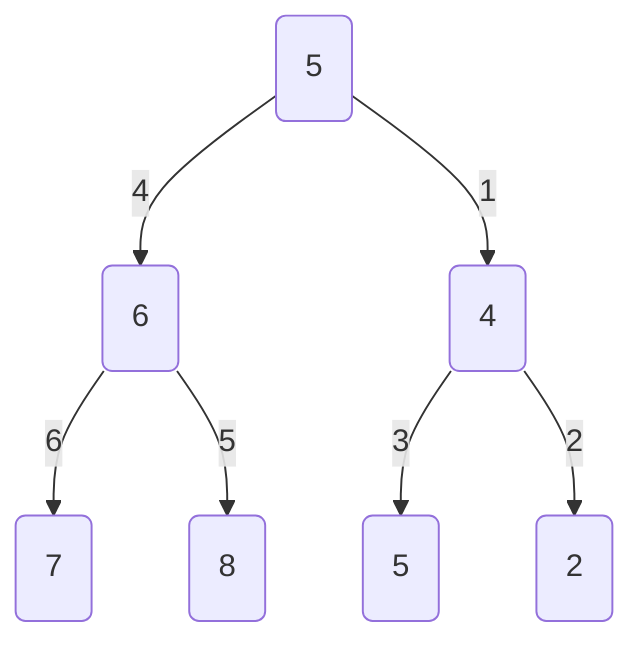
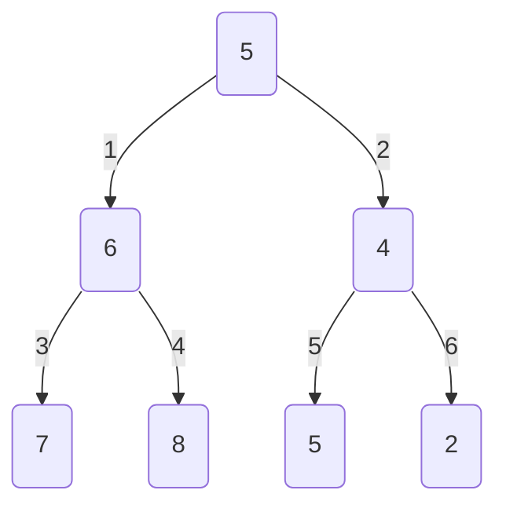
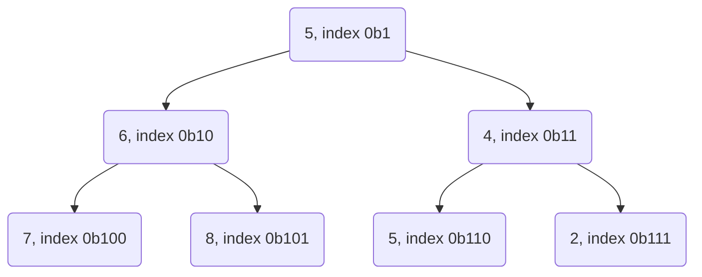
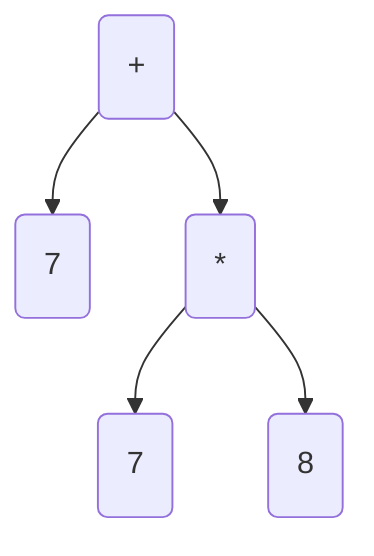
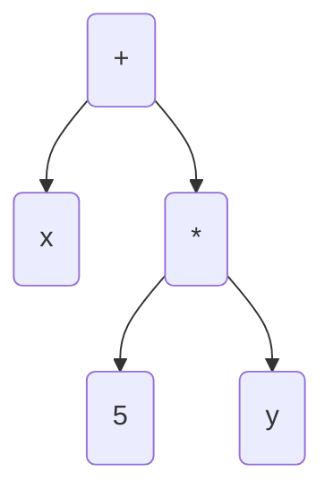

## Programování 2

# 9. cvičení, 13-4-2023

###### tags: `Programovani 2`, `čtvrtek 1`, `čtvrtek 2`

## Farní oznamy

1. Tento text a kódy ke cvičení najdete v repozitáří cvičení na https://github.com/PKvasnick/Programovani-2.
2. **Domácí úkoly** Jeden těžší (i když s nápovědou), dva lehčí.
3. **Zápočtový program**: Jsme pomalu v půlce dubna, popřemýšlejte prosím nad tématem svého zápočtového programu.

---

**Dnešní program**:

- Kvíz 
- Pythonské okénko
- Poznámka k domácím úkolům
- Rekurze: sudoku
- Binární stromy - opakování a pokračování

---

## Na zahřátí


V komentářích si můžete zapamatovat důležité podrobnosti o kódu.

- Nevýhoda komentářů je, že se neaktualizují, když změníte kód - musí se aktualizovat ručně. Matoucí komentář dělá přesný opak toho, co by měl.
- Ani zakomentovaný kód se sám nezkontroluje, jestli je funkční po změnách v ostatním kódu. Proto v kódu nikdy nenechávejte zakomentované bloky. 
- Používejte docstringy u funkcí a tříd.

```python
def my_fun(x: float) - float:
    """Funkce spočte druhou mocninu vstupího parametru"""
    return x * x

>> help(fun)
Help on function fun in module __main__:
my_fun(x: float) -> float
    Funkce spočte druhou mocninu vstupího parametru
```

### Co dělá tento kód

```python
x = True
y = False
x == not y
???
```

Pokud chceme narušit pořadí operací, potřebujeme závorky.

### `None`

V Pythonu je `None`  unikátní objekt typu `NoneType`, který signalizuje 

- hodnotu `null` (pro pointry, které nikam neukazují) nebo 
- chybějící hodnotu (např. pro návratovou hodnotu funkce, která nic nevrací). 

Konvence je nepoužívat pro testování na `None` relační operátory, ale operátor `is` (`None` je unikátní objekt) nebo konverzi objektu na `bool` - cokoli co je `None` se konvertuje na `FALSE`.

```python
if x == None:        # Špatně (ale funguje)
if x != None
 
if x is None:        # Správně
if x is not None:
    
if x:                # Správně 
if not x:

```

Poslední způsob psaní je nejůspornější a nejčitelnější a nejspíš se u něj vyhnete potřebě závorkování.

---

## Rekurze: Sudoku

## Sudoku


- V každém řádku, sloupci a čtverci 3x3 chceme všechny číslice 1-9.

Sudoku dokáže být velice těžké, napsat program na řešení ale těžké není. Musíme jenom do hloubky prohledat prostor řešení a pokud to urobíme rekurzivně, nebude program složitý.

**Ingredience:**

- Reprezentace mřížky

```python
grid = [[5, 3, 0, 0, 7, 0, 0, 0, 0],
        [6, 0, 0, 1, 9, 5, 0, 0, 0],
        [0, 9, 8, 0, 0, 0, 0, 6, 0],
        [8, 0, 0, 0, 6, 0, 0, 0, 3],
        [4, 0, 0, 8, 0, 3, 0, 0, 1],
        [7, 0, 0, 0, 2, 0, 0, 0, 6],
        [0, 6, 0, 0, 0, 0, 2, 8, 0],
        [0, 0, 0, 4, 1, 9, 0, 0, 5],
        [0, 0, 0, 0, 8, 0, 0, 7, 9]
       ]
```

- Metoda pro kontrolu, zda je daná číslice přípustná v daném místě mřížky

```python
def possible(x, y, n):
    """Is digit n admissible at position x, y in the grid?"""
    global grid
    for row in range(9):
        if grid[row][x] == n:
            return False
    for col in range(9):
        if grid[y][col] == n:
            return False
    row0 = (y // 3) * 3
    col0 = (x // 3) * 3
    for row in range(3):
        for col in range(3):
            if grid[row0+row][col0+col] == n:
                return False
    return True
```

- Algoritmus

Najdeme nevyplněné místo a vyzkoušíme všechny přípustné číslice. Rekurzivně pokračujeme, dokud je co vyplňovat nebo dokud nenajdeme spor.

```python
def solve():
    global grid
    for row in range(9):
        for col in range(9):
            if grid[row][col] == 0:
                for n in range(1, 10):
                    if possible(col, row, n):
                        grid[row][col] = n
                        solve()
                        grid[row][col] = 0
                return
    print_grid()
    s = input("Continue?")
```

Toto celkem dobře funguje a hned máme (jediné) řešení:

```python
5 3 4 6 7 8 9 1 2
6 7 2 1 9 5 3 4 8
1 9 8 3 4 2 5 6 7
8 5 9 7 6 1 4 2 3
4 2 6 8 5 3 7 9 1
7 1 3 9 2 4 8 5 6
9 6 1 5 3 7 2 8 4
2 8 7 4 1 9 6 3 5
3 4 5 2 8 6 1 7 9
Continue?

```

Pokud ubereme některé číslice, můžeme samozřejmě dostat víc řešení. 

## Binární stromy

Každý uzel má nejvíc dvě větve:


(Kód v `code/Ex8/binary_tree1.py`)

```python
class Node:
    def __init__(self, value, left=None, right=None):
        self.value = value
        self.left = left
        self.right = right
 
```

Jak s takovýmto objektem vytvářet binární stromy a pracovat s nimi?

Vytváření stromů je lehké díky tomu, že v konstruktoru můžeme zadat dceřinné uzly:

```python
    tree = Node(
        5,
        Node(
            6,
            Node(7),
            Node(8)
        ),
        Node(
            4,
            Node(5),
            Node(2)
        )
    )
```



Takže umíme vytvořit strom, ale také potřebujeme vypsat hodnoty ze stromu nebo dokonce strom zobrazit.

### Rekurze

Mnoho věcí umíme lehce definovat, pokud si uvědomíme rekurzivní podstatu binárního stromu:

U každého uzlu máme hodnotu, levý strom a pravý strom:



Takže například lehce vypíšeme hodnoty ze seznamu:

```python
    def count(self):
        count = 1                       # kořen
        if self.left is not None:
            count += self.left.count()  # levý strom
        if self.right is not None:
            count += self.right.count()  # pravý strom
        return count
    
7
```

Tady jsme jenom počítali hodnoty, takže výsledek nezávisel od toho, jak jsme stromem procházeli. 

Stejně můžeme chtít vypsat hodnoty ve všech uzlech stromu. V takovém případě ale musíme definovat, jak budeme stromem procházet:

```python
    def to_list_preorder(self):
        flat_list = []
        flat_list.append(self.value)
        if self.left is not None:
            flat_list.extend(self.left.to_list_preorder())
        if self.right is not None:
            flat_list.extend(self.right.to_list_preorder())
        return flat_list

    def to_list_inorder(self):
        flat_list = []
        if self.left is not None:
            flat_list.extend(self.left.to_list_inorder())
        flat_list.append(self.value)
        if self.right is not None:
            flat_list.extend(self.right.to_list_inorder())
        return flat_list

    def to_list_postorder(self):
        flat_list = []
        if self.left is not None:
            flat_list.extend(self.left.to_list_postorder())
        if self.right is not None:
            flat_list.extend(self.right.to_list_postorder())
        flat_list.append(self.value)
        return flat_list

[5, 6, 7, 8, 4, 5, 2]
[6, 7, 8, 5, 4, 5, 2]
[6, 7, 8, 4, 5, 2, 5]
```

| Pořadí     | Použití                                                      |
| ---------- | ------------------------------------------------------------ |
| Pre-order  | Výpis od kořene k listům, kopírování, výrazy s prefixovou notací |
| In-order   | Ve vyhledávacích stromech dává inorder hodnoty v uzlech v neklesajícím pořadí. |
| Post-order | Vymazání stromu                                              |

Aritmetické výrazy: 



Výraz ve tvaru binárního stromu je jednoznačný a nepotřebuje závorky. Podle toho, jak výraz ze stromu přečteme, dostáváme různé typy notace: 

- in-order --> infixová notace (běžná notace, potřebuje závorky) (7+8) x 4
- Pre-order --> prefixová notace (Polská logika, nepotřebuje závorky) * 4 +7 8
- Post-order --> postfixová notace (RPL, nepotřebuje závorky) 7 8 + 4 *

Pro binární operátory je binární graf jednoznačným zápisem výrazu a nepotŕebuje závorky. Pro výraz 7 + 8 * 4 máme úplně jiný strom než pro (7 + 8) * 4:



**Úkol** Jak vypočíst hodnotu takovéhoto stromu?

Uměli bychom strom nějak zobrazit? Můžeme třeba zkusit posouvat jednotlivé úrovně stromu a použít in-order průchod stromem: 

```python
    def to_string(self, level = 0):
        strings = []
        if self.left is not None:
            strings.append(self.left.to_string(level + 1))
        strings.append(' ' * 4 * level + '-> ' + str(self.value))
        if self.right is not None:
            strings.append(self.right.to_string(level + 1))
        return "\n".join(strings)

    def __str__(self):
        return self.to_string()
    
        -> 7
    -> 6
        -> 8
-> 5
        -> 5
    -> 4
        -> 2
```

Výsledek sice neoslní, ale jakž-takž vyhoví. 

`to_string` musí být oddělená od `__str__`, protože potřebujeme jinou signaturu. 

### Nerekurzivní průchod stromem

**Rekurze** je sice elegantní způsob, jak implementovat metody procházení binárními stromy, ale víme, že bychom brzo narazili na meze hloubky rekurze. Proto je zajímavé zkusit implementovat nerekurzivní verze těchto metod. 

1. Použít zásobník: FIFO pro prohledávání do hloubky (depth-first):
   - Jako zásobník by nám stačil obyčejný seznam (list), tady používáme collections.deque
   - cestou tiskneme stav zásobníku, abychom viděli, co se děje

```python
from collections import deque
...

	def to_list_depth_first(self):
        stack = deque()
        df_list = []
        stack.append(self)
        print(stack)
        while len(stack)>0:
            node = stack.pop()
            df_list.append(node.value)
            if node.left:
                stack.append(node.left)
            if node.right:
                stack.append(node.right)
            print(stack)
        return df_list

deque([5])
deque([6, 4])
deque([6, 5, 2])
deque([6, 5])
deque([6])
deque([7, 8])
deque([7])
deque([])
[5, 4, 2, 5, 6, 8, 7]
```



 Pořadí dáme do pořádku přehozením levé a pravé větve. 

2. Použít frontu LIFO pro prohledávání do šířky (breadth-first)

```python
    def to_list_breadth_first(self):
        queue = deque()
        bf_list = []
        queue.append(self)
        print(queue)
        while len(queue)>0:
            node = queue.popleft()
            bf_list.append(node.value)
            if node.left:
                queue.append(node.left)
            if node.right:
                queue.append(node.right)
            print(queue)
        return bf_list
    
deque([5])
deque([6, 4])
deque([4, 7, 8])
deque([7, 8, 5, 2])
deque([8, 5, 2])
deque([5, 2])
deque([2])
deque([])
[5, 6, 4, 7, 8, 5, 2]
```



Tato poslední metoda je zvlášť důležitá, protože umožňuje jednoduché mapování binárního stromu do pole (už jsme viděli u hromady, že je praktické nepoužít nultý prvek pole).



- Potomci uzlu na indexu k jsou 2k a 2k+1
- Předek uzlu na indexu k je k // 2
- Uzel k je levý potomek svého předka, pokud k % 2 == 0, jinak je to pravý potomek.

**Úkol** Zkuste popřemýšlet, jak byste ze seznamu hodnot, který poskytuje metoda `to_list_breadth_first` zrekonstruovali původní strom. 

(Kód v `code/Ex9/list_tree.py`)

```python
...
def tree_from_list(values: list[int]) -> Node:
    values = [0] + values
    queue = deque()
    index = 1
    tree = Node(values[index])
    index += 1
    queue.append(tree)
    while index < len(values):
        print(queue)
        node = queue.popleft()
        node.left = Node(values[index])
        print(index)
        index += 1
        queue.append(node.left)
        if index == len(values):
            node.right = None
            break
        node.right = Node(values[index])
        print(index)
        index += 1
        queue.append(node.right)
    return tree


def main() -> None:
    tree = Node(
        5,
        Node(
            6,
            Node(7),
            Node(8)
        ),
        Node(
            4,
            Node(5),
            Node(2)
        )
    )

    print(tree.to_string())
    values = tree.to_list_breadth_first()
    tree2 = construct_from_list(values)
    print(tree2.to_string())


if __name__ == '__main__':
    main()
```

Tato metoda funguje jenom pro úplné binární stromy, tedy v případě, že chybějí jenom několik listů na levé straně poslední vrstvy. Jinak bychom museli dodat do seznamu doplňující informaci - buď "uzávorkování" potomků každého uzlu, anebo u každého uzlu uvést počet potomků. 

**Úkol** Napište metodu `Node.copy(self)`, která vrátí kopii stávajícího stromu.

**Úkol** Napište metodu `Node.delete(self)`, která vymaže strom s kořenem v `Node`.

---

### Nerekurzivní inorder a postorder průchody binárním stromem

Metoda pro nerekurzivní průchod stromem s využitím zásobníku, kterou jsme ukazovali výše, je pre-order metodou, protože vypisuje hodnotu uzlu před hodnotami uzlů v podstromech. 

```python
    def to_list_depth_first(self):
        stack = deque()
        df_list = []
        stack.append(self)
        print(stack)
        while len(stack)>0:
            node = stack.pop()
            df_list.append(node.value)
            if node.right:
                stack.append(node.right)
            if node.left:
                stack.append(node.left)
            print(stack)
        return df_list

```

Je logické se ptát, zdali můžeme implementovat i nerekurzivní inorder a postorder průchody.

**Můžeme**, i když implementace je mírně odlišná.

#### Nerekurzivní in-order průchod binárním stromem:

Uložíme do zásobníku nejdříve celý levý podstrom, pak hodnotu, a pak pravý podstrom.

```python
    def to_list_df_inorder(self):
        stack = deque()
        df_list = []
        current = self
        while True:
            if current:
                stack.append(current)
                current = current.left
            elif stack:
                current = stack.pop()
                df_list.append(current.value)
                current = current.right
            else:
                break
        return df_list

```

#### Nerekurzivní post-order průchod binárním stromem

Toto je komplikovanější případ, potřebujeme dva zásobníky, přičemž do druhého si za pomoci prvního ukládáme uzly ve správném pořadí.

```python
    def to_list_df_postorder(self):
        s1 = deque()
        s2 = deque()
        df_list = []
        s1.append(self)
        while s1:
            node = s1.pop()
            s2.append(node)
            if node.left:
                s1.append(node.left)
            if node.right:
                s1.append(node.right)
        while s2:
            node = s2.pop()
            df_list.append(node.value)
        return df_list

```

(V našem případě vypadá poslední cyklus poněkud směšně, protože výstupní seznam je prostě stack s2 v obráceném pořadí; z pedagogických důvodů je ale vhodnější odlišit výstupní seznam od s2.)

## Operace s výrazy


Výraz ve tvaru binárního stromu je jednoznačný a nepotřebuje závorky. Podle toho, jak výraz ze stromu přečteme, dostáváme různé typy notace: 

- in-order --> infixová notace (běžná notace, potřebuje závorky) (7+8) x 4
- Pre-order --> prefixová notace (polská logika, nepotřebuje závorky) * 4 +7 8
- Post-order --> postfixová notace (reverzní polská logika, nepotřebuje závorky) 7 8 + 4 *

Pro binární operátory je binární graf jednoznačným zápisem výrazu a nepotŕebuje závorky. Pro výraz 7 + 8 * 4 máme úplně jiný strom než pro (7 + 8) * 4:



**Úkol** Jak vypočíst hodnotu takovéhoto stromu?

### Operace s výrazy ve tvaru stromů




```python
class Expression:
    ...


class Constant(Expression):
    def __init__(self, value):
        self.value = value

    def __str__(self):
        return str(self.value)

    def eval(self, env):
        return self.value

    def derivative(self, by):
        return Constant(0)


class Variable(Expression):
    def __init__(self, name):
        self.name = name

    def __str__(self):
        return self.name

    def eval(self, env):
        return env[self.name]

    def derivative(self, by):
        if by == self.name:
            return Constant(1)
        else:
            return Constant(0)


class Plus(Expression):
    def __init__(self, left, right):
        self.left = left
        self.right = right

    def __str__(self):
        return f"({self.left} + {self.right})"

    def eval(self, env):
        return self.left.eval(env) + self.right.eval(env)

    def derivative(self, by):
        return Plus(
            self.left.derivative(by),
            self.right.derivative(by)
        )


class Times(Expression):
    def __init__(self, left, right):
        self.left = left
        self.right = right

    def __str__(self):
        return f"({self.left} * {self.right})"

    def eval(self, env):
        return self.left.eval(env) * self.right.eval(env)

    def derivative(self, by):
        return Plus(
            Times(
                self.left.derivative(by),
                self.right
            ),
            Times(
                self.left,
                self.right.derivative(by)
            )
        )

        
def main():
    vyraz = Plus(
        Variable("x"),
        Times(
            Constant(5),
            Variable("y")
        )
    )
    print(vyraz)
    print(vyraz.eval({"x": 2, "y": 4}))
    print(vyraz.derivative(by="x"))
    print(vyraz.derivative(by="y"))


if __name__ == '__main__':
    main()
    
-----------    
(x + (5 * y))
(1 + ((0 * y) + (5 * 0)))
(0 + ((0 * y) + (5 * 1)))

```

Sice to funguje, ale dostáváme obecně větší strom, ve kterém je spousta hlušiny:

- příčítání nuly a násobení nulou
- násobení jedničkou

Můžeme si vytvořit čistící proceduru, která stromy rekurzivně vyčistí, a opět postupujeme tak, že určité uzly či struktury ve stromu rekurzivně nahrazujeme jinými uzly či strukturami. 

```python
class Expression:
    ...


class Constant(Expression):
    def __init__(self, value):
        self.value = value

    def __str__(self):
        return str(self.value)

    def eval(self, env):
        return self.value

    def derivative(self, by):
        return Constant(0)

    def prune(self):
        return self

# Testování konstanty, zdali je či není 0 nebo 1 !!

def is_zero_constant(x):
    return isinstance(x, Constant) and x.value == 0


def is_unit_constant(x):
    return isinstance(x, Constant) and x.value == 1


class Variable(Expression):
    def __init__(self, name):
        self.name = name

    def __str__(self):
        return self.name

    def eval(self, env):
        return env[self.name]

    def derivative(self, by):
        if by == self.name:
            return Constant(1)
        else:
            return Constant(0)

    def prune(self):
        return self


class Plus(Expression):
    def __init__(self, left, right):
        self.left = left
        self.right = right

    def __str__(self):
        return f"({self.left} + {self.right})"

    def eval(self, env):
        return self.left.eval(env) + self.right.eval(env)

    def derivative(self, by):
        return Plus(
            self.left.derivative(by),
            self.right.derivative(by)
        )

    def prune(self):
        self.left = self.left.prune()
        self.right = self.right.prune()
        if is_zero_constant(self.left):
            if is_zero_constant(self.right):
                return Constant(0)
            else:
                return self.right
        if is_zero_constant(self.right):
            return self.left
        return self


class Times(Expression):
    def __init__(self, left, right):
        self.left = left
        self.right = right

    def __str__(self):
        return f"({self.left} * {self.right})"

    def eval(self, env):
        return self.left.eval(env) * self.right.eval(env)

    def derivative(self, by):
        return Plus(
            Times(
                self.left.derivative(by),
                self.right
            ),
            Times(
                self.left,
                self.right.derivative(by)
            )
        )

    def prune(self):
        self.left = self.left.prune()
        self.right = self.right.prune()
        if is_zero_constant(self.left) | is_zero_constant(self.right):
            return Constant(0)
        if is_unit_constant(self.left):
            if is_unit_constant(self.right):
                return Constant(1)
            else:
                return self.right
        if is_unit_constant(self.right):
            return self.left
        return self


def main():
    vyraz = Plus(
        Variable("x"),
        Times(
            Constant(5),
            Variable("y")
        )
    )
    print(vyraz)
    print(vyraz.derivative(by="x"))
    print(vyraz.derivative(by="x").prune())
    print(vyraz.derivative(by="y"))
    print(vyraz.derivative(by="y").prune())


if __name__ == '__main__':
    main()
-----------    
(x + (5 * y))
(1 + ((0 * y) + (5 * 0)))
1
(0 + ((0 * y) + (5 * 1)))
5
```

- Všimněte si post-order procházení stromu při prořezáváni.
- Metodu `prune` definujeme také pro konstanty a proměnné, i když s nimi nedělá nic. Ulehčuje to rekurzivní volání metody.
- Musíme být pozorní při testování, zda je daný uzel/výraz nulová nebo jedničková konstanta. Nestačí operátor rovnosti, musíme nejdřív zjistit, zda se jedná o konstantu a pak otestovat její hodnotu. V principu bychom mohli dvě testovací funkce proměnit v metody třídy `Expression`.

**Domácí úkol**

Implementujte konstrukci, která ze stromu, kódujícího polynomiální funkci, vytvoří strom, kódující její primitivní funkci (podle některé proměnné). 
